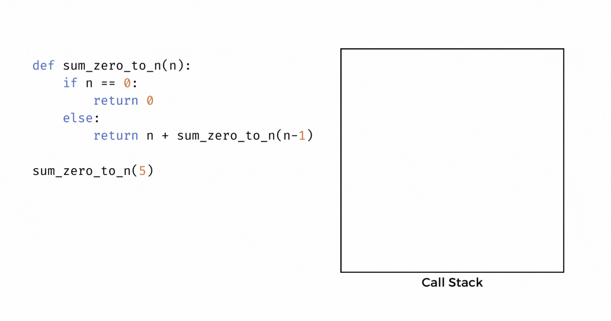

# Recursion Review
<iframe src="https://adaacademy.hosted.panopto.com/Panopto/Pages/Embed.aspx?pid=40e2e5cc-dcfb-40f3-b321-afb30054067c&autoplay=false&offerviewer=true&showtitle=true&showbrand=true&captions=true&interactivity=all" height="405" width="720" style="border: 1px solid #464646;" allowfullscreen allow="autoplay"></iframe>

## Learning Goals
 - Review recursion
 - Understand how to write recursive functions

## Vocabulary

| Term      | Definition |
|---        |---         |
| Recursion | A problem solving technique in which a function calls itself repeatedly on smaller versions of the original input to solve the overall problem|
| Bottom-Up | An approach to problem solving where smaller subproblems are solved, then combined to find a complete solution | 
| Top-Down  | An approach to problem solving where in which the problem is solved by breaking apart the overall problem into smaller subproblems |

## Overview

Before we dive deeper into different categories of algorithms, it may be helpful to review a common technique used in devising many types of algorithms, including divide and conquer and dynamic programming algorithms: **recursion**. 

Recall from the classroom phase that recursive functions are functions which call themselves. For example, the function `hello_crash` prints the string `"Hello, crash!"` and then invokes itself. 

```python
def hello_crash():
    print("Hello, crash!")
    hello_crash()
```
By invoking itself, the function body will execute again - printing `"Hello, crash!"` then calling itself yet again. The invocation at the end of the function body causes the function to run in an endless cycle, until eventually the program crashes. 

More practical examples of recursion which we will review below use a **base case** to define an end condition that stops the recursive calls and prevents the recursive function from crashing.

### Iteration vs Recursion

Like iteration, recursion is a way of repeatedly executing a piece of code. In fact, recursion and iteration achieve the same goal (repetition) but with inverse approaches.

Iteration uses a **bottom-up** approach. This means that we start by solving the smallest subproblem (ex. printing `"Hello, crash!"` once) and then continue to solve larger and larger subproblems, working our way up to a solution to the overall problem (ex. printing `"Hello, crash!"` an infinite number of times).

In contrast, recursion uses a **top-down** approach. It takes the overall problem and breaks it apart into smaller and smaller subproblems until it finally finds one that can be solved readily. Then, if necessary, recursion follows the same pattern as iteration of using the subproblem solutions to build back up to the overall solution.

The difference may seem subtle. Let's compare the two approaches more closely with an example problem. Say we want to modify our function `hello_crash` so that instead of trying to print `"Hello, crash!"` an infinite number of times, the algorithm prints `"Hello"` `num` times, where `num` is an integer parameter. 

<table>
    <tr>
        <th> Iterative Approach </th>
        <th> Recursive Approach </th>
    </tr>
    <tr>
        <td>
        <pre>
def hello_repeat_iterative(num):
    i = 1
    while i <= num:
        print(f"Hello {i}!")
        i += 1
        </pre>
        </td>
        <td>
        <pre>
def hello_repeat_recursive(num):
    print(f"Hello {num}!")
    if num == 1:
        return
    else:
        hello_repeat_recursive(num - 1)
        </pre>
        </td>
    </tr>
    <tr>
        <td>
            Input: <code>5</code><br>
            Output:<br>
            <code>"Hello 1!"</code><br>
            <code>"Hello 2!"</code><br>
            <code>"Hello 3!"</code><br>
            <code>"Hello 4!"</code><br>
            <code>"Hello 5!"</code><br>
        </td>
        <td>
            Input: <code>5</code><br>
            Output:<br>
            <code>"Hello 5!"</code><br>
            <code>"Hello 4!"</code><br>
            <code>"Hello 3!"</code><br>
            <code>"Hello 2!"</code><br>
            <code>"Hello 1!"</code><br>
        </td>
    </tr>
    <tr>
        <td> Try it yourself: <a href = "https://github.com/Ada-Activities/hello-repeat-iterative">hello repeat iterative</a></td>
        <td> Try it yourself: <a href = "https://github.com/Ada-Activities/hello-repeat-recursive">hello repeat recursive</a></td>
    </tr>
</table>

Notice that with the iterative approach, we use a loop to repeat code. We initialize a loop control variable `i` to value 1 and work forward, _repeating the loop body_ which _increments_ `i` until we reach our final value of `num` which stops the repetition.

In contrast, the recursive implementation uses recursive function calls to work backwards. We start with the original `num` value of 5, and with each recursive invocation of `hello_repeat_recursive` _decrement_ `num` and _repeat the function body_ until `num` is assigned to value 1. When `num` has value 1, we exit our function with a return statement instead of making another recursive call, thus ending the cycle of repetition.

Observe that the iterative and recursive solutions have opposite start and stop conditions for the repeated body of code. Loop control variable `i` is assigned an initial value of `1`, while that same value of `1` in the recursive solution is used to stop the cycle of recursive calls. Likewise, the iterative solution stops looping when `i` is assigned the value 5. The same value of 5 is the argument passed into the initial call to `hello_repeat_recursive` which begins the recursive cycle.

### !callout-info

## Strengthening Recursive Coding Skills

Struggling with recursion? If you are trying but struggling to come up with a recursive implementation, see if you can implement an iterative solution first. Then use the observations included above to help transform your iterative implementation into a recursive implementation. 

### !end-callout

## Components of a Recursive Function

 A recursive function should always have two basic components. The first is the **base case** which is our _end condition_. In other words, the base case is the condition under which we want to stop making recursive calls. Often the base case is the smallest subproblem of the overall problem we are working to solve.

 The second component in a recursive function is the **recursive case**. The code we execute in the recursive case will run for all subproblems (including the overall problem) that do not match the base case. It includes invoking our function again, but passing in a simpler, smaller input/subproblem. With each subsequent recursive invocation of the function, we should be moving closer to our base case. The initial input passed in to a recursive function is often similar to the loop's end condition in the matching iterative function. 

<!-- >>>>>>>>>>>>>>>>>>>>>> BEGIN CHALLENGE >>>>>>>>>>>>>>>>>>>>>> -->
<!-- Replace everything in square brackets [] and remove brackets  -->

### !challenge

* type: multiple-choice
* id: 1a935cf3-a8c9-4dd1-875f-66ec29241aae
* title: hello_repeat_recursive base case
* points: 1
<!-- * topics: [python, pandas] (Checkpoints only. optional the topics for analyzing points) -->

##### !question

Which of the following is the base case of `hello_repeat_recursive`?

##### !end-question

##### !options

a| ```python
    print(f"Hello{num}!")
```
b| ```python
    if num == 1:
        return
```
c| 
```python
    else:
        hello_repeat_recursive(num - 1)
```
##### !end-options

##### !answer

b|

##### !end-answer

<!-- other optional sections -->
##### !hint 
Which line(s) end the recursive calls?
##### !end-hint
<!-- !rubric - !end-rubric (markdown, instructors can see while scoring a checkpoint) -->
##### !explanation 
The answer is b because we stop calling `hello_repeat_recursive` and exit our function with a simple `return` statement once `n == 1`
##### !end-explanation

### !end-challenge

<!-- ======================= END CHALLENGE ======================= -->
<!-- available callout types: info, success, warning, danger, secondary, star  -->

<!-- >>>>>>>>>>>>>>>>>>>>>> BEGIN CHALLENGE >>>>>>>>>>>>>>>>>>>>>> -->
<!-- Replace everything in square brackets [] and remove brackets  -->

### !challenge

* type: multiple-choice
* id: f16197e8-b45a-416c-a7a3-00243da2a6e6
* title: hello_repeat_recursive recursive case
* points: 1
<!-- * topics: [python, pandas] (Checkpoints only. optional the topics for analyzing points) -->

##### !question

Which of the following is the recursive case of `hello_repeat_recursive`?

##### !end-question

##### !options

a| ```python
    print(f"Hello{num}!")
```
b| ```python
    if num == 1:
        return
```
c| 
```python
    else:
        hello_repeat_recursive(num - 1)
```
##### !end-options

##### !answer

c|

##### !end-answer

<!-- other optional sections -->
##### !hint 
Which line(s) create a new recursive call?
##### !end-hint
<!-- !rubric - !end-rubric (markdown, instructors can see while scoring a checkpoint) -->
##### !explanation 
The answer is c because we call `hello_repeat_recursive` on a smaller input.
##### !end-explanation

### !end-challenge


## Expanding Our Recursion Toolbox

There are a variety of sub-techniques that can help us devise recursive solutions to a wider array of problems.

### Combining Results

Our first recursive example `hello_repeat` was a simple case of doing the exact same action repeatedly. What we wanted to print with the first call to `hello_repeat` (print `"Hello!"`) wasn't any different than what we wanted to do with the nth recursive call to `hello_repeat` (also print `"Hello!"`). 

But often what we want to do in one recursive call depends on the results of other recursive calls. This is most often the case when we are using recursive function calls to solve subproblems then combining their results to find the solution to the overall problem. 

For example, say we want to sum numbers 0...n where n is a non-negative integer. The iterative solution is pretty straightforward:

```python
def sum_zero_to_n_iterative(n):
    sum = 0
    for num in range(n+1):
        sum += num
    return sum
```

We create an accumulator variable `sum` with an initial value of 0. Then we iterate over numbers 0...n adding each number to `sum` as we go. Once we finish iterating, we simply return `sum`.

In general, the pattern for the iterative solution is to find the sum of 0...1, then the sum of 0...2, then the sum of 0...3, and so on - continuing the pattern until we eventually find the target sum, the sum of 0...n. 

How could we implement this same function recursively? Observe that the sum of numbers 0...n is the same as the sum of numbers n...0. In other words, we can solve this problem backwards (top-down with recursion) as easily as we can solve it forwards (bottom-up with iteration). 

What does it look like to solve this problem 'backwards'? If we flip the pattern we observed in the iterative solution, we get that the sum of n...0 is n itself plus the sum of n-1...0. For example if we passed in `n=5`, we could observe that the sum of 5...0 is the same as 5 + the sum of 4...0. We can continue this pattern (e.g. the sum of 4...0 is 4 + the sum of 3...0) until all we're left to sum is 0 with... nothing. 

The fact that we have nothing left to sum with 0 is a good indication that `n == 0` is our end condition or base case. With this function, we would actually like to return a value. The value we would like to return is the sum of 0...n, but in this case n _is_ 0, so the sum we should return is 0. 

Let's write out our recursive function so far:

```python
def sum_zero_to_n_recursive(n):
    # base case
    if n == 0:
        return 0
``` 

<!-- available callout types: info, success, warning, danger, secondary, star  -->
### !callout-info

## 'Base Case' in the Iterative Solution

Notice that when we implemented this function iteratively we still had to directly tell our program what the sum is when n is 0. We do this by setting our accumulator variable `sum` to 0. Otherwise, we have no initial value to sum with the subsequent numbers we iterate over. In the case that the input passed into the function is 0, the iterative solution will just return the initial value of `sum` which is also 0. 

### !end-callout

Our recursive case is when n is not zero. We can handle our recursive case by generalizing the pattern we observed above: the sum of n...0 is the same as the sum of n + the sum of n-1...0. This is true whether n is 5 or some other value. So in our recursive case, we want to sum our current input of `n` with the result of calling our `sum_zero_to_n` function on a smaller input: `n-1`. Notice that this smaller input moves us closer to our base case where n is 0. 

The sum of n and `sum_zero_to_n(n-1)` is also the return value for our recursive case. It is very common in recursive problems for the recursive case to return the result of some operation between the current input and the return value of a recursive call.

Now we have a complete recursive implementation of `sum_zero_to_n`.

```python
def sum_zero_to_n_recursive(n):
    # base case
    if n == 0:
        return 0
    # recursive case
    else:
        return n + sum_zero_to_n_recursive(n-1)
```

#### The Call Stack

When we make function calls, the body of the called function may invoke other functions which may themselves invoke even more functions. Recall that to keep track of a chain of function calls, the computer uses a **call stack**.

The call stack is a stack data structure that stores function calls. When we invoke a function, that function call is added to the top of the stack as a new element. When the function call finishes executing, it is popped off the top of the stack.

<!-- available callout types: info, success, warning, danger, secondary, star  -->
### !callout-info

## What's a stack?

A **stack** is a special type of array in which items are inserted and removed from the array like a stack of plates. When we insert a new plate onto the stack, we add it to the top of the stack. When we remove a plate, it also comes off the top of the stack. 

<br />

Think of the end of the array as the top of the stack - new elements are appended to the end of the array and removed elements are taken from the end of the array. We never insert or remove elements from any other index in the array. 

### !end-callout

Below we can see the call stack for our `sum_zero_to_n` recursive implementation with an example input of `n=5`. With each recursive function call, a new element or frame is added to the top of the stack. When we reach our base case, we finally stop adding recursive calls to the stack and `sum_zero_to_n(0)` finishes executing in full. It returns `0` and gets popped off the stack. We then go back to our previous recursive call `sum_zero_to_n(1)` and finish executing this function call by combining `1` (n) with the result of our base case. `sum_zero_to_n(1)` can now be removed from the stack and we continue the pattern with the next function call at the top of the stack until the stack is empty and we have the answer to `sum_zero_to_n(5)`!




### Multiple Base Cases

Recursive functions can have multiple stopping conditions. In other words, they can have multiple base cases. 

Consider a recursive implementation to find the nth number in the Fibonacci series. Recall that Fibonacci is a naturally recursive sequence of numbers in which the nth number in the series is the sum of the previous two numbers in the series. Mathematically we express this as: _F<sub>n</sub> = F<sub>n-1</sub> + F<sub>n-2<sub>_.

But if we need to sum the previous two Fibonacci numbers to find the nth Fibonacci number, how do we handle the first two Fibonacci numbers in the series for which the two previous numbers do not exist?

These numbers are given or pre-defined. The 0th and 1st numbers in the Fibonacci series thus each represent a separate base case in our recursive implementation. They can't be represented in terms of a previous number in the sequence, we must directly give the program the answer.

```python
def fibonacci(n):
    # base case 1: find the 0th number in fibonacci series
    if n == 0:
        return 0
    # base case 2: find the 1st number in fibonacci series
    if n == 1:
        return 1
    # recursive case: otherwise fibonacci(n) is the sum of previous two numbers in series
    return fibonacci(n-1) + fibonacci(n-2)
```

<!-- available callout types: info, success, warning, danger, secondary, star  -->
### !callout-secondary

## Base Case Refactor

For some problems, it is possible to handle multiple base cases with just one conditional statement. We can do so for Fibonacci with the following refactor:
```python
def fibonacci(n):
    if n <= 1:
        return n
    return fibonacci(n-1) + fibonacci(n-2)
```
### !end-callout

### Multiple Recursive Cases
Just as it is possible to have multiple base cases, it is also possible to have multiple recursive cases. 

Consider the binary search algorithm. Recall that with binary search, we have a sorted list and a value that we are searching for. If our target value is less than that of the middle element in the list, we know our target must be in the first half of the list. If our target has greater value, then we know it must be in the latter half of the list.  We repeat the process of halving our search area again and again until we find the element we are looking for or determine that it is not in the list. 


<!-- Image source: https://brilliant.org/wiki/binary-search/-->

We can recursively implement a version of binary search which returns `True` if a `target` integer is found within a sorted list `numbers` and returns `False` otherwise.

```python
def binary_search(numbers, target):
    #base case: if we receive an empty list
    if not numbers:
        # target is not in list, return False
        return False
    # find the middle index of numbers
    middle_index = len(numbers) // 2
    # base case: if the value at middle index is our target value
    if numbers[middle_index] == target:
        # return True
        return True
    # recursive case: if the value at middle index is greater than target value
    elif numbers[middle_index] > target:
        # target must be in first half of numbers
        # perform binary search again on first half of numbers
        return binary_search(numbers[:middle_index], target)
    # recursive case: otherwise value at middle index 
    # must be less than or equal to target value
    else:
        # perform binary search again on last half of numbers
        return binary_search(numbers[middle_index+1:], target)        
```

Play around with this code yourself: [recursive binary search](https://github.com/Ada-Activities/bst-dfs-practice)

 Notice that once again we have two base cases:
 - We receive an empty list, in which case it is not possible to break down the problem into further subproblems and it is obvious that the integer `target` is not in the list
 - The middle index of the input list happens to be the value we are looking for, in which case we have found our answer and can stop recursing

However with this function, we also have two recursive cases:
- If the value at the middle of the list is bigger than the value we are searching for, we want to run `binary_search` again on the _left_ half of the list
- If the value at the middle of the list is less than to the value we are searching for, we want to run `binary_search` again on the _right_ half of the list

Multiple recursive cases allow us to select which subproblem we recurse on in different scenarios. We no longer have to follow the same recursive pattern with every recursive function call as we did with `sum_zero_to_n` and `fibonacci`. 

### Using Helper Functions
Our implementation of `binary_search` in the section above returns a boolean value. This may be sufficient for some use cases, but in other cases we may want to return the specific index in the list where our target value can be found. Is it possible to refactor our implementation to now return the target value's index in the input list? 

With our current solution, when we make a recursive call, we replace the original input `numbers` with either its first or second half using list splicing. 

If we pass in the first half of `numbers`, then the indices of each value in our spliced list will match the indices of each value in the original `numbers` list. However, if we pass in the second half of `numbers`, then the indices of our spliced list no longer match those of our original list! If we find `target` during our recursive call and return the index of `target` in the spliced list, it won't be the index we wanted which is the index of `target` in our original input list. 

<details>
    <summary>Boolean Binary Search Implementation</summary>

```py
def binary_search(numbers, target):
    if not numbers:
        return False
    middle_index = len(numbers) // 2
    if numbers[middle_index] == target:
        return True
    elif numbers[middle_index] > target:
        return binary_search(numbers[:middle_index], target)
    else:
        return binary_search(numbers[middle_index+1:], target)
```
</details>

How can we pass along the original indices of our `numbers` array with each recursive call? One method would be to alter our function to take in two extra parameters. Instead of passing in a spliced section of `numbers` to each recursive call, we could instead pass in all of `numbers` but tell it we only want to look for our `target` integer within some `start_index` and some `end_index`. 

 Our revised function will accept four parameters:
- `numbers`, a sorted integer array
- `target`, an integer that may or may not be found in `numbers`
- `start_index`, the lower bound of our search range
- `end_index`, the upper bound of our search range

```python
def binary_search(numbers, target, start_index, end_index):
    # base case: if our search range has size zero
    if start_index > end_index:
        # target is not in numbers which we indicate by returning -1
        return -1
    else:
        # find midpoint of search range
        middle_index = (start_index + end_index) // 2
        # if the value at the midpoint is what we are looking for
        if numbers[middle_index] == target:
            # return the midpoint
            return middle_index
        # if the number we are looking for is 
        # larger than value at current midpoint
        elif numbers[middle_index] > target:
            # target must be to the left of current middle_index
            # perform binary search, reduce the part of numbers we are searching to
            # numbers[start_index: middle_index + 1]
            return binary_search(numbers, target, start_index, middle_index-1)
        # otherwise number we are looking for is
        # smaller than value at current midpoint
        else:
            # target must be to the right of current middle_index
            # perform binary search, reduce the part of numbers we are searching to
            # numbers[middle_index - 1: end_index]
            return binary_search(numbers, target, middle_index+1, end_index)        
```

In this new variation of binary search,  our initial call to `binary search` should pass in `0` for `start_index` and the last index in our input array `numbers` for `end_index` so that our function searches the entirety of `numbers`. 

This is slightly clunky. So that users only have to input our original two parameters `numbers` and `target`, we can instead add a helper function.

Our main function `binary_search` will take the original two parameters:
- `numbers`, a sorted integer array
- `target`, an integer that may or may not be found in `numbers`

Our main function will then find the start and end indices of `number` and call our helper function which will take in all four parameters of our refactored solution:
- `numbers`, a sorted integer array
- `target`, an integer that may or may not be found in `numbers`
- `start_index`, the lower bound of our search range
- `end_index`, the upper bound of our search range

Our refactored code with the helper function will look like this:
```python
# helper function
# identical to our previous solution which returned index of binary search
def binary_search_helper(numbers, target, start_index, end_index):
    if start_index > end_index:
        return -1
    else:
        middle_index = (start_index + end_index) // 2
        if numbers[middle_index] == target:
            return middle_index
        elif numbers[middle_index] > target:
            return binary_search_helper(numbers, target, start_index, middle_index-1)
        else:
            return binary_search_helper(numbers, target, middle_index+1, end_index)

# main/driver function
def binary_search(numbers, target):
    # finds the last index of numbers
    end_index = len(numbers) - 1
    # calls the helper and returns the result of the helper
    # passes in 0 (start index) and end index found above
    return binary_search_helper(numbers, target, 0, end_index)
```

Notice that the helper function is identical to the original binary search function we wrote to return `target`'s index except that it is now called `binary_search_helper` instead of `binary_search`. It does all of the recursive work. 

The main function `binary_search` doesn't do much. All it does is initialize values for `start_index` and `end_index` and pass them in as arguments to the helper function. 

Creating a helper function with extra parameters is a common technique used to devise recursive algorithms when the function declaration we are given does not provide all the parameters needed to solve the problem recursively. The helper function does almost all of the work. The main function mostly exists to pass along any parameters it received and initialize values for any arguments required by the helper function but not passed in to the main function. the main function sometimes also includes guard clauses for edge cases (ex. we could alter our solution above to check if `numbers` is an empty list, and immediately return -1 if it is empty).


## Call Stack and Memory

Recursive solutions to problems often use more auxiliary space than their iterative counterparts. This is because of the space they take up in the call stack.

Going back to our example of `sum_zero_to_n`, the iterative solution makes just one additional function call (it calls the `range` function) while the recursive function makes n-1 function calls. As a result the iterative solution takes O(1) space while the recursive solution takes O(n) space. 

<details>
<summary>Iterative Implementation</summary>

```py
def sum_zero_to_n_iterative(n):
    sum = 0
    for num in range(n+1):
        sum += num
    return sum
```
</details>

<details>
<summary>Recursive Implementation</summary>

```py
def sum_zero_to_n_recursive(n):
    # base case
    if n == 0:
        return 0
    # recursive case
    else:
        return n + sum_zero_to_n_recursive(n-1)
```
</details>

When considering the Big O of recursive algorithms, we should always remember to account for the size of the recursive call stack. 

## Summary

Recursion is a technique that allows us to repeatedly execute the body of a function by having the function call itself. Recursive functions use base cases to stop the cycle of recursive calls and recursive cases to call the function on smaller subproblems. It is possible to have multiple base cases and/or multiple recursive cases in a single recursive function. We can combine the results of recursive calls to find the solution to an overall problem.

Programs track a chain of function calls using the call stack. Each function call added to the call stack takes up memory, so we must account for the size of the call stack a recursive function creates when calculating its space complexity. 

## Categories of Algorithms

There are a [number of different categories of algorithms](https://s2.smu.edu/~vdebroy/cse3353/Lectures/Lecture-7/Algorithm-Types.pdf).  Each category describes the general approach to the algorithm's use in solving its particular problem.  Categories are not exclusive; an algorithm can be a member of multiple categories.  For example QuickSort can be both a divide and conquer algorithm and a randomized algorithm if it picks a random element as a pivot to sort against at each stage. Categories of algorithms can provide us with useful tips and techniques for devising algorithms to problems that fall within a category.

Next, we will look at two categories:  _divide and conquer_ algorithms and _dynamic programming_ algorithms.