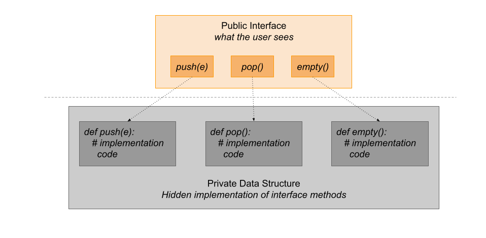
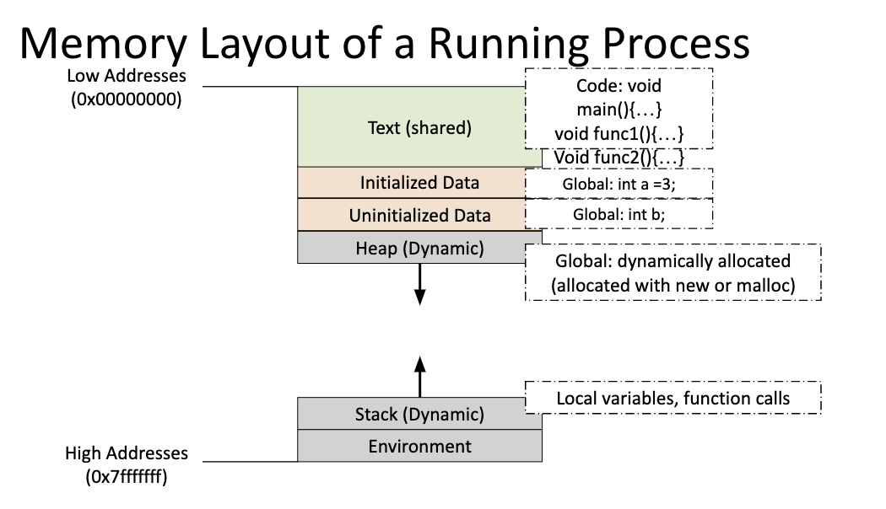
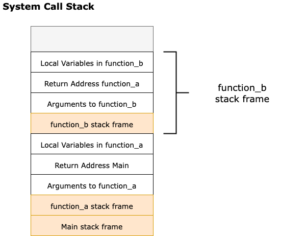

# Applications of Linked Lists

## Overview

Linked lists have a variety of practical applications. Imagine a playlist in your favorite music application. Each song in the playlist represents a node in a doubly linked list. We can add new songs onto the end of our playlist in O(1) time. As we listen to our playlist, it is very easy to replay or skip a song using our previous and next pointers. 

We might also imagine the undo and redo functions of a word processor or other software. Each change to our word document is stored in a node in a doubly linked list. We can undo and redo our changes by traversing our list backwards and forwards.

Linked lists are also prove useful when implementing many other data types that fall into a category called _abstract data types_.

## Abstract Data Types

An _Abstract Data Type_ (ADT), is a type of object which is described by the methods it has and how they perform. Implementation details are not included.  You could for example create a `List` class. You can provide methods to add elements and retrieve elements at a given index. The user of your class never needs to know if you used an array or linked list to store the information internally. The class is called _abstract_ because the data structure's description is independent from it's implementation.  

Linked lists are not considered abstract data types, because a key feature of a linked list is that is implemented by linking nodes together in a chain. However, as mentioned previously, linked lists are often used to implement abstract data types.

Two abstract data types often implemented with linked lists are stacks and queues. Stacks and queues are, like linked lists, ordered linear collections of data. Unlike linked lists, they are described by what they do, rather than how they are implemented. This means that while we might choose to implement stacks and queues with a linked list, we could also choose to implement them with an array.

## Stacks

A Stack is a data structure which stores a list of data and only provides access in a Last-In-First-Out (LIFO) order.  You've seen stacks before at Ada.  When we discussed recursion we noted that function calls are saved on the system stack.  This is so the most recent function called is the first function returned to when the current function ends.

A Stack provides the following methods:

- **push(item)** - This method puts an item into the stack at the top.
- **pop** - This method removes and returns the item on the top of the stack.
- **is_empty** - This method returns true if the stack is empty and false otherwise.

A Stack might also implement a `peek` method which returns, but does not remove the item on top of the stack, and `size` which would return the number of items on the stack.

You can picture a Stack like a stack of plates where new plates can be added and removed from the top, but cannot be removed from the middle or bottom of the structure.


### Implementation of a Stack

You can use any linear data structure to implement a stack.  For example you could implement a `Stack` class like this:

```python
class Stack:
  
    def __init__(self):
        self.store = LinkedList()

    def push(self, item):
        self.store.add_first(item)

    def pop(self):
      return self.store.remove_first()

    def empty(self):
        return self.store.length() == 0
```

You could later change the implementation of Stack to use an Array, and the users of the class would not need to change anything of their code.  This is because the implementation is _hidden_ behind a public interface.  The top of the stack would reference the last element in the array.

**Stack ADT**


**Exercise**:  Implement a `top` method which returns the top of the stack without changing the stack.

**Exercise**:  Write a method which takes a string as an argument.  Return the string reversed using a Stack.

### The Function Stack

As methods get called in an application, the system stores the current instruction addresses, local variables etc on a stack known as the _system call stack_.  Then when a method ends, the topmost method is popped off the stack allowing the system to resume execution.



The diagram below shows the memory used by a running application.  At the top, the text in the application, and global variables are stored.  Below them is the dyanmic data allocated.  At the bottom the system stack stores the functions called.

```python
def function_a(x):
    y = 4
    z = function_b(x, y)
    print(f"The number is {z}")


def function_b(x, y):
  # pause application
    return x + y

x = 3
function_a(x)
```

For the code snippet above, the stack frame at the `# pause application` line would look like this:



<!-- Graphic saved at: https://drive.google.com/file/d/1SsxrrqIIw5oYonpKzwxvXAF3lTcQmB10/view?usp=sharing -->

As the application starts the system puts the main part of the application on the stack, and then main calls `function_a`.  So the system saves the arguments to `function_a` onto the stack, the address to return to (Main) when the method is finished and the local variabes in `function_a`.  Then `function_b` is called and the system saves the arguments to `function_b` onto the stack, the return address (function_a) and any local variables in `function_b`.  When function_b finishes, it's stack frame is popped off the stack, and the return address is used to resume `function_a`.  When `function_a` finishes the same pop operation is performed and the application returns to main.  When the main part of the application is finished, it's stack frame is popped off and the application terminates.  

When an error is raised, the stack is popped until the error is rescued in the current method, or the application terminates and a trace of all the elements on the stack at the time of the error is reported.

## Queues

A queue unlike a stack operates in a first-in-first out order.  Like a line of people at a concert, the first element to enter the queue is the first element removed.  


As shown above elements are added to the back of the queue in an operation called _enqueue_ and removed with an operation called _dequeue_.  

Queues are great for any operation that needs to work with data in a first-in-first-out order.  For example some systems have worker processes which can be assigned tasks to work on and these worker processes take on jobs assigned to them in the order they appeared, completing one before taking on the next.

**Exercise**: With pseudocode implement a `front` method which returns the item at the front, but leaves the Queue unchanged without directly accessing any methods of the Queue except `dequeue`, `enqueue` and `empty?`.  Feel free to use any other data structures.

A Queue provides the following methods:

- **enqueue(item)** - This method puts an item into the back of the queue.
- **dequeue** - This method removes and returns the item at the front of the queue.
- **is_empty** - This method returns true if the queue is empty and false otherwise.

### Queue Implementation Considerations

Like a stack a queue can be implemented several ways and the implementation should be hidden from the user.  One way would be to implement a queue with a linked list like this:

```python
class Queue:
    def __init__(self):
        self.store = LinkedList.new

    def enqueue(self, item):
        self.store.add_last(item)

    def dequeue(self):
        if self.is_empty():
            return None

        self.store.remove_first()

    def is_empty(self):
        return self.store.empty()
```

<!-- >>>>>>>>>>>>>>>>>>>>>> BEGIN CHALLENGE >>>>>>>>>>>>>>>>>>>>>> -->
<!-- Replace everything in square brackets [] and remove brackets  -->

### !challenge

* type: multiple-choice
* id: bade61da-8d68-401f-abd1-345fbd38bc4b
* title: Enqueue & Dequeue
* points: 1
* topics: queues, linked lists

##### !question

What would be the Big-O here of enqueue and dequeue?

##### !end-question

##### !options

* O(1)
* O(log n)
* O(n log n)
* O(n^2)
* It depends

##### !end-options

##### !answer

* It depends

##### !end-answer

<!-- other optional sections -->
##### !hint

Do all LinkedList implementation have the same time complexity for add_last and remove_first?

##### !end-hint
<!-- !rubric - !end-rubric (markdown, instructors can see while scoring a checkpoint) -->
##### !explanation

If the Linked List has a tail reference, and is a doubly linked list, then both enqueue and dequeue can be done in O(1) time.  If there is no tail reference then enqueue should perform in O(n) time.

##### !end-explanation

### !end-challenge

<!-- ======================= END CHALLENGE ======================= -->

This implementation has a number of advantages, it's easy to read, fairly performant, but the data is a bit fragmented.  If you had a queue with a fixed maximum size, how would you use an Array to implement it?


## Abstract Data Types


