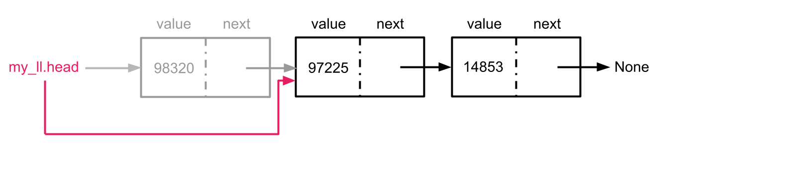

# Supplemental Concepts & Resources

## Pointers & References

You will often hear the terms _pointer_ and _reference_ in relation to dynamic data structures like linked lists.  Both terms refer to a variable which **points** to data in memory, or holds the address of another variable in memory.  The concept is similar to a home.  The home is an object in memory, while the home's address is a _reference_ which indicates where to find the home.

In some languages like C/C++ you can manipulate memory addresses and memory directly.  In other languages, like Python, you have references which refer to objects in memory, but you cannot directly work with the memory addresses.

An example in C++:

```c++
  int x = 5; // declare an integer variable x which is assigned value 5
  int* ptr_x;  // declare a variable ptr_x which will be assigned the memory address of an integer variable
  ptr_x = &x;  // Assign ptr_x the value of the memory address of x.
```

We use references in Python whenever we use a Linked List since each node _refers_ to the next node in the chain and `head` refers to the first node in the chain.


## Memory Leaks

A **memory leak** is a bug resulting from how a program manages memory.  A _memory leak_ occurs when memory that is no longer needed by the program is not released back to the operating system.  Over time, if memory is used and not returned to the system, less and less memory is available to other programs to use. Eventually, there will not be enough available memory for applications to use. When a program ends, modern operating systems will return all memory allocated to that program back to the operating system itself. For this reason, most memory leaks today occur in long-running processes like [daemons](https://www.techtarget.com/whatis/definition/daemon).

In Python, the Python interpreter manages memory for developers.  Python uses a [garbage collection](https://en.wikipedia.org/wiki/Garbage_collection_(computer_science)) system which identifies memory no longer used by the application and returns it.

Consider when a node is removed from a Linked List:


<!-- source:  https://stackoverflow.com/questions/41474163/singly-linked-list-remove -->


When there is no longer a variable to reference a given node, for example `node.next` no longer references the node with value 99 in the image above, the Python garbage collector eventually returns the memory used to store node 99 to the operating system.

```python
def remove_first(self):
    if not self.head:
        return False

    value = self.head.value
    self.head = self.head.next

    return value
```

Other languages place memory management on the developer. C is one such language. These lower-level languages give a developer more flexibility and control over low-level operations at the cost of more responsibility and a greater likelihood of errors.

Removing a Node from a Linked List in C

```c
void removeFirst(struct node **headRef) {
  if (*head != NULL) {
    struct node* temp = *head;
    int value = (*temp)->value;
    head = (*head)->next;
    free(temp);  // <-- Give back memory to the OS
    return value;
  }
}
```

## Resources
- [Past Linked List Video Lessons](https://adaacademy.hosted.panopto.com/Panopto/Pages/Viewer.aspx?pid=b1664c7e-f95e-40f5-971f-ad9000fe85d8)
- [Past Stacks & Queues Video Lessons (in depth)](https://adaacademy.hosted.panopto.com/Panopto/Pages/Viewer.aspx?pid=b987fd8f-b63c-479a-a679-ad93018aecaa)
- [Past Slide Deck Used](https://docs.google.com/presentation/d/1lJ8WJnA6qRlHAIaRAjim3kiL4nRBWT5qvFGQQIB4EL4/edit?usp=sharing)
- [Linked Lists from Geeks for Geeks](https://www.geeksforgeeks.org/data-structures/linked-list/) - Lots of articles & practice problems
- [Stanford Linked List Basics](http://cslibrary.stanford.edu/103/LinkedListBasics.pdf)
