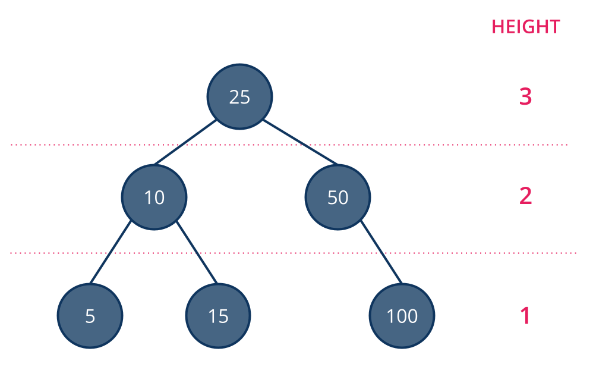
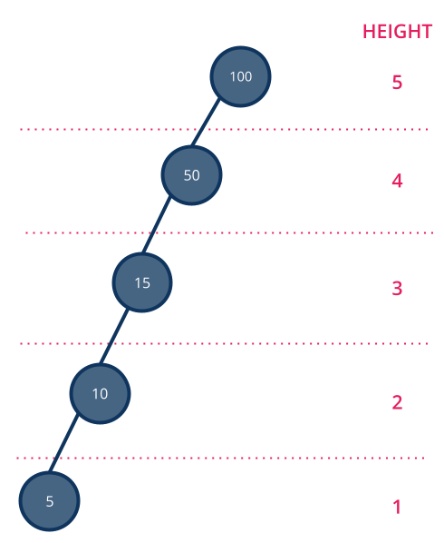

# Balancing Trees

<iframe src="https://adaacademy.hosted.panopto.com/Panopto/Pages/Embed.aspx?pid=c63daaac-decb-44ad-b239-afcd0008dbe7&autoplay=false&offerviewer=true&showtitle=true&showbrand=true&captions=true&interactivity=all" height="405" width="720" style="border: 1px solid #464646;" allowfullscreen allow="autoplay"></iframe>

## Learning Goals
- Explain the difference between balanced and unbalanced trees
- Explain the importance of balanced trees
- Determine the time and space complexity of search, insert, and delete operations on both balanced and unbalanced trees

### Overview
Before we move on to serialization of binary search trees, let's take a moment to discuss the time and space complexity of searching, insertion, and deletion. To fully understand that, we must first talk about _balancing_. 

### Exercise

Try this exercise out by drawing a binary tree with pen and paper or using the [Binary Tree Visualizer](https://visualgo.net/en/bst). To make your own tree with the Binary Tree Visualizer, use the _Create_ option in the navigation bar in the bottom left corner to make an empty tree. Then use the _Insert_ function to add nodes with your desired key.  

**Question**:  If you have a tree of height 5, what's the worst-case for finding a value in the tree?  What affects the number of comparisons you need to make?

  

    Open this to see our answer.
  

  Worst-case, you need to make comparisons to 5 nodes before finding the value you are looking for.
  
  Worst-case:  O(h) comparisons where _h_ is the height of the tree

## Balanced Trees & Unbalanced Trees

A tree is considered _balanced_ if the height difference between the left and right subtree is at most one and both subtrees are also balanced.  In this way the nodes in the tree must be spread fairly evenly.

This is an example of a balanced tree.

On the other hand, this is an example of an unbalanced tree.

The time and space complexity of operations such as search, insert, and delete depend on whether a tree is balanced or unbalanced. 

Refer to the examples of balanced and unbalanced trees above to answer the questions 1 and 2 below. You may also find it helpful to draw out the scenarios posed in the questions.

### !challenge

* type: number
* id: 476cab10-a81f-4877-aad3-682602a3c30d
* title: How many nodes do you need to examine to find 5, in the balanced example?
* decimal: 0
* points: 1
* topics: bst

##### !question

How many nodes do you need to examine to find 5, in the balanced example?

##### !end-question

##### !placeholder

Number goes here

##### !end-placeholder

##### !answer

3

##### !end-answer

### !end-challenge

<!-- ======================= END CHALLENGE ======================= -->

<!-- >>>>>>>>>>>>>>>>>>>>>> BEGIN CHALLENGE >>>>>>>>>>>>>>>>>>>>>> -->

### !challenge

* type: number
* id: 5a4ce281-7f17-47e5-961e-a582171eb3be
* title: How many nodes do you need to examine to find 5 in the unbalanced example?
* decimal: 0
* points: 1
* topics: bst

##### !question

How many nodes do you need to examine to find 5 in the unbalanced example?

##### !end-question

##### !placeholder

Number goes here

##### !end-placeholder

##### !answer

5

##### !end-answer

### !end-challenge

<!-- ======================= END CHALLENGE ======================= -->

<!-- >>>>>>>>>>>>>>>>>>>>>> BEGIN CHALLENGE >>>>>>>>>>>>>>>>>>>>>> -->

### !challenge

* type: number
* id: b7d69d24-04e0-4891-beaa-ccbb81f73fed
* title: 5 level tree
* decimal: 0
* points: 1
* topics: bst

##### !question

With the [Binary Tree Visualizer](https://visualgo.net/en/bst) or pen and paper, build a **balanced** tree with a height of 5 levels.  How many comparisons do you need to make to find a particular leaf node?

##### !end-question

##### !placeholder

Number goes here

##### !end-placeholder

##### !answer

5

##### !end-answer

### !end-challenge

<!-- ======================= END CHALLENGE ======================= -->

<!-- >>>>>>>>>>>>>>>>>>>>>> BEGIN CHALLENGE >>>>>>>>>>>>>>>>>>>>>> -->

### !challenge

* type: number
* id: 0dd499dc-7260-4d51-aabd-b9f4560e1047
* title: 6 level tree
* decimal: 0
* points: 1
* topics: bst

##### !question

Add 5 more nodes to the balanced tree, maintaining the balance.  How many comparisons do you need to make now to find a particular leaf node?

##### !end-question

##### !placeholder

Number goes here

##### !end-placeholder

##### !answer

6

##### !end-answer

<!-- other optional sections -->
##### !hint 

How many levels does adding 5 nodes add, if you maintain balance?

##### !end-hint

### !end-challenge

<!-- ======================= END CHALLENGE ======================= -->

<!-- >>>>>>>>>>>>>>>>>>>>>> BEGIN CHALLENGE >>>>>>>>>>>>>>>>>>>>>> -->

### !challenge

* type: number
* id: f32167e5-2264-49bc-8850-f81afd0f697b
* title: Unbalanced 5 level tree
* decimal: 0
* points: 1
* topics: bst

##### !question

Build a **completely unbalanced** tree with 5 levels.  How many comparisons to find a leaf node?

##### !end-question

##### !placeholder

Number here

##### !end-placeholder

##### !answer

5

##### !end-answer

<!-- other optional sections -->
##### !hint

What's the worst case time complexity?

##### !end-hint
<!-- !rubric - !end-rubric (markdown, instructors can see while scoring a checkpoint) -->
##### !explanation

Worst-case you have to travel to the last node in the chain and since there are 5 levels, it takes 5 comparisons

##### !end-explanation

### !end-challenge

<!-- ======================= END CHALLENGE ======================= -->

<!-- >>>>>>>>>>>>>>>>>>>>>> BEGIN CHALLENGE >>>>>>>>>>>>>>>>>>>>>> -->
<!-- Replace everything in square brackets [] and remove brackets  -->

### !challenge

* type: number
* id: a97fce91-ee27-4f04-be01-7484247a236e
* title: Adding 4 more unbalanced nodes
* decimal: 0
* points: 1
* topics: bst

##### !question

What if you added 4 nodes and kept the tree unbalanced. How many comparisons would you need to make in the worst-case scenario?

##### !end-question

##### !placeholder

Number goes here 

##### !end-placeholder

##### !answer

9

##### !end-answer

<!-- other optional sections -->
##### !hint

If you have 5 levels and add 4 more nodes, how many levels do you gain if the tree is totally unbalanced?

##### !end-hint

##### !explanation

Worst case you added 4 more levels 5 + 4 = 9, so 9 comparisons to find the value.

##### !end-explanation

### !end-challenge

<!-- ======================= END CHALLENGE ======================= -->

<!-- >>>>>>>>>>>>>>>>>>>>>> BEGIN CHALLENGE >>>>>>>>>>>>>>>>>>>>>> -->

### !challenge

* type: short-answer
* id: 78ea3ad2-2a41-496b-af4a-535720e0e4f4
* title: Growth as `n` changes
* points: 1
* topics: bst

##### !question

Create a tree with one node.  Then double the number of nodes, **keeping the tree balanced.**  Then double the number of nodes again, maintaining balance.  Notice how the height changes.

What standard Big-O time complexity does this match?
  

##### !end-question

##### !placeholder

O(?)

##### !end-placeholder

##### !answer

/O\(log n\)/

##### !end-answer

<!-- other optional sections -->
##### !hint 

Answer in the form of O(n), O(nlog n), O(log n), O(1), etc.

##### !end-hint
<!-- !rubric - !end-rubric (markdown, instructors can see while scoring a checkpoint) -->
##### !explanation 

O(log n) when you double the number of nodes, the height increases by 1.

##### !end-explanation

### !end-challenge

<!-- ======================= END CHALLENGE ======================= -->

## Tree Balance & Time Complexity

Looking at the answers to the questions above, notice that if a tree is balanced, when we move left or right to search for a given node or find the spot in the tree you want to insert or delete a node, we eliminate half of the possible nodes. This means we are essentially doing **binary search.**  If the tree is unbalanced, we are performing a linear search.

Assume that we are using the binary search tree methods as we have described in the above unbalanced tree example. If all the nodes were inserted in order, the worst case time complexity for search, insertion, or deletion would be O(n) where n is the number of nodes in the tree because each node except the root would be the left child of the previous node. 

When a tree is balanced, because with each step we choose to only traverse one subtree or approximately half of the original tree, the same methods would have O(log n) time complexity.

* If a tree is unbalanced the time complexity to search, insert, or delete a node are all O(n) in the worst case.
* If a tree is balanced the time complexity to search, insert, or delete a node are all O(log n) in the worst case.

Therefore it is very important that a tree **remain balanced**. 

<!-- available callout types: info, success, warning, danger, secondary, star  -->
### !callout-star

## Balance is important in a tree's efficiency

If a tree is _balanced_ then the adding, finding, and removing operations on that tree perform in O(log n) time.  However if a tree becomes unbalanced the efficiency can approach O(n) time complexity.  

For this reason, computer scientists spend a lot of time focusing on ways to maintain the balance of a Binary Search Tree.

### !end-callout

**Self-Balancing Trees** There are a lot of algorithms for [keeping a tree balanced](https://en.wikipedia.org/wiki/Self-balancing_binary_search_tree).  The act of keeping a tree balanced is also O(log n) so rebalancing a tree after an insertion or deletion doesn't significantly impact the runtime of a binary search tree.  These structures are wonderful things to learn, but beyond the scope of this class.  You **can** however rest assured that any library tree classes that you use will keep the tree balanced in such a manner.

## Recursion & Space Complexity

The recursive solutions to search, insertion, and deletion all have a space complexity of O(log n) for a balanced tree while the iterative implementations all have a space complexity of O(1).

This is because with the recursive solutions, each recursive call of the methods adds a frame to the system's [call stack](../02-linked-lists//05-linked-lists-supplemental-concepts.md). With each of these operations, we make a recursive call each time we choose to traverse a new subtree which we do O(log n) times. 

In contrast, the iterative solutions make only a single call to the method regardless of the size of the tree. We don't create any additional data structures that vary with the size of the tree in any of the operations, thus time complexity is constant or O(1).

### !challenge

* type: checkbox
* id: e2bae5b6-597a-4f7d-b8c2-1bf859ef2ad2
* title: Balanced Binary Search Tree Advantages
* points: 1
* topics: binary-search-trees, big-o

##### !question

What are advantages of a balanced Binary Search Tree?

##### !end-question

##### !options

* Fast insertion speed `O(log n)`
* Fast removal speed `O(log n)`
* Uses less space than a Linked List or Array
* Fast O(1) lookup speed
* Fast O(1) insertion to the head and tail
* Maintains the order of elements

##### !end-options

##### !answer

* Fast insertion speed `O(log n)`
* Fast removal speed `O(log n)`
* Maintains the order of elements

##### !end-answer

##### !hint

Remember that finding things in a balanced binary search tree is essentially performing binary search. Trees do have to maintain references to the children of each parent node.

This is also our first nonlinear data structure.

##### !end-hint

### !end-challenge

## Summary

In this lesson we looked at the difference between balanced and unbalanced trees and why maintaining balance in a tree is important.  Binary search trees provide an O(log n) time to add, remove and find elements because searching a tree performs a binary search.  This performance, however, depends on the tree being **balanced**.  A balanced tree has subtrees of height within 1 of each other.

In short we want to use a binary search tree when:

- Maintaining order is important
- We want to maintain efficient search, insertion and deletion time complexities

## Big-O Comparison

We can see below a balanced Binary Search Tree provides good performance while maintaining elements in order.  

**#**|**Data Structure**|**Access By Key**|**Search**|**Insertion (Middle)**|**Deletion (Middle)**|**Add First**|**Add Last**
:-----:|:-----:|:-----:|:-----:|:-----:|:-----:|:-----:|:-----:
1|Unsorted Array|O(1)|O(n)|O(n)|O(n)|O(n)|O(1)
2|Sorted Array|O(1)|O(log n)|O(n)|O(n)|O(n)|O(1)
3|Doubly Linked List|O(n)|O(n)|O(n)|O(n)|O(1)|O(1)
4|Binary Tree (balanced)|O(log n)|O(log n)|O(log n)|O(log n)|NA|NA
5|Binary Tree (unbalanced)| O(n)|O(n)|O(n)|O(n)|NA|NA
6|Hash Table* |O(1)|O(1)|O(1)|O(1)|NA|NA

*Hash tables are _unordered_ collections of data