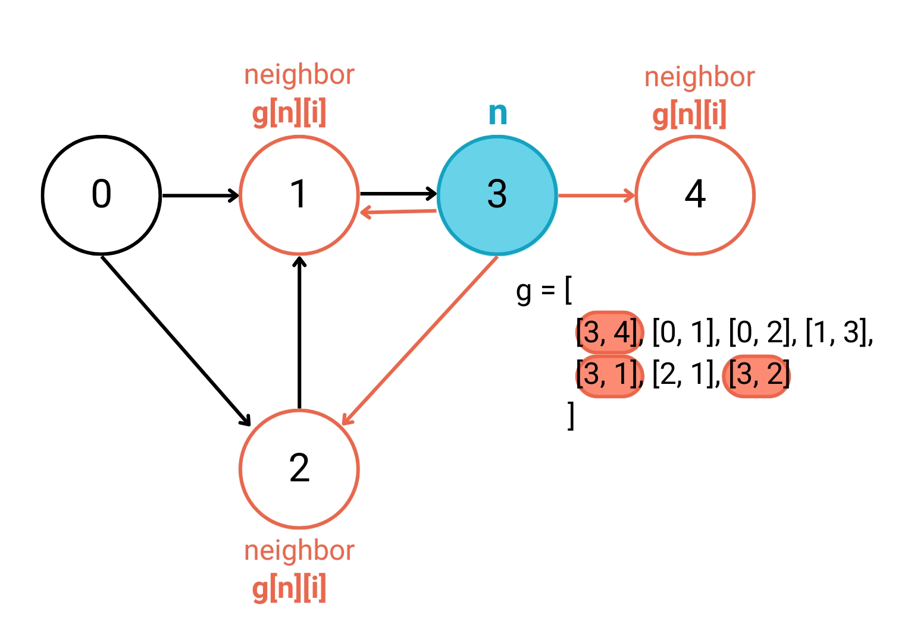

## Graph Algorithms

There are a huge [class of algorithms](https://en.wikipedia.org/wiki/Category:Graph_algorithms) involving graphs.  We will look at two of the most common graph algorithms as a sample.  

### Breadth First Search

Like in a binary search tree a breadth first search (BFS) in a graph is performed with a queue.  However, unlike trees, graphs often have cycles so we will need to keep track of the nodes we have visited and ensure that we only traverse nodes that have yet to be visited. Otherwise, we will get stuck in a loop visiting the same nodes in the cycle over and over again.

### !callout-info

## Cycles in Graphs
In graph theory, a path that starts from a given node and ends at that same node is called a *cycle*. In the graph below, there is a cycle starting from node A -> node B -> node C -> node A.


### !end-callout

In breadth first search (BFS)we start with a particular node and visit each node connected to the starting point in the graph starting with the closest node to the starting point and expanding outward.

We do so by adding each of the neighbors of the starting node to a queue. Then we loop through the queue, removing the first element in the queue and adding each of its unvisited neighbors to the queue. We repeat this process until the queue is empty. 

Once the queue is empty we know we have visited all nodes in the graph that are possible to reach from the starting node.


In the above visualization, the algorithm starts its traversal from the specified start node, node 0 in this case, and expands outwards. First the algorithm visits the start node's neighbors, then the neighbor's neighbors, and so on until it has traversed every node reachable from the start node. If a neighbor has already been visited, the algorithm skips over visiting that neighbor and moves on to the next unvisited neighbor.

You can also interact with a breadth first search animation on [HackerEarth](https://www.hackerearth.com/practice/algorithms/graphs/breadth-first-search/visualize/)

**Breadth First Search Pseudocode Walkthrough**
<iframe src="https://adaacademy.hosted.panopto.com/Panopto/Pages/Embed.aspx?id=493ecb29-6431-4e61-b918-af170141a8da&autoplay=false&offerviewer=true&showtitle=true&showbrand=false&captions=true&interactivity=all" height="360" width="640" style="border: 1px solid #464646;" allowfullscreen allow="autoplay"></iframe>

The pseudocode for breadth first search is as follows:
```
    - Initialize an empty list of visited nodes
    - Initialize an empty queue 
    - Add the node we would like to start our traversal from to the queue 
    - Add the node we would like to start our traversal from to visited
    - While the queue is not empty:
        - Remove an element from the queue and store it in a variable, `current`
        - Loop through each of the current node's neighbors:
            - If the neighbor has not yet been visited:
                - Add the neighbor to the queue
                - Add the neighbor to the list of visited nodes
    - Return the list of visited nodes
```
Notice that because the breadth first search algorithm asks us to loop through each node's neighbors, it is most convenient when the graph being traversed is represented as an adjacency list or dictionary. If graph `g` is represented as an adjacency list, we can easily access a list of node `n`'s neighbors with `g[n]`. Looping through `n`'s neighbor's would simply mean looping through each element in `g[n]`.  


If the graph is provided to us as an adjacency matrix, it is still possible to loop through the graph's neighbors. However, when `g` is changed to an adjacency matrix, note that `g[n]` is now a list of _all the nodes in the graph_ - not just node `n`'s neighbors - with `g[n][i]` indicating whether there is an edge from node `n` to node `i`. To loop through node `n`'s neighbors, we have to check the value of `g[n][i]` for all `i` in `g[n]` to determine whether `n` and `i` are neighbors. 


If the graph is represented by a list of edges it is difficult to find a node's neighbors because we need to search the entire list of edges for edges from node `n`. For this reason, when we are interested in performing breadth first search on a list of edges, it is common to convert the list of edges to an adjacency list or adjacency matrix. 



Some implementations of a breadth first search may have the user pass in the node they would like the traversal to start at as a parameter. Other times, breadth first search implementations will start their traversal with a random node in the graph or the first node listed in the given graph representation.

<!-- >>>>>>>>>>>>>>>>>>>>>> BEGIN CHALLENGE >>>>>>>>>>>>>>>>>>>>>> -->
<!-- Replace everything in square brackets [] and remove brackets  -->

### !challenge

* type: multiple-choice
* id: 911d76a6-f2c5-4f94-97b9-c1d5477c0502
* title: Breadth First Search on a Disconnected Graph
* points: 1

##### !question

Using the pseudocode included in the above lesson, if we begin our traversal from `Seattle`, what will a Breadth First Search return as its list of `visited` nodes for the following graph?

```python
    g = {
        "Seattle": ["Portland", "Chicago"],
        "Chicago": ["Seattle"],
        "Portland": ["Seattle", "Kona"],
        "Kona": ["Portland"],
        "Miami": ["El Paso"],
        "El Paso": ["Miami"]
    }
```


##### !end-question

##### !options

a| `visited = ["Seattle", "Portland", "Chicago", "Kona"]`
b| `visited = ["Seattle", "Chicago", "Portland", "Kona"]`
c| `visited = ["Seattle", "Portland", "Chicago", "Kona", "El Paso", "Miami"]`
d| `visited = ["Seattle", "Portland", "Chicago", "Kona", "Miami", "El Paso"]`

##### !end-options

##### !answer

a|

##### !end-answer

<!-- other optional sections -->
<!-- !hint - !end-hint (markdown, hidden, students click to view) -->
<!-- !rubric - !end-rubric (markdown, instructors can see while scoring a checkpoint) -->
##### !explanation

Seattle will be added to visited first because Seattle is our specified start node. So visited is `["Seattle"]`.

<br>

We loop through Seattle's neighbors. Since the graph is provided as an adjacency dictionary, we will loop through Seattle's neighbors in the order they are listed in the adjacency dictionary. `g["Seattle"]` is `["Portland", "Chicago"]` so we will visit Portland first, then Chicago. Our visited list is now `["Seattle", "Portland", "Chicago"]`.

<br>

Then we will visit Portland's neighbor Kona and our visited list becomes `["Seattle", "Portland", "Chicago", "Kona"]`. Chicago doesn't have any unvisited neighbors, so our Breadth First is finished! 

<br>

Miami and El Paso are never visited because a basic breadth first search only visits nodes _reachable by the start node_. There is no path in the graph from Seattle to Miami or El Paso.

##### !end-explanation

### !end-challenge

<!-- ======================= END CHALLENGE ======================= -->

<!-- >>>>>>>>>>>>>>>>>>>>>> BEGIN CHALLENGE >>>>>>>>>>>>>>>>>>>>>> -->
<!-- Replace everything in square brackets [] and remove brackets  -->

### !challenge

* type: multiple-choice
* id: 37080b8b-47fc-468d-b47a-80451f736a26
* title: Breadth First Search on a Directed Graph
* points: 1

##### !question

Using the pseudocode included in the above lesson, if we begin our traversal from `Seattle`, what will a Breadth First Search return as its list of `visited` nodes for the following graph?

```python
    g = {
        "Seattle": ["Portland"],
        "Chicago": ["Seattle"],
        "Portland": ["Kona"],
        "Kona": []
    }
```


##### !end-question

##### !options

a| `visited = ["Seattle", "Chicago", "Portland", Kona"]`
b| `visited = ["Seattle", "Portland", "Chicago", Kona"]`
c| `visited = ["Seattle", "Chicago", "Portland"]`
d| `visited = ["Seattle", "Portland", "Kona"]`

##### !end-options

##### !answer

d|

##### !end-answer

<!-- other optional sections -->
<!-- !hint - !end-hint (markdown, hidden, students click to view) -->
<!-- !rubric - !end-rubric (markdown, instructors can see while scoring a checkpoint) -->
##### !explanation 

Seattle will be added to visited first because Seattle is our specified start node. So visited is `["Seattle"]`.

<br>

We loop through Seattle's neighbors. Since the graph is provided as an adjacency dictionary, Seattle's neighbors are represented by `g["Seattle"]` which has value `["Portland"]`.  So we will visit Portland next and our visited list becomes `["Seattle", "Portland"]`.
<br>

Then we will visit Portland's neighbor Kona and our visited list becomes `["Seattle", "Portland", "Kona"]`.
<br>

There is an edge from Chicago to Seattle but there is no edge from Seattle to Chicago. Thus, Chicago is not reachable from Seattle and will never be visited during our breadth first search.

##### !end-explanation

### !end-challenge

<!-- ======================= END CHALLENGE ======================= -->

Breadth first search is used to solve a variety of problems including:

- Checking to see if a graph is **connected** - we can get from any node in the graph to any other node in the graph
- Finding the shortest path in an unweighted graph/maze
- Solving puzzle games like a [Rubik's Cube](https://www.quora.com/How-can-solving-a-Rubiks-Cube-be-framed-as-a-graph-problem)

<!-- >>>>>>>>>>>>>>>>>>>>>> BEGIN CHALLENGE >>>>>>>>>>>>>>>>>>>>>> -->
<!-- Replace everything in square brackets [] and remove brackets  -->

### !challenge

* type: code-snippet
* language: python3.6
* id: 3398d942-7078-4567-9b81-67bb6c38d104
* title: Iterative Breadth First Search
* points: 1

##### !question

Write a function returning a list of elements representing a breadth first search of the items in the graph represented by `self.adjacency_list`. The traversal should begin with `start_node`. 

The function should return a list of all nodes reachable from `start_node` in the order they were traversed. If the graph is empty, the function should return an empty list. 

Spend no more then 15 minutes working through this independently. Use the hints below or reach out for help if you are still feeling stuck after 15 minutes. 

##### !end-question

##### !placeholder

```py
class Graph:
    
    # The graph is stored in an adjacency dictionary where each key 
    # represents a node in the graph and each value in the dictionary
    # represents the corresponding key's list of edges
    def __init__(self, adjacency_dict = {}):
        self.adjacency_dict = adjacency_dict

    def bfs(self, start_node):
        pass
```

##### !end-placeholder

##### !tests
```py
import unittest
from main import *

class TestPython1(unittest.TestCase):
    def test_bfs(self):
        adjacency_dict = {
            "Seattle": ["Portland", "Chicago"],
            "Chicago": ["Seattle"],
            "Portland": ["Seattle", "Kona"],
            "Kona": ["Portland"]
        }

        g = Graph(adjacency_dict)

        answer = ["Seattle", "Portland", "Chicago", "Kona"]
        self.assertEqual(answer, g.bfs("Seattle"))

    def test_bfs_empty_graph(self):
        g = Graph()
        self.assertEqual([], g.bfs("Seattle"))

    def test_bfs_one_item(self):
        adjacency_dict = {
            "Seattle": []
        }
        g = Graph(adjacency_dict)
        self.assertEqual(["Seattle"], g.bfs("Seattle"))
    
    def test_bfs_start_node_other_than_first_node(self):
        adjacency_dict = {
            "Seattle": ["Portland", "Chicago"],
            "Chicago": ["Seattle"],
            "Portland": ["Seattle", "Kona"],
            "Kona": ["Portland"]
        }

        g = Graph(adjacency_dict)

        answer = ["Chicago", "Seattle", "Portland", "Kona"]
        self.assertEqual(answer, g.bfs("Chicago"))    


    def test_bfs_disconnected_graph(self):
        adjacency_dict = {
            "Seattle": ["Portland", "Chicago"],
            "Chicago": ["Seattle"],
            "Portland": ["Seattle", "Kona"],
            "Kona": ["Portland"],
            "Miami": ["El Paso"],
            "El Paso": ["Miami"]
        }
        g = Graph(adjacency_dict)

        seattle_answer = ["Seattle", "Portland", "Chicago", "Kona"]
        self.assertEqual(seattle_answer, g.bfs("Seattle"))

        miami_answer = ["Miami", "El Paso"]
        self.assertEqual(miami_answer, g.bfs("Miami"))

    def test_bfs_directed_graph(self):
        adjacency_dict = {
            "Seattle": ["Portland"],
            "Chicago": ["Seattle"],
            "Portland": ["Kona"],
            "Kona": []
        }
        g = Graph(adjacency_dict)

        answer = ["Seattle", "Portland", "Kona"]
        self.assertEqual(answer, g.bfs("Seattle"))

```

##### !end-tests

##### !hint

Refer to the pseudocode included earlier in the topic to guide your implementation. 

Still feeling stuck? Check this video walkthrough of the solution.

<iframe src="https://adaacademy.hosted.panopto.com/Panopto/Pages/Embed.aspx?id=42ac2142-176c-4846-8b69-af1d012341bf&autoplay=false&offerviewer=true&showtitle=true&showbrand=false&captions=true&interactivity=all" height="360" width="640" style="border: 1px solid #464646;" allowfullscreen allow="autoplay"></iframe>

### !end-hint

### !explanation 
An example of a working implementation:

```python
from collections import deque

def bfs(self, start_node):
    # store adjacency dictionary in variable for clarity
    graph = self.adjacency_dict
    
    # if there are no nodes in the graph
    if len(graph) == 0:
        # return an empty list
        return []
    
    # initialize a new queue and add start_node
    queue = deque([start_node])
    # initialize a list of visited nodes and add start_node
    visited = [start_node]
    
    # while there are still nodes int he queue
    while queue:
        # pop node off the queue and set it as current
        current = queue.popleft()
        
        # loop through current's neighbors
        for neighbor in graph[current]:
            # if the neighbor has not yet been visited
            if neighbor not in visited:
                # add it to the list of visited nodes
                # (we've now visited it!)
                visited.append(neighbor)
                # append the node to the queue so we can visit its neighbors!
                queue.append(neighbor)
    # return list of visited nodes
    return visited
```
### !end-explanation

### !end-challenge

<!-- ======================= END CHALLENGE ======================= -->

<!-- >>>>>>>>>>>>>>>>>>>>>> BEGIN CHALLENGE >>>>>>>>>>>>>>>>>>>>>> -->
<!-- Replace everything in square brackets [] and remove brackets  -->

### !challenge

* type: multiple-choice
* id: 7b46c76f-c47e-4ed1-8606-732c610a1eaa
* title: Time complexity of BFS
* points: 1
* topics: graphs

##### !question

What is the time complexity of Breadth First Search with N nodes and E edges.

##### !end-question

##### !options

* O(N)
* O(N^2)
* O(E)
* O(NE)
* O(N + E)
* O(1)

##### !end-options

##### !answer

* O(N + E)

##### !end-answer

##### !explanation

Since we will visit each node in a connected graph once, and loop through each of the edges of each visited node the Big-O of this algorithm is O(N + E) where `N` is the number of nodes in the graph and `E` is the number of edges since each node and each edge will be explored.

O(N + E) is different from O(NE) because O(NE) implies that we visit each node `E` times. On the contrary, we visit each node at most one time, which is a set of operations resulting in a Big-O of O(N). We examine the edges adjacent to a node only when we visit the node, so each edge is examined at most two times, once for each of the nodes to which it is connected. This gives us a Big-O of O(2E) = O(E). Put together O(N) + O(E) and we get O(N + E).

##### !end-explanation

### !end-challenge

<!-- ======================= END CHALLENGE ======================= -->

<!-- >>>>>>>>>>>>>>>>>>>>>> BEGIN CHALLENGE >>>>>>>>>>>>>>>>>>>>>> -->
<!-- Replace everything in square brackets [] and remove brackets  -->

### !challenge

* type: multiple-choice
* id: 4376fdea-ebec-4fdc-897d-21fc7ca5ff91
* title: Space Complexity of BFS
* points: 1
* topics: graphs

##### !question

What is the space complexity of Breadth First Search with N nodes and E edges?

##### !end-question

##### !options

* O(N)
* O(E)
* O(NE)
* O(N + E)
* O(1)


##### !end-options

##### !answer

* O(N)

##### !end-answer

<!-- other optional sections -->
<!-- !hint - !end-hint (markdown, users can see after a failed attempt) -->
<!-- !rubric - !end-rubric (markdown, instructors can see while scoring a checkpoint) -->
##### !explanation

In the worst-case you will need to add each node to the Queue, so the space complexity is O(N) where `N` is the number of nodes in the graph.

##### !end-explanation

### !end-challenge

<!-- ======================= END CHALLENGE ======================= -->


### Depth First Search

Where breadth first search spreads out from a starting node in order of distance from the starting node, depth first search follows each path as far as possible before backing up and following the next closest path. For this reason we refer to depth first search as a _backtracking_ algorithm.

We can imagine depth first search as if we were exploring a maze. Whenever there is a fork in the path, we make a choice about which fork to continue to travel down. If the fork we choose leads us to a dead-end (a node without unvisited neighbors), we turn around and go back to the most recent fork in the road, and choose one of the other options. 


In the above visualization, observe that the when the algorithm reaches node 3, it visits its first neighbor 2. When node 2 is visited, depth first search chooses to next explore node 2's neighbors instead of going to visit node 3's second neighbor node 4 as breadth first search would have done. It's only when depth first search realizes that node 2's only neighbor node 1 has already been visited that it backtracks to node 3 and moves on to explore node 3's second neighbor, node 4. 


[HackerEarth](https://www.hackerearth.com/practice/algorithms/graphs/depth-first-search/visualize/) also has an excellent description and visualization of the algorithm.

**Depth First Search Pseudocode Walkthrough**
<iframe src="https://adaacademy.hosted.panopto.com/Panopto/Pages/Embed.aspx?id=8e2085ff-4dd1-46aa-a961-af170141a92a&autoplay=false&offerviewer=true&showtitle=true&showbrand=false&captions=true&interactivity=all" height="360" width="640" style="border: 1px solid #464646;" allowfullscreen allow="autoplay"></iframe>

The pseudocode for an iterative depth first search implementation is as follows:
```
- Start by taking the first item in the adjacency dictionary `start_node`
- Initialize an empty stack
- Initialize an empty list to store visited nodes
- Add the node we would like to start our traversal from to the stack
- Add the node we would like to start our traversal from to the visited list
- while the stack is not empty:
    - Pop the topmost node off the stack and store it in a variable, `current`
    - Loop through the current node's neighbors:
        - If the neighbor has not yet been visited
            - Push the neighbor onto the stack
            - Add the neighbor to the list of visited nodes
- Return list of visited nodes
```


Depth first search has a number of applications in graph problems including:

- Detecting a cycle in a graph
- Finding a path in a maze where there is only one correct path
- Scheduling jobs based on dependencies on other jobs

**Questions**

<!-- >>>>>>>>>>>>>>>>>>>>>> BEGIN CHALLENGE >>>>>>>>>>>>>>>>>>>>>> -->
<!-- Replace everything in square brackets [] and remove brackets  -->

### !challenge

* type: code-snippet
* language: python3.6
* id: ce448643-59d9-44a8-b2c6-ba4a8a2227e5
* title: Iterative Depth First Search
* points: 1

##### !question

Write a function returning a list of elements representing a depth first search of the items in `self.adjacency_dict`. Please write the function iteratively, i.e. without using recursion.

Spend no more then 15 minutes working through this independently. Use the hints below or reach out for help if you are still feeling stuck after 15 minutes.

##### !end-question

##### !placeholder

```py
class Graph:
    
    # The graph is stored in an adjacency dictionary where each key 
    # represents an item in the graph and each value in the dictionary
    # corresponds to a list of edges from the key
    def __init__(self, adjacency_dict = {}):
        self.adjacency_dict = adjacency_dict

    def dfs(self, start):
        pass
```

##### !end-placeholder

##### !tests

```py
import unittest
from main import *

class TestPython1(unittest.TestCase):
    def test_dfs(self):
        adjacency_dict = {
            "Seattle": ["Chicago", "Portland"],
            "Chicago": ["Seattle"],
            "Portland": ["Seattle", "Hawaii"],
            "Hawaii": ["Portland", "Juneau"],
            "Juneau": ["Hawaii"]
        }

        g = Graph(adjacency_dict)

        answer = ["Seattle", "Portland", "Hawaii", "Juneau", "Chicago"]
        self.assertEqual(answer, g.dfs())

    def test_dfs_empty_graph(self):
        g = Graph()
        self.assertEqual([], g.dfs())

    def test_dfs_one_item(self):
        adjacency_dict = {
            "Seattle": []
        }
        g = Graph(adjacency_dict)
        self.assertEqual(["Seattle"], g.dfs())
```

##### !end-tests

### !hint
Use the pseudocode included above this problem to guide your implementation. Observe that this is the exact same pseudocode as breadth first search except we use a stack in place of queue. 

Still feeling stuck? Check this video walkthrough of the solution.

<iframe src="https://adaacademy.hosted.panopto.com/Panopto/Pages/Embed.aspx?id=77eefecf-346b-4fe5-8b31-af1d0123414e&autoplay=false&offerviewer=true&showtitle=true&showbrand=false&captions=true&interactivity=all" height="360" width="640" style="border: 1px solid #464646;" allowfullscreen allow="autoplay"></iframe>

### !end-hint 

### !explanation
An example of a working implementation:

```python
def dfs(self):
    graph = self.adjacency_dict
    
    if len(graph) == 0:
        return []
        
    first_item = list(graph.keys())[0]
    stack = [first_item]
    visited = []

    while stack:
        current = stack.pop()
        visited.append(current)

        for neighbor in graph[current]:
            if neighbor not in visited:
                stack.append(neighbor)

    return visited
```
### !end-explanation

### !end-challenge

<!-- >>>>>>>>>>>>>>>>>>>>>> BEGIN CHALLENGE >>>>>>>>>>>>>>>>>>>>>> -->

### Stacks and recursion

Whenever we deploy the use of a stack to solve a problem, the problem may typically be solved using recursion, especially if the problem involves doing the same operation repeatedly. We can use the program's call stack to replace the explicit creation of a stack by using a recursive call. 

The pseudocode for the recursive implementation is as follows:
```
- For base function:
    - Create empty list called `visited`
    - Take the first item in the adjacency graph `first_item`
    - Call helper function with `visited`, `self.adjacency_dict`, and `first_item`
    - Return `visited`

- For helper function (takes in `visited`, `graph`, and `node`):
    - If `node` is not in `visited`:
        - Append `node` to `visited`
        - For each `neighbor` of the `node`:
            - Call helper with `visited`, `graph`, and the `neighbor`
```

The key difference between our iterative and recursive implementations is that the explicit stack created in the iterative version is replaced by the recursive call stack.


### !challenge

* type: code-snippet
* language: python3.6
* id: 243eaf9a-e87e-48f6-bfa0-9df10c5b15d2
* title: Recursive Depth First Search
* points: 1

##### !question

Write a function returning a list of elements representing a depth first search of the items in `self.adjacency_dict`. Please write the function recursively.

Spend no more then 15 minutes working through this independently. Use the hints below or reach out for help if you are still feeling stuck after 15 minutes.

##### !end-question

##### !placeholder

```py
class Graph:
    
    # The graph is stored in an adjacency dictionary where each key 
    # represents an item in the graph and each value in the dictionary
    # corresponds to a list of edges from the key
    def __init__(self, adjacency_dict = {}):
        self.adjacency_dict = adjacency_dict

    def dfs(self):
        pass
```

##### !end-placeholder

##### !tests
```py
import unittest
from main import *

class TestPython1(unittest.TestCase):
    def test_dfs(self):
        adjacency_dict = {
            "Seattle": ["Chicago", "Portland"],
            "Chicago": ["Seattle", "New York"],
            "Portland": ["Seattle", "Honolulu"],
            "New York": ["Chicago"],
            "Juneau": ["Honolulu"],
            "Honolulu": ["Portland", "Juneau"]
        }

        g = Graph(adjacency_dict)

        answer = ["Seattle", "Chicago", "New York", "Portland", "Honolulu", "Juneau"]
        self.assertEqual(answer, g.dfs())

    def test_dfs_empty_graph(self):
        g = Graph()
        self.assertEqual([], g.dfs())

    def test_dfs_one_item(self):
        adjacency_dict = {
            "Seattle": []
        }
        g = Graph(adjacency_dict)
        self.assertEqual(["Seattle"], g.dfs())
```

##### !end-tests

##### !hint
Use the pseudocode above to guide your implementation.

Still feeling stuck? Check this video walkthrough of the solution.

<iframe src="https://adaacademy.hosted.panopto.com/Panopto/Pages/Embed.aspx?id=25b3e12d-bc1a-40a5-b60c-af1d01234183&autoplay=false&offerviewer=true&showtitle=true&showbrand=false&captions=true&interactivity=all" height="360" width="640" style="border: 1px solid #464646;" allowfullscreen allow="autoplay"></iframe>

##### !end-hint 

##### !explanation
An example of a working implementation:

```python
def dfs_helper(self, visited, graph, node):
    if node not in visited:
        visited.append(node)
        for neighbor in graph[node]:
            self.dfs_helper(visited, graph, neighbor)

def dfs(self):
    graph = self.adjacency_dict
    if len(graph) == 0:
        return []
        
    visited = []
    first_item = list(graph.keys())[0]

    self.dfs_helper(visited, graph, first_item)
    return visited
```

##### !end-explanation 

### !end-challenge

<!-- ======================= END CHALLENGE ======================= -->

<!-- >>>>>>>>>>>>>>>>>>>>>> BEGIN CHALLENGE >>>>>>>>>>>>>>>>>>>>>> -->
<!-- Replace everything in square brackets [] and remove brackets  -->

### !challenge

* type: multiple-choice
* id: 72fd7b4f-2d0b-4f60-9f99-57ede4dc769b
* title: Time complexity of DFS
* points: 1
* topics: graphs

##### !question

What is the time complexity of Depth First Search with N nodes and E edges?

##### !end-question

##### !options

* O(N)
* O(E)
* O(NE)
* O(N + E)
* O(1)


##### !end-options

##### !answer

* O(N + E)

##### !end-answer

<!-- other optional sections -->
<!-- !hint - !end-hint (markdown, users can see after a failed attempt) -->
<!-- !rubric - !end-rubric (markdown, instructors can see while scoring a checkpoint) -->
##### !explanation

Since you will visit each node once, and loop through each of the edges in each node the Big-O of this algorithm is O(N + E) where `N` is the number of nodes in the graph and `E` is the number of edges since each node and each edge will be explored.  Note, this is the same as breadth-first-search.

##### !end-explanation

### !end-challenge

<!-- ======================= END CHALLENGE ======================= -->

<!-- >>>>>>>>>>>>>>>>>>>>>> BEGIN CHALLENGE >>>>>>>>>>>>>>>>>>>>>> -->
<!-- Replace everything in square brackets [] and remove brackets  -->

### !challenge

* type: multiple-choice
* id: ac56a302-147e-44bd-9438-3779d9fe226a
* title: Space complexity of DFS
* points: 1
* topics: graphs

##### !question

What is the space complexity of Depth First Search?

##### !end-question

##### !options

* O(N)
* O(E)
* O(NE)
* O(N + E)
* O(1)

##### !end-options

##### !answer

* O(N)

##### !end-answer

<!-- other optional sections -->
<!-- !hint - !end-hint (markdown, users can see after a failed attempt) -->
<!-- !rubric - !end-rubric (markdown, instructors can see while scoring a checkpoint) -->
##### !explanation

In the worst-case you will need to add each node to the Stack, so the space complexity is O(N) where `N` is the number of nodes in the graph.

##### !end-explanation

### !end-challenge

<!-- ======================= END CHALLENGE ======================= -->
## Choosing Between Traversal Algorithms

How do we decide which algorithm to use? Oftentimes, problems requiring graph traversal can be solved with either breadth first search or depth first search.

If we expect the solution to be relatively close to our start node, we may choose to breadth first search because it explores nodes closest to it first. Conversely, if we expect the solution to be much further away from the start node, we may choose to use depth first search. 

Breadth first search will also find the shortest path in an unweighted graph because it chooses which node to visit next based on proximity (first neighbors, then the neighbor's neighbors, etc.). 

Depth first search goes down one path as far as possible and only turns around and explores other possibilities only once it can't continue down the path its on. For this reason, depth first search is often used to solve problems where we want to test out different possible game outcomes or win conditions.

## Summary

Two popular graph traversal algorithms are breadth first search (BFS) and depth first search (DFS). Both algorithms will visit each node and edge in the graph, but they have different methods of performing the traversal. In most cases, both BFS and DFS can be used to solve a problem. However, there are instances in which the differences in approach make one a better choice than the other. The most common use cases for each are listed below. 

Breadth first search processes nodes by visiting all neighboring nodes before moving on to nodes that are neighbors of its neighbors and so-on.
Depth first search processes nodes by following a path as deep as it can before backing up and following another path.

**Breadth-first-search**|**Depth-first-search**|
:-----:|:-----:|
Typically implemented using a queue|Typically implemented using a stack|
Generally requires more memory than DFS|Generally requires less memory than BFS|
Optimal for finding the shortest distance of a path|Not optimal for finding the shortest distance|

**BFS Use Cases**|**DFS Use Cases**|
:-----:|:-----:|
Shortest path between two nodes|Detecting cycles in a graph|
Testing if a graph is bipartite|Problems that require graph backtracking|
Find all connected nodes in a graph|Topological sorting|
