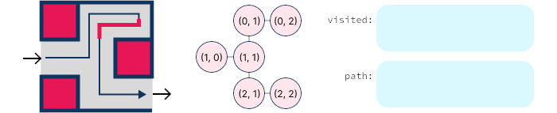

# Graph Application - Maze Solving

<!--
<iframe src="https://adaacademy.hosted.panopto.com/Panopto/Pages/Embed.aspx?pid=6e2b199d-f7d8-4899-b750-afdc000581be&autoplay=false&offerviewer=true&showtitle=true&showbrand=true&captions=true&interactivity=all" height="405" width="720" style="border: 1px solid #464646;" allowfullscreen allow="autoplay"></iframe>
-->

## Overview

Rarely do we need to search through a graph just for the sake of searching. Instead, we use graphs to model real-world problems and then use graph algorithms to solve those problems. Often, additional data will need to be carried along with the graph, and the graph algorithms will need to be modified to take advantage of that data. In this lesson, we'll look at one way that graph searching with additional data can be used to solve problems.

## Maze Solving

Some of the graph examples we have already seen involved places. Each node represented a city and each edge represented a road or other mode of transportation between the two connected cities. But why restrict ourselves to the scale of cities?

We could make the graph nodes represent city blocks, intersections, or even arbitrarily small areas of space, such as every 1 square meter area of floor in our home. Areas with no obstructions (such as a wall) between them could then be connected by edges. In this way we could build a graph representation of the entire world, or at least a small part of it.

For the moment, let's restrict our attention to something slightly smaller than the entire world. We could use a graph to represent a maze, where each node represents a small location in the maze and each edge represents a path between two locations. Representing the maze this way, we could solve the maze by searching for a path of connected nodes from the start of the maze to the end.

Thus far, we have only considered the _mechanics_ of searching algorithms, and the resulting order they would visit the nodes in a graph. Now, we will examine how we can use our ability to search through the nodes of a graph to discover a path through the maze. To do so, we will need to consider how to represent the terrain of the maze, how to represent the maze as a graph, and how to modify our search algorithms to find a path through the maze.

### Maze Representation

There's no universal standard for how to describe a maze to a computer. The requirements of the description will vary based on the features of the maze. Is it curvy? Is it boxy (more formally we might say rectilinear)? Is it multi-level (overlapping)?

  
*Fig. Three rectilinear mazes of varying complexity.*

We'll keep things less complicated and restrict our mazes to a single level, rectilinear maze. There will be a single starting location, and single exit. We could use text, an image, or even a 3D model to describe the maze, but for our purposes, text will be the easiest to work with.

Consider the first maze depicted above. We can describe it as a series of rows and columns, where each cell is either a wall or a passage. We could use the following structure to describe the maze:

```py
maze_a = [
    "  #",
    "# #",
    "#  ",
]
```

Each character represents a cell in the maze. A space represents a passage, and a `#` represents a wall. The first row of the maze is represented by the first string in the list, the second row by the second string, and so on.

The other mazes can also be represented with this structure as shown below:

```py
maze_b = [
    "    #     ",
    " ## # # # ",
    " #  # ### ",
    " #### #   ",
    "      # # ",
]

maze_c = [
    "      #         #            #",
    "##### # ####### # ########## #",
    "## ## #       # #            #",
    "## ## #### #### ###### #######",
    "         # #        ## # #    ",
    "## ## #### #### ### ## # ## # ",
    "## ####### #### #         # # ",
    "              # ### ## # ## # ",
    "## ####### ######## ## # ## # ",
    "## #       #        ## #    # ",
]
```

One point to note is that the representations above do not explicitly indicate the start and end of the maze. We could add additional information to the representation to indicate the start and end (perhaps the start and end could be marked with "S" and "E" characters), but for now, we'll assume that information will be provided to us separately, such as tuples indicating the row and column of the start and end positions.

### Representing a Maze as a Graph

To find a path through the maze, we could absolutely work directly with the maze representation above. But it would be more convenient to convert the maze into a graph representation first. While this may seem more complicated, the benefit is that it allows us to separate the concern of processing this data representation from the concern of searching the graph.

In some ways, the maze representation is _already_ a graph, though in a non-standard layout. Each location acts as a node, and each has up to 4 neighbors (excluding diagonals) to its adjacent locations. But there are some complications.

First, the adjacency information exists only implicitly. Given a location composed of a row and column location `(r, c)`, we need to inspect each of the four adjacent locations by calculating them from the current location. Locations on the edges and corners of the maze will have fewer than four potential neighbors. We could account for this while also looking for a path through the maze (we need to account for this one way or another), but addressing this first will make the search algorithm simpler.

Second, when turning the maze representation into a graph, we need only represent the actual passage areas of the maze. A path through the maze cannot pass through walls, meaning the walls are not relevant to the search, and so we can ignore them. This will make the graph representation smaller and easier to work with.

To address these issues, we will create a new graph representation of the maze. In previous examples, we have used a string or a number to identify each node in our adjacency information. In this case, we will use a tuple of two numbers, representing the row and column of the location in the maze. We will still use a dictionary to represent the adjacency information. The keys of the dictionary will be the nodes, and the values will be a list of the nodes that are adjacent to the node represented by the key. In other words, we will construct an adjacency list representation of the maze corridors.

![Three representations of the 3 by 3 maze presented earlier. The grid representation represents the walls and corridors spatially. The node representation labels each corridor by location, and connects each to the immediately reachable adjacent corridors. Here, the nodes are arranged in the same shape as the original maze, though they could just as readily have been arranged in a straight line. The adjacency list depicts how we would expect the nodes to be represented using a python dictionary as described.](images/graphs_application_maze_to_graph.png)  
*Fig. Representing a maze as (a) a grid, (b) a collection of nodes, and as (c) an adjacency list. A lot of the code that programmers write relates to converting among various data representations.*  

<br />

<details style="max-width: 700px; margin: auto;">
  <summary>Click here to see the adjacency list source as text.</summary>

```py
graph = {
    (0, 0): [(0, 1)],
    (0, 1): [(0, 0), (1, 1)],
    (1, 1): [(0, 1), (2, 1)],
    (2, 1): [(1, 1), (2, 2)],
    (2, 2): [(2, 1)],
}
```

</details>

There are a few ways we could process the grid representation. Assuming we write a function `convert_maze_to_graph` that takes a maze grid `maze` as input and returns an adjacency list of nodes, each node represented by a tuple of its row and column, and the list of adjacent nodes, think about what the steps to convert the maze to a graph might be. Then take a look at our steps!

<br />

<details style="max-width: 700px; margin: auto;">
  <summary>Click here to see our steps!</summary>

1. Create an empty dictionary to hold the adjacency information.
2. Iterate over each row in the maze.
3. Iterate over each column in the row.
4. If the current cell is a wall, skip it, since the path cannot pass through a wall.
5. Otherwise, create a tuple representing the current cell `(r, c)`.
6. Create an empty list to hold the adjacent nodes.
7. For each of the four directions (up, right, down, left):
    1. Calculate the row and column of the adjacent cell.
    2. If the adjacent cell is out of bounds or a wall, skip it.
    3. Otherwise, create a tuple representing the adjacent cell.
    4. Add the tuple to the list of adjacent nodes.
8. Add the tuple and list of adjacent nodes to the dictionary.
9. Return the dictionary.

</details>

  
*Fig. (A) has no location above or to the left in our maze representation. (B) has no location above it. Locations in the other corners and along the other edges have similar restrictions. We must inspect all of the neighboring locations, looking for a passage or a wall, and use that information to build a graph of the connected passage areas.*

Using those steps as a guide, think about how to write the function. Then take a look at our implementation! Notice that checking the directions around each node has the complication of needing to handle the case of the adjacent cell being out of bounds. We could simplify our main code by using a helper function to look up the value of the cell at the given row and column. If the row or column is out of bounds, we can treat it as though it were a wall. Then our main direction-handling code can be simplified to just checking whether or not the cell is a wall.

<br />

<details style="max-width: 700px; margin: auto;">
  <summary>Click here to see our implementation!</summary>

```py
# constants representing the walls and corridor
MAZE_WALL = "#"
MAZE_CORRIDOR = " "

# Builds an adjacency-list based graph from a grid-based maze representation.
def convert_maze_to_graph(maze):
    graph = {}

    # iterate over all the cells in the grid
    for r in range(len(maze)):
        for c in range(len(maze[0])):
            # skip this cell if it's not a corridor
            if maze[r][c] != MAZE_CORRIDOR:
                continue

            cell = (r, c)

            # Which directions can we move in?
            # Check each of the 4 locations by using a delta row and delta 
            # column pair. Delta typically refers to a change in a value, so 
            # here, dr is the delta row, the change in value of the row, and dc 
            # is the delta column, the change in value of the column.
            directions = []
            for dr, dc in ((-1, 0), (0, 1), (1, 0), (0, -1)):
                loc = (cell[0] + dr, cell[1] + dc)  # neighbor location

                # Use a helper to get the location value, treating invalid 
                # locations (outside the grid) as though they were walls
                if cell_lookup(maze, loc[0], loc[1]) == MAZE_CORRIDOR:
                    # Add this computed location to the valid directions from
                    # current cell
                    directions.append(loc)

            # Add the cell and its directions to the graph
            graph[cell] = directions

    return graph

# Helper method to safely get the value for the cell at the supplied row and
# columns. Invalid locations (outside the grid) are treated as walls.
def cell_lookup(maze, r, c):
    if r < 0 or r >= len(maze):
        return MAZE_WALL
    
    row = maze[r]
    if c < 0 or c >= len(row):
        return MAZE_WALL
    
    return row[c]
```

</details>

### Building a Path

Now that we have a graph representation of the maze, we actually already know everything we need to determine whether we _can_ reach the end of the maze. We can use any of the search approaches we have already seen to determine whether there is a path from the start to the end of the maze. Assuming we're told the start and the end node locations, then if we start searching through the graph from the start node and eventually visit the end node, there is a path! But what if we want to know _what_ the path is?

A later topic will cover finding the shortest path through a graph using breadth first search aided by some intermediate calculations. But for now, let's consider how we might find _some_ path through the maze. Assuming there is only a single path through the maze, then any search approach will find that same single path.

Let's use depth first search, modifying it slightly so that we can keep track of the path we have taken so far. Recursive depth first search is a convenient choice, since the calls it makes while moving through the graph follow a single path at a time. We can use this to our advantage by keeping track of the path it has taken so far, and then adding the current node to the path before continuing the search. If we reach the end of the maze, we will have a path from the start to the end. In contrast, breadth first search or iterative depth first search track a list of pending nodes. Each pending node may belong to a different path, so it would be more challenging to keep track of the path taken so far.

There is still one complication. Mazes have dead ends. What should we do if we have been tracking our path, but then encounter a dead end? We could simply stop the search, but that would mean we would never find a path through the maze. Instead, we need to **backtrack**. We need to remove the last node from the path, and then continue the search from the previous node. If we reach a dead end again, we need to backtrack again. We need to keep backtracking until we find a node that has an unvisited neighbor. Then we can continue the search from that node.

  
*Fig. A small maze with a dead end, requiring backtracking to move back to the last decision point where the next unvisited node can be reached. The grid representation depicts the exploration path as an arrow, and the red portion is where backtracking occurs. The node representation shows how the visited list and path are tracked as the end is searched for.*  

A recursive depth first search works very well for this situation. As we recurse our way through the graph, we can add the current node to our path. If we reach a dead end (a node with no unvisited neighbors), we can remove the node from the end of the path, then `return` to the previous node, where we can resume iterating over _its_ neighbors.

<!-- available callout types: info, success, warning, danger, secondary, star  -->
### !callout-info

## Other Path Finding Approaches Are Possible

As we become more comfortable with graphs, we might think about how iterative depth first search or breadth first search could also be modified to find a path through the maze. Since the pending list of nodes in these approaches can contain nodes from multiple paths, it's more challenging to know whether the next node to visit is part of the current path or a different path. Tracking additional data for each node, such as its distance from the start of the path (equivalent to the depth of the call stack in our example), or the node that led to it, can help us determine whether we've switched paths, or could even be used to reconstruct the path once we reach the end of the maze.

<br />

For the moment, we don't recommend spending too much time delving into these other approaches, but it's worth coming back to this topic later, once we've had more practice with graphs.

### !end-callout

If we reach the end of the maze, we can return the path, and the search will unwind, returning the path from the previous node, and so on, until we reach the start of the maze, and our full path is returned.

Let's try implementing this! Since we're going to use a recursive strategy to implement our depth first search, we'll need to write a helper function that takes the additional parameters we need to track the path. We'll also need to keep track of which nodes we have already visited, so that we don't get stuck in an infinite loop. We'll use a set to track the visited nodes, since it's fast to check whether a node is in a set. So let's start with the following function:

```py
def find_graph_path(graph, start, end):
    visited = set()  # use set for O(1) `in` lookups
    path = []  # list we'll use to track our path through the graph
    return find_graph_path_helper(graph, start, end, visited, path)
```

In this code, `find_graph_path` is the entry to our recursive calls. It's responsible for initializing the visited set and the path list. It then calls the helper function `find_graph_path_helper`, which will do the actual work of searching the graph. The helper function takes the graph, the start and end nodes, the visited set, and the path list as parameters. It will return the path list. If we can't find a path, it will return `None`.

This leaves us with the task of writing the helper function. Remember that we're basing our approach on recursive depth first search, so it can be useful to think through the steps of how we accomplish depth first search to start with, and then think about where we need to make changes to track the path. Think about what steps we need in order to traverse the graph and track the path. Then take a look at our steps!

<br />

<details style="max-width: 700px; margin: auto;">
  <summary>Click here to see our steps! New steps are marked with ➡️.</summary>

1. If the node we're about to visit has already been visited, we know this path doesn't lead to a solution. We return `None` to inform the caller of this.
2. Mark this node as visited by adding it to the `visited` set.
3. ➡️ Assume the node will be a part of our path through the maze by adding it to the path list.
4. ➡️ If the node is the end that we were looking for, we're done! Return the path that we constructed.
5. Otherwise, we haven't found the end yet. Iterate over each of the neighbors of the current node.
   1. Try recursively calling our helper with the neighbor as the new start node.
   2. If a path can be found, this call will return the path. If no path can be found, it will return `None`.
   3. ➡️ If we get back a path, we're done! Return the path up the call chain
   4. Iterate over the remaining neighbors.
6. ➡️ If we make it through all the neighbors without finding a path then the current node is not part of the path. Remove it from the end of the path list.
7. ➡️ Return `None` to indicate that we didn't find a path through this node. This will allow the caller to continue iterating over the neighbors of the previous node. Since we removed this node from the path list, the subsequent recursive calls will not consider this node as part of the path.

</details>

Notice that now when we search through the graph we may not need to visit every node. As soon as we find the end node, we can stop searching and start returning. Otherwise, the general approach is the same as depth first search, save that we need to keep track of the path we have taken so far. We add it to the path list before checking the neighbors, and remove it from the path list if we don't find a path through the current node.

Using the steps above as a guide, think about how to write the function. Try to implement `find_graph_path_helper` in the following challenge. The challenge has progressive hints. Keep clicking through them to reveal a version of the steps above arranged more like pseudocode. And if you get stuck, the final hint has a suggested implementation available for you to study.

<!-- >>>>>>>>>>>>>>>>>>>>>> BEGIN CHALLENGE >>>>>>>>>>>>>>>>>>>>>> -->
<!-- Replace everything in square brackets [] and remove brackets  -->

### !challenge

* type: code-snippet
* language: python3.9
* id: 1f401a36-8109-45c6-b2d9-f738cd3ea239
* title: Maze Solving Recursive Helper
<!-- * points: [1] (optional, the number of points for scoring as a checkpoint) -->
<!-- * topics: [python, pandas] (Checkpoints only, optional the topics for analyzing points) -->
<!-- * test_file: [/path/to/file.txt] (External test file, replaces 'tests' section) -->
<!-- * setup_file: [/path/to/file.txt] (External setup file, replaces 'setup' section) -->

##### !question

Implement the function `find_graph_path_helper` that takes a `graph`, a `start` node, an `end` node, a set of `visited` nodes, and a list of nodes representing the `path` so far.

The function should return a list of nodes representing the path from the start to the end. If no path can be found, the function should return `None`.

Spend no more than 15 minutes working through this independently. Use the hints below or reach out for help if you are still feeling stuck after 15 minutes.

##### !end-question

##### !placeholder

```py
def find_graph_path_helper(graph, start, end, visited, path):
    pass
```

##### !end-placeholder

##### !tests

```py
import unittest
from main import *

MAZE_WALL = "#"
MAZE_CORRIDOR = " "

def convert_maze_to_graph(maze):
    graph = {}

    for r in range(len(maze)):
        for c in range(len(maze[0])):
            if maze[r][c] != MAZE_CORRIDOR:
                continue

            cell = (r, c)

            directions = []
            for dr, dc in ((-1, 0), (0, 1), (1, 0), (0, -1)):
                loc = (cell[0] + dr, cell[1] + dc)

                if cell_lookup(maze, loc[0], loc[1]) == MAZE_CORRIDOR:
                    directions.append(loc)

            graph[cell] = directions

    return graph

def cell_lookup(maze, r, c):
    if r < 0 or r >= len(maze):
        return MAZE_WALL
    
    row = maze[r]
    if c < 0 or c >= len(row):
        return MAZE_WALL
    
    return row[c]

def find_graph_path(graph, start, end):
    visited = set()
    path = []
    return find_graph_path_helper(graph, start, end, visited, path)

class TestPython1(unittest.TestCase):
    def test_path_through_degenerate_maze(self):
        maze = [" "]
        start = (0, 0)
        end = (0, 0)

        path = find_graph_path(convert_maze_to_graph(maze), start, end)

        self.assertEqual(path, [(0, 0)])

    def test_path_through_small_maze(self):
        maze = [
            "  #",
            "# #",
            "#  ",
            ]
        start = (0, 0)
        end = (2, 2)

        path = find_graph_path(convert_maze_to_graph(maze), start, end)

        self.assertEqual(path, [(0, 0), (0, 1), (1, 1), (2, 1), (2, 2)])

    def test_path_through_small_up_branch_maze(self):
        maze = [
            "#  ",
            "  #",
            "#  ",
            ]
        start = (1, 0)
        end = (0, 2)

        path = find_graph_path(convert_maze_to_graph(maze), start, end)

        self.assertEqual(path, [(1, 0), (1, 1), (0, 1), (0, 2)])

    def test_path_through_small_maze_with_no_solution(self):
        maze = [
            "  #",
            "###",
            "#  ",
            ]
        start = (0, 0)
        end = (2, 2)

        path = find_graph_path(convert_maze_to_graph(maze), start, end)

        self.assertIsNone(path)

    def test_path_through_small_down_branch_maze(self):
        maze = [
            "#  ",
            "  #",
            "#  ",
            ]
        start = (1, 0)
        end = (2, 2)

        path = find_graph_path(convert_maze_to_graph(maze), start, end)

        self.assertEqual(path, [(1, 0), (1, 1), (2, 1), (2, 2)])
        
    def test_path_through_medium_branch_maze(self):
        maze = [
            "    #     ",
            " ## # # # ",
            " #  # ### ",
            " #### #   ",
            "      # # ",
            ]
        start = (0, 0)
        end = (4, 9)

        path = find_graph_path(convert_maze_to_graph(maze), start, end)

        self.assertEqual(path, [
            (0, 0), (1, 0), (2, 0), (3, 0), (4, 0), 
            (4, 1), (4, 2), (4, 3), (4, 4), (4, 5), 
            (3, 5), (2, 5), (1, 5), (0, 5), 
            (0, 6), (0, 7), (0, 8), (0, 9), 
            (1, 9), (2, 9), (3, 9), (4, 9), 
            ])
        
    def test_path_through_large_branch_maze(self):
        maze = [
            "      #         #            #",
            "##### # ####### # ########## #",
            "## ## #       # #            #",
            "## ## #### #### ###### #######",
            "         # #        ## # #    ",
            "## ## #### #### ### ## # ## # ",
            "## ####### #### #         # # ",
            "              # ### ## # ## # ",
            "## ####### ######## ## # ## # ",
            "## #       #        ## #    # ",
            ]
        start = (0, 0)
        end = (9, 29)

        path = find_graph_path(convert_maze_to_graph(maze), start, end)

        self.assertEqual(path, [
            (0, 0), (0, 1), (0, 2), (0, 3), (0, 4), (0, 5), (1, 5), 
            (2, 5), (3, 5), (4, 5), (4, 4), (4, 3), (4, 2), (5, 2), 
            (6, 2), (7, 2), (7, 3), (7, 4), (7, 5), (7, 6), (7, 7), 
            (7, 8), (7, 9), (7, 10), (6, 10), (5, 10), (4, 10), (3, 10), 
            (2, 10), (2, 9), (2, 8), (2, 7), (1, 7), (0, 7), (0, 8), 
            (0, 9), (0, 10), (0, 11), (0, 12), (0, 13), (0, 14), (0, 15), 
            (1, 15), (2, 15), (3, 15), (4, 15), (4, 16), (4, 17), (4, 18), 
            (4, 19), (5, 19), (6, 19), (6, 20), (6, 21), (6, 22), (6, 23), 
            (6, 24), (7, 24), (8, 24), (9, 24), (9, 25), (9, 26), (9, 27), 
            (8, 27), (7, 27), (6, 27), (5, 27), (4, 27), (4, 28), (4, 29), 
            (5, 29), (6, 29), (7, 29), (8, 29), (9, 29)
            ])
```

##### !end-tests

##### !hint
Though the tests show the text representation of each maze, they will be converted into a graph before being passed to your function. You can assume that the start and end nodes will be valid locations in the maze.
##### !end-hint

##### !hint
For the smaller mazes, you may wish to convert them to graphs by hand to help you visualize the graph representation. Try not to let the very large result path of the final maze intimidate you. Focus on the smaller mazes, which can be more easily visualized. The larger maze is included to help you test your code against a more complex maze, but as long as you can solve the smaller mazes, you should be able to solve the larger one as well.

The next hint contains the steps from above, presented more closely to how they might be implemented in code. You may wish to try implementing the function without looking at the steps first, but if you get stuck, you can refer to the steps for guidance.
##### !end-hint

##### !hint
```py
def find_graph_path_helper(graph, start, end, visited, path):
    # if we already visited the start node
        # return None

    # mark the start node as visited

    # add the start node to the path

    # if the start node is the end node
        # return the path

    # iterate over each of the neighbors of the start node
        # recursively call our helper with the neighbor as the new start node
        # if we got back a path
            # return the path

    # remove the start node from the end of the path

    # return None
```

The next hint presents our implementation.
##### !end-hint

##### !hint
```py
def find_graph_path_helper(graph, start, end, visited, path):
    # If the node we're about to visit has already been visited, we know this
    # path doesn't lead to a solution
    if start in visited:
        return None
    
    # mark this node as now visited
    visited.add(start)

    # NEW - provisionally consider this node as part of the path
    path.append(start)

    # NEW - If the node is the end that we were looking for, we're done! Return
    # the path that we constructed. This differs from basic depth first search
    # which traverses through the entire graph. Here, we can stop as soon as we
    # find the end node.
    if start == end:
        return path
    
    # If we reach this point, the node was not the end, but it may have
    # neighbors for us to visit.
    for move in graph[start]:
        # Don't bother traversing to a node that's already been visited. This
        # check isn't strictly necessary, but it can save a few recursive calls.
        if move in visited:
            continue

        # Try to find a path from this adjacent node to the end. NEW - If a 
        # path can be found, this call will return the path. If no path can be 
        # found, it will return None.
        found_path = find_graph_path_helper(graph, move, end, visited, path)

        # NEW - If we got a path back, we're done. Continue returning the path
        # up the call chain.
        if found_path:
            return path
        
    # NEW - If we make it through all the neighbors without having found a path
    # (we would have returned before reaching this code) then the current node
    # is not part of the path.
    path.pop()

    # NEW - We didn't find a path through this node, so return None
    return None
```
##### !end-hint

<!-- other optional sections -->
<!-- !hint - !end-hint (markdown, hidden, students click to view) -->
<!-- !rubric - !end-rubric (markdown, instructors can see while scoring a checkpoint) -->
<!-- !explanation - !end-explanation (markdown, students can see after answering correctly) -->

### !end-challenge

<!-- ======================= END CHALLENGE ======================= -->

<br>
<details style="max-width: 700px; margin: auto;">
<summary>Click here to see the tests that will be run against your code</summary>

Note that you are only implementing `find_graph_path_helper`. The `find_graph_path` and `convert_maze_to_graph` functions are provided for you with the implementations shown in the lesson. If you wish to work on this challenge outside of Learn (e.g., in VS Code), you'll need to copy over those functions as well.

```py
def test_path_through_degenerate_maze():
    maze = [" "]
    start = (0, 0)
    end = (0, 0)

    path = find_graph_path(convert_maze_to_graph(maze), start, end)

    assert path == [(0, 0)]

def test_path_through_small_maze():
    maze = [
        "  #",
        "# #",
        "#  ",
        ]
    start = (0, 0)
    end = (2, 2)

    path = find_graph_path(convert_maze_to_graph(maze), start, end)

    assert path == [(0, 0), (0, 1), (1, 1), (2, 1), (2, 2)]

def test_path_through_small_maze_with_no_solution():
    maze = [
        "  #",
        "###",
        "#  ",
        ]
    start = (0, 0)
    end = (2, 2)

    path = find_graph_path(convert_maze_to_graph(maze), start, end)

    assert path is None

def test_path_through_small_up_branch_maze():
    maze = [
        "#  ",
        "  #",
        "#  ",
        ]
    start = (1, 0)
    end = (0, 2)

    path = find_graph_path(convert_maze_to_graph(maze), start, end)

    assert path == [(1, 0), (1, 1), (0, 1), (0, 2)]

def test_path_through_small_down_branch_maze():
    maze = [
        "#  ",
        "  #",
        "#  ",
        ]
    start = (1, 0)
    end = (2, 2)

    path = find_graph_path(convert_maze_to_graph(maze), start, end)

    assert path == [(1, 0), (1, 1), (2, 1), (2, 2)]
    
def test_path_through_medium_branch_maze():
    maze = [
        "    #     ",
        " ## # # # ",
        " #  # ### ",
        " #### #   ",
        "      # # ",
        ]
    start = (0, 0)
    end = (4, 9)

    path = find_graph_path(convert_maze_to_graph(maze), start, end)

    assert path == [
        (0, 0), (1, 0), (2, 0), (3, 0), (4, 0), 
        (4, 1), (4, 2), (4, 3), (4, 4), (4, 5), 
        (3, 5), (2, 5), (1, 5), (0, 5), 
        (0, 6), (0, 7), (0, 8), (0, 9), 
        (1, 9), (2, 9), (3, 9), (4, 9), 
        ]
    
def test_path_through_large_branch_maze():
    maze = [
        "      #         #            #",
        "##### # ####### # ########## #",
        "## ## #       # #            #",
        "## ## #### #### ###### #######",
        "         # #        ## # #    ",
        "## ## #### #### ### ## # ## # ",
        "## ####### #### #         # # ",
        "              # ### ## # ## # ",
        "## ####### ######## ## # ## # ",
        "## #       #        ## #    # ",
        ]
    start = (0, 0)
    end = (9, 29)

    path = find_graph_path(convert_maze_to_graph(maze), start, end)

    assert path == [
        (0, 0), (0, 1), (0, 2), (0, 3), (0, 4), (0, 5), (1, 5), 
        (2, 5), (3, 5), (4, 5), (4, 4), (4, 3), (4, 2), (5, 2), 
        (6, 2), (7, 2), (7, 3), (7, 4), (7, 5), (7, 6), (7, 7), 
        (7, 8), (7, 9), (7, 10), (6, 10), (5, 10), (4, 10), (3, 10), 
        (2, 10), (2, 9), (2, 8), (2, 7), (1, 7), (0, 7), (0, 8), 
        (0, 9), (0, 10), (0, 11), (0, 12), (0, 13), (0, 14), (0, 15), 
        (1, 15), (2, 15), (3, 15), (4, 15), (4, 16), (4, 17), (4, 18), 
        (4, 19), (5, 19), (6, 19), (6, 20), (6, 21), (6, 22), (6, 23), 
        (6, 24), (7, 24), (8, 24), (9, 24), (9, 25), (9, 26), (9, 27), 
        (8, 27), (7, 27), (6, 27), (5, 27), (4, 27), (4, 28), (4, 29), 
        (5, 29), (6, 29), (7, 29), (8, 29), (9, 29)
        ]
```

</details>

<br />

### Limitations

In general, this approach works quite well! If there is a path through the maze, this will find it! But if there had been multiple valid paths through the maze, _which_ path it would have returned would be implementation-dependent. This is why all of the test cases were constructed so that there was only a single path through the maze.

In the case of there being multiple possible paths, what makes the returned path so dependent on a particular implementation? To answer this, we need to think about the order in which a particular approach will explore the graph. Since we based our implementation upon depth first search, we know that it will walk down a path as far as it can before backtracking. But which path will it take?

The path depends on the order of the neighbors in the adjacency list, which we built when we converted the maze from the original grid representation. The sample code added the neighbors in the order of north, east, south, west. As the solver explores the graph, for each visited node it's as though at each intersection it checks the available directions in the same order: north, east, south, west. If we had added them in a different order, we would have explored the maze in a different order, and possibly found a different path.

If we had used iterative depth first search or breadth first search (making appropriate modifications to our logic to work with those approaches), this too would have affected the order in which we explored the maze, and hence, the path that we found.

Another point to keep in mind about this approach is that the path returned would not necessarily be the shortest path through the maze. As discussed, it's only the first path that was found. If we absolutely needed the shortest path, we would need to use a different approach, such as breadth first search.  Assuming we made appropriate changes that would allow us to apply breadth first search, our code would return _a_ shortest path, but if there were multiple shortest paths through the maze, the order we expand the nodes would still have an impact on _which_ shortest path was returned, just as with depth first search.

### Complexity

Our approach is based on recursive depth first search. As such, the core part of our algorithm `find_graph_path_helper` will have the same time complexity as depth first search. We will visit each node in the graph once, and for each node, we will iterate over its neighbors. If we have N nodes in the graph, and E edges connecting the nodes, then the time complexity will be O(N + E). The work we do adding (and potentially removing) nodes from the path are all constant time operations, so they don't affect the overall time complexity.

In the general case, we would need to consider the number of edges in the graph. But in our particular use case, we know that the number of edges will be no more than 4 times the number of nodes. So while a general analysis would be O(N + E), we can simplify it to O(N + 4N), which simplifies to O(N).

Our analysis of `find_graph_path_helper` follows basically the same reasoning for the space complexity. Observing that our approach is based on depth first search, we know that the space complexity will be O(N) for the call stack. We also have the visited set, which will contain at most N nodes, so the space complexity will be O(N) for the visited set. The path list will as well contain at most N nodes, so the space complexity will be O(N) for the path list. The total space complexity will be O(N) + O(N) + O(N), which simplifies to O(N).

To get the overall complexity of the algorithm, we still need to consider the complexity of the `convert_maze_to_graph` function. We first convert the maze into a graph and then search through the graph for a path. So if we figure out the complexity of both parts, then add them together (since they are performed sequentially), that gives us the overall complexity.

`convert_maze_to_graph` iterates over each cell in the maze, and for each cell, it iterates over each of the four directions. The time complexity will be O(N) for the number of cells in the maze, and O(1) for the number of directions. The total time complexity will be O(N) * O(1), which simplifies to O(N).

If the number of directions were somehow variable, this would look more like regular graph searching with O(N + E) time complexity, with E being the total number of cell connections. But since the number of directions is fixed, we can treat it as a constant.

Since the input to `convert_maze_to_graph` is a 2-dimensional array, it can be tempting to think that the time complexity is O(N^2) since we use a nested loop to process the data, but this is not the case. The input is a 2-dimensional array, but the number of cells in the maze is not N^2. Rather, the number of cells is the number of rows times the number of columns, which is R * C, where R is the number of rows and C is the number of columns. So we could describe the time complexity as O(R * C), which is still not the same as O(N^2). But it's also fine to stick with calling N the total number of cells in the maze, which is R * C, and say that the time complexity is O(N). It really comes down to whether it's more useful to think about the problem in terms of the total amount of data (N), or the shape of the data (R * C).

For the space complexity of `convert_maze_to_graph`, the 2-dimensional array is passed in, and therefore does not contribute to the space complexity. Our function works by building up a dictionary representing the graph, which will contain at most N nodes. Therefore, the space complexity will be O(N). Again, as with the time complexity, we could allow for the possibility of a variable number of directions, which would make the space complexity O(N + E), but since the number of directions is fixed, we can treat it as a constant.

In total, for converting the maze to a graph and then searching the graph for a path, the time complexity will be O(N) + O(N), which simplifies to O(N). The space complexity will also be O(N) + O(N), which simplifies to O(N). Not too shabby!

## Summary

In this lesson, we applied the concepts of graphs to a real-world problem: finding a path through a maze. We started by representing the maze as a grid, and then converted it into a graph. We then used a recursive depth first search to find a path through the maze. Though the core of the algorithm remained the same, we needed to make some modifications to track the path as we searched the graph. When using graph searching to solve problems, it is very common to pass along some extra data to keep track of our progress towards a solution. The specific additional data and how we update it will vary according to what the problem is looking for.