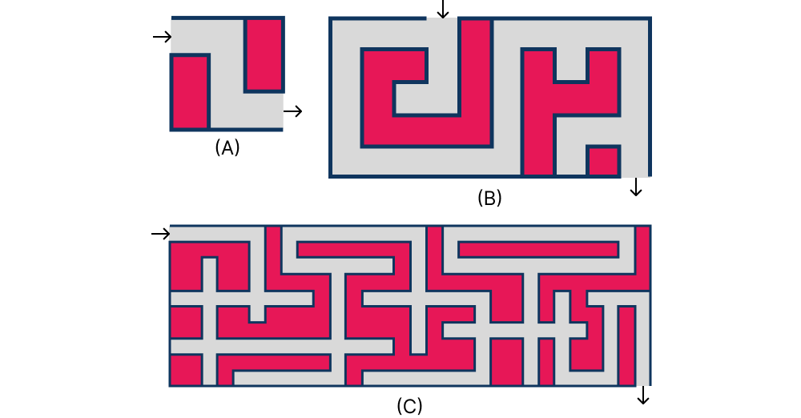

# Graph Algorithms - Application

<!--
<iframe src="https://adaacademy.hosted.panopto.com/Panopto/Pages/Embed.aspx?pid=6e2b199d-f7d8-4899-b750-afdc000581be&autoplay=false&offerviewer=true&showtitle=true&showbrand=true&captions=true&interactivity=all" height="405" width="720" style="border: 1px solid #464646;" allowfullscreen allow="autoplay"></iframe>
-->

## Overview

Rarely do we need to search through a graph just for the sake of searching. Instead, we use graphs to model real-world problems and then use graph algorithms to solve those problems. Often, additional data will need to be carried along with the graph, and the graph algorithms will need to be modified to take advantage of that data. In this lesson, we'll look at how graph searching can be used as the core of several problem approaches.

## Path Finding

Some of graph examples we have already seen involved places. Each node represented a city and each edge represented a road or other mode of transportation between the two connected cities. But why restrict ourselves to the scale of cities?

We could make the graph nodes represent city blocks, intersections, or even arbitrarily small areas of space, such as every 1 square meter area of floor in our home. Areas with no obstructions between them (such as a wall) could then be connected by edges. In this way we could build a graph representation of the entire world, or at least a small part of it.

For the moment, let's restrict our attention to something slightly smaller than the entire world. We could use a graph to represent a maze, where each node represents a small location in the maze and each edge represents a path between two locations. Representing the maze this way, we could solve the maze by searching for a path of connected nodes from the start of the maze to the end.

Thus far, we have only considered the _mechanics_ of searching algorithms, and the resulting order they would visit the nodes in a graph. Now, we will examine how we can use our ability to visit the nodes of a graph to discover a through the maze. To do so, we will need to consider how to represent the terrain of the maze, how to represent the maze as a graph, and how to modify our search algorithms to find a path through the maze.

### Maze Representation

There's no universal standard for how to describe a maze to a computer. The requirements of the description will vary based on the features of the maze. Is it curvy? Is it boxy (more formally we might say rectilinear)? Is it multi-level (overlapping)?

  
*Fig. Three rectilinear mazes of varying complexity.*

We'll keep things uncomplicated and restrict our mazes to a single level, rectilinear maze. There will be a single starting location, and single exit. We could use text, an image, or even a 3D model to describe the maze, but for our purposes, text will be the easiest to work with.

Consider the first maze depicted above. We can describe it as a series of rows and columns, where each cell is either a wall or a passage. We could use the following structure to describe the maze:

```py
maze_a = [
    "  #",
    "# #",
    "#  ",
]
```

Each character represents a cell in the maze. A space represents a passage, and a `#` represents a wall. The first row of the maze is represented by the first string in the list, the second row by the second string, and so on.

The other mazes can also be represented with this structure as shown below:

```py
maze_b = [
    "    #     ",
    " ## # # # ",
    " #  # ### ",
    " #### #   ",
    "      # # ",
]

maze_c = [
    "      #         #            #",
    "##### # ####### # ########## #",
    "## ## #       # #            #",
    "## ## #### #### ###### #######",
    "         # #        ## # #    ",
    "## ## #### #### ### ## # ## # ",
    "## ####### #### #         # # ",
    "              # ### ## # ## # ",
    "## ####### ######## ## # ## # ",
    "## #       #        ## #    # ",
]
```

One point to note is that the representations above do not explicitly indicate the start and end of the maze. We could add additional information to the representation to indicate the start and end (perhaps the start and end could be marked with "S" and "E" characters), but for now, we'll assume that information will be provided to us separately, such as tuples indicating the row and column of the start and end positions.

### Representing a Maze as a Graph

### Building a Path

### Limitations

### Complexity

## Map Coloring

### Problem Statement

### Representing Maps as Graphs

### Coloring Nodes

### Backtracking

### Limitations

### Complexity

### Alternative Approaches

### Scheduling and Resource Allocation Problems

## Summary


