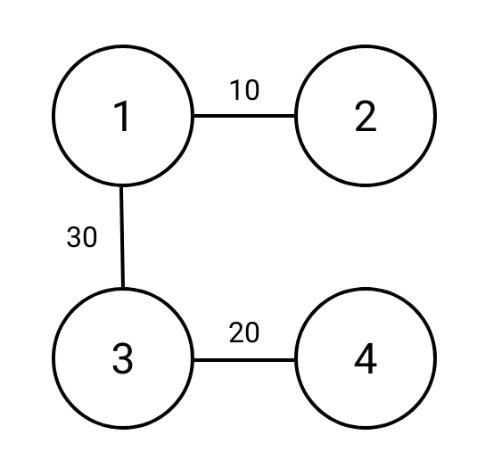
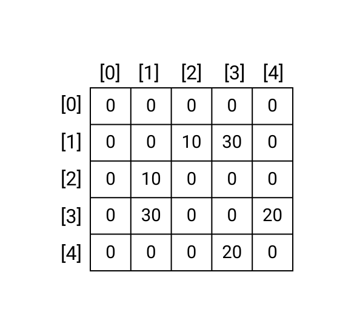

# Graph Representations Review

## Overview of Graphs
In the previous topic, we talked about graphs, how to represent them, and two algorithms for traversing graphs: breadth first search and depth first search. This topic will review and extend some key concepts from the previous topic. It will also introduce Dijkstra's algorithm which will allow us to solve a new subset of graph problems. 
<!-- Add more advanced review questions -->


<!-- ======================= END CHALLENGE ======================= -->
## Graph Representations

In the previous topic, we introduced three methods for representating graphs: list of edges, adjacency matrix, and adjacency lists. An adjacency list can also be formed with a dictionary. 

### !challenge

* type: multiple-choice
* id: 36416c92-a94c-4da8-9719-c7b67bc59d3f
* title: Graph Conversions
* points: 1

##### !question
```python
list_of_edges = 
[
[1,2],
[2,3],
[2,4],
[3,4],
[1,5],
[1,4],
[4,6],
[3,6]
]
```
Choose the adjacency matrix that represents the same graph as the list of edges above. The list of edges represents an _undirected_ and _unweighted_ graph. 
##### !end-question

##### !options

a| ```python
    adj_matrix = [
        [0, 0, 0, 0, 0, 0, 0],
        [0, 0, 1, 0, 1, 1, 0],
        [1, 1, 0, 0, 0, 0, 0],
        [0, 0, 1, 0, 1, 1, 1],
        [0, 1, 1, 1, 0, 1, 1],
        [0, 1, 0, 0, 0, 1, 0],
        [1, 1, 1, 1, 1, 1, 1]
    ]
b| ```python
    adj_matrix = [
        [0, 0, 1, 1, 0, 0, 0],
        [0, 0, 1, 0, 1, 1, 0],
        [0, 1, 0, 1, 1, 0, 0],
        [0, 0, 1, 0, 1, 0, 1],
        [0, 1, 1, 1, 0, 0, 1],
        [0, 1, 0, 0, 0, 0, 0],
        [0, 0, 0, 1, 1, 0, 0]
    ]
c| ```python
    adj_matrix = [
        [0, 0, 0, 0, 0, 0, 0],
        [0, 0, 1, 0, 1, 1, 0],
        [0, 1, 0, 1, 1, 0, 0],
        [0, 0, 1, 0, 1, 0, 1],
        [0, 1, 1, 1, 0, 0, 1],
        [0, 1, 0, 0, 0, 0, 0],
        [0, 0, 0, 1, 1, 0, 0]
    ]
##### !end-options

##### !answer

c|

##### !end-answer

<!-- other optional sections -->
##### !hint 
Consider using the list of edges to draw out the graph on a piece of paper. Then convert the drawing to an adjacency matrix. 

<details>
<summary>See our drawing of the graph below</summary>
<div style="position: relative; width: 100%; height: 0; padding-top: 100.0000%;
 padding-bottom: 0; box-shadow: 0 2px 8px 0 rgba(63,69,81,0.16); margin-top: 1.6em; margin-bottom: 0.9em; overflow: hidden;
 border-radius: 8px; will-change: transform;">
  <iframe loading="lazy" style="position: absolute; width: 100%; height: 100%; top: 0; left: 0; border: none; padding: 0;margin: 0;"
    src="https:&#x2F;&#x2F;www.canva.com&#x2F;design&#x2F;DAFgMkiiMTE&#x2F;view?embed" allowfullscreen="allowfullscreen" allow="fullscreen">
  </iframe>
</div>
<a href="https:&#x2F;&#x2F;www.canva.com&#x2F;design&#x2F;DAFgMkiiMTE&#x2F;view?utm_content=DAFgMkiiMTE&amp;utm_campaign=designshare&amp;utm_medium=embeds&amp;utm_source=link" target="_blank" rel="noopener">dijkstra-q1-graph</a> 

Watch the graph be drawn:

<iframe src="https://adaacademy.hosted.panopto.com/Panopto/Pages/Embed.aspx?id=7d3983a7-0f67-4782-88d7-afe50161ada7&autoplay=false&offerviewer=true&showtitle=true&showbrand=true&captions=true&interactivity=all" height="405" width="720" style="border: 1px solid #464646;" allowfullscreen allow="autoplay"></iframe>

##### !end-hint
<!-- !rubric - !end-rubric (markdown, instructors can see while scoring a checkpoint) -->
##### !explanation 
In Option A, the last row has index 6 and therefore represents edges stemming from node 6. Each element of row 6 is a `1` indicating that node 6 has an edge to every other node in the graph, however the list of edges indicates node 6 is only connected to two other nodes in the graph, nodes 3 and 4.

In Option B, `adj_matrix[0][2]` and `adj_matrix[0][3]` indicates there is an edge from node 0 to node 2 and from node 0 to node 3 but that is not reflected in the list of edges. 

In Option C, each row-column intersection can also be found in the list of edges. Therefore, the answer is C.

See the video below for an example of translating the list of edges to an adjacency matrix. 

<iframe src="https://adaacademy.hosted.panopto.com/Panopto/Pages/Embed.aspx?id=8ae40a35-a45c-4424-977d-afe5015ea21e&autoplay=false&offerviewer=true&showtitle=true&showbrand=true&captions=true&interactivity=all" height="405" width="720" style="border: 1px solid #464646;" allowfullscreen allow="autoplay"></iframe>

##### !end-explanation 

### !end-challenge

<!-- ======================= END CHALLENGE ======================= -->

<!-- Write code to convert list of edges to adjacency matrix -->

### Representing Weighted Graphs

We can also represent weighted graphs with slight alterations to the same formats.

#### List of Edges
With a list of edges, we simply add a third value to each edge list representing the weight of that edge.



For example, the following list represents the weighted graph above as a list of edges:

```py
list_of_edges = [
    [1, 2, 10],
    [1, 3, 30],
    [3, 4, 20]
]
```

#### Adjacency Matrix

With an adjacency matrix, we can use the value of each row-column intersection in the matrix to represent the weight of each edge. Generally, values of 0 are still used to indicate the absence of an edge. However, if we wanted to allow for edges with zero or negative values, we could use a value like `None` to represent the absence of an edge.


Below is an example matrix of the above graph. Notice that in this graph we use a zero value to indicate the absence of an edge.



The above weighted matrix can be represented in Python as follows:

```py
adj_matrix = [
    [0, 0, 0, 0, 0],
    [0, 0, 10, 30, 0],
    [0, 10, 0, 0, 0],
    [0, 30, 0, 0, 20],
    [0, 0, 0, 20, 0]
]
```


#### Adjacency List
With an adjacency list, tuples are commonly used to pair each destination node in a source node's edge list with the edge weight. 


```py
adj_list = [
    [],
    [(2, 10), (3, 30)],
    [(1, 10)],
    [(1, 30), (4, 20)],
    [(3,20)]
]
```
Other data structures such as lists and dictionaries can also be used as an alternative to tuples to pair the destination node with the edge weight

If we wanted to represent the same graph as an adjacency dictionary, it would look like the following:

```py
adj_dict = {
    1: [(2, 10), (3, 30)],
    2: [(1, 10)],
    3: [(1, 30), (4, 20)],
    4: [(3, 20)]
}
```

### Hidden Graphs

Many interview problems can be solved using graph theory even though they are not explicitly framed as graph problems. Problems in this category usually do not provide the graph as a list of edges, adjacency list, or adjacency matrix. Instead, it is on you as the interviewee to think about how you can transform the given information into a graph.

One common scenario is a problem in which we are given a 2D matrix or grid. This matrix is **not** an adjacency matrix. In an adjacency matrix, each value in the matrix represents either the presence or absence of an _edge_ between two nodes in the graph. In these 'hidden graph' problems, each value in the matrix represents a _node_ in the graph.

Consider the following problem:
 
> Given an `mxn` 2D binary grid `grid` which represents a map of 
> `1`s (land) and `0`s (water) return _the number of islands_.
> 
> An **island** is surrounded by water and is formed by connecting adjacent lands
> horizontally or vertically. You may assume all four edges of the grid are all 
> surrounded by water. 

[Number of Islands](https://leetcode.com/problems/number-of-islands/)

If the following grid was passed in, we would expect our function to return `3` because there are three groups of adjacent 1s.

```python
grid = [
  ["1","1","0","0","0"],
  ["1","1","0","0","0"],
  ["0","0","1","0","0"],
  ["0","0","0","1","1"]
]

```
<!-- Add image of the islands -->

Notice that values of `1` in the grid represent land; values of `1` do not represent the presence of an edge between the row and column index nodes, therefore `grid` is not an adjacency matrix. Also notice that the grid we are given is _not_ a square matrix. An adjacency matrix will always be a square `nxn` matrix wher `n` is the number of nodes in the graph. Even though the problem does not provide us with a graph representation we are familiar with, we can still transform the grid into a graph. 

We can think of the overall grid as our graph with each value in the grid representing a potential node. Each node has four potential neighbors: the values one left, right, up, or down of it. 

We can refine our graph to say that only pieces of land (`1`s) are actual nodes in the graph. Each of its four potential neighbors are actual neighbors if they have a value of `1`. That is to say, there is an edge between two `1`s if they are adjacent. 

Imagining the graph in this way, we can pseudocode the following solution:

```
- Create a variable `num_islands` to track the number of islands by one
- Create a list of visited values
- Iterate through each value in the grid
    - If the value is land and has not yet been visited
        - Increase `num_islands` by one
        - Start a breadth first or depth first traversal with the current value
          as the start node
            - To loop through the neighbors, check the values up, down, left,
              and right of the current value
                - If the potential neighbor has a value `1` and is unvisited add
                  it to the queue/stack
    - Add the value to list of visited values
- Return `num_islands`
```

Recall that breadth first search and depth first search in their most basic form only find _connected_ elements in a graph, so BFS/DFS will be performed multiple times, one for each island. You can try solving this problem on [Leetcode](https://leetcode.com/problems/number-of-islands/)


<!-- >>>>>>>>>>>>>>>>>>>>>> BEGIN CHALLENGE >>>>>>>>>>>>>>>>>>>>>> -->
<!-- Replace everything in square brackets [] and remove brackets  -->

### !challenge

* type: paragraph
* id: 90ba81b1-027b-4760-a801-5c27feed732f
* title: Word Search Graph
* points: 1

##### !question

Consider the following problem.

> Given an `m x n` grid of characters `board` and a string `word`, return `True` if `word` exists in the grid. 
>
> The word can be constructed from letters of sequentially adjacent cells, where adjacent cells are horizontally or vertically neighboring. The same letter cell may not be used more than once. 

Example)


Input: `board = [["A","B","C","E"],["S","F","C","S"],["A","D","E","E"]]`

`word = "ABCCED"`

Output: `True`

[word search](https://leetcode.com/problems/word-search/)

Write out the steps to solve the above problem using a modified breadth first or depth first search.

Spend no more then 10 minutes working through this independently. Use the hints below or reach out for help if you are still feeling stuck after 10 minutes.

##### !end-question

##### !placeholder


##### !end-placeholder

##### !answer

/.*/

##### !end-answer

<!-- other optional sections -->
##### !hint
What would be the nodes of the graph?

What would be the edges of the graph?

How would you find your start and end nodes in your traversal (breadth first or depth first search)? 

How will you know if you have found the entire word?

Would you need to perform multiple iterations of breadth first or depth first search?
##### !end-hint
<!-- !rubric - !end-rubric (markdown, instructors can see while scoring a checkpoint) -->
##### !explanation 
Each letter can be thought of as a node in the graph. A node has four potential neighbors, the letters left, right, up, and down of it. 

One example of possible pseudocoded solution:

```
- Create a list of visited values
- Initialize a variable `word_length` the number of letters in `word` 
  traversed so far to zero
- Iterate through each value in the grid
    - Add the value to the list of visited values
    - If the value is the first letter in `word` and has not yet been 
      visited
        - Start a breadth first or depth first traversal with the current
          value as the start node
            - Increment `word_length` by one
            - If `word_length` is equal to the length of `word`
                - Return `True`
            - To loop through the neighbors, check the values up, down,
              left, and right of the current value
                - If the potential neighbor is the next letter in `word`
                  add it to the queue/stack
- Return `False`
```
##### !end-explanation 

### !end-challenge
