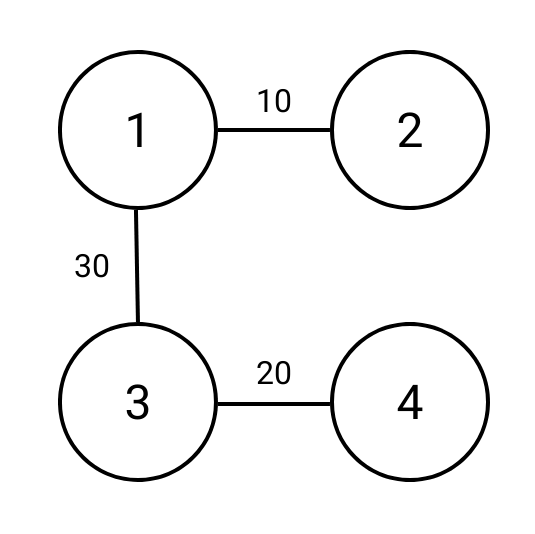
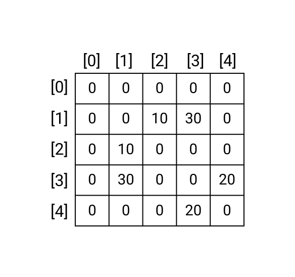

# Graphs Review

## Overview of Graphs
In the previous topic, we talked about graphs, how to represent them, and two algorithmsfor traversing graphs: breadth first search and depth first search. This topic will review and extend some key concepts from the previous topic. It will also introduce Dijkstra's algorithm which will allow us to solve a new subset of graph problems. 
<!-- Add more advanced review questions -->


<!-- ======================= END CHALLENGE ======================= -->
## Graph Representations

In the previous topic, we introduced three methods for representating graphs: list of edges, adjacency matrix, and adjacency lists. An adjacency list can also be formed with a dictionary. 

### !challenge

* type: multiple-choice
* id: 36416c92-a94c-4da8-9719-c7b67bc59d3f
* title: Graph Conversions
* points: 1

##### !question
```python
list_of_edges = 
[
[1,2],
[2,3],
[2,4],
[3,4],
[1,5],
[1,4],
[4,6],
[3,6]
]
```
Choose the adjacency matrix that represents the same graph as the list of edges above. The list of edges represents an _undirected_ and _unweighted_ graph. 
##### !end-question

##### !options

a| ```python
    adj_matrix = [
        [0, 0, 0, 0, 0, 0, 0],
        [0, 0, 1, 0, 1, 1, 0],
        [1, 1, 0, 0, 0, 0, 0],
        [0, 0, 1, 0, 1, 1, 1],
        [0, 1, 1, 1, 0, 1, 1],
        [0, 1, 0, 0, 0, 1, 0],
        [1, 1, 1, 1, 1, 1, 1]
    ]
b| ```python
    adj_matrix = [
        [0, 0, 1, 1, 0, 0, 0],
        [0, 0, 1, 0, 1, 1, 0],
        [0, 1, 0, 1, 1, 0, 0],
        [0, 0, 1, 0, 1, 0, 1],
        [0, 1, 1, 1, 0, 0, 1],
        [0, 1, 0, 0, 0, 0, 0],
        [0, 0, 0, 1, 1, 0, 0]
    ]
c| ```python
    adj_matrix = [
        [0, 0, 0, 0, 0, 0, 0],
        [0, 0, 1, 0, 1, 1, 0],
        [0, 1, 0, 1, 1, 0, 0],
        [0, 0, 1, 0, 1, 0, 1],
        [0, 1, 1, 1, 0, 0, 1],
        [0, 1, 0, 0, 0, 0, 0],
        [0, 0, 0, 1, 1, 0, 0]
    ]
##### !end-options

##### !answer

c|

##### !end-answer

<!-- other optional sections -->
##### !hint 
Consider using the list of edges to draw out the graph on a piece of paper. Then convert the drawing to an adjacency matrix. 

<details>
<summary>See our drawing of the graph below</summary>
<div style="position: relative; width: 100%; height: 0; padding-top: 100.0000%;
 padding-bottom: 0; box-shadow: 0 2px 8px 0 rgba(63,69,81,0.16); margin-top: 1.6em; margin-bottom: 0.9em; overflow: hidden;
 border-radius: 8px; will-change: transform;">
  <iframe loading="lazy" style="position: absolute; width: 100%; height: 100%; top: 0; left: 0; border: none; padding: 0;margin: 0;"
    src="https:&#x2F;&#x2F;www.canva.com&#x2F;design&#x2F;DAFgMkiiMTE&#x2F;view?embed" allowfullscreen="allowfullscreen" allow="fullscreen">
  </iframe>
</div>
<a href="https:&#x2F;&#x2F;www.canva.com&#x2F;design&#x2F;DAFgMkiiMTE&#x2F;view?utm_content=DAFgMkiiMTE&amp;utm_campaign=designshare&amp;utm_medium=embeds&amp;utm_source=link" target="_blank" rel="noopener">dijkstra-q1-graph</a> 

Watch the graph be drawn:

<iframe src="https://adaacademy.hosted.panopto.com/Panopto/Pages/Embed.aspx?id=7d3983a7-0f67-4782-88d7-afe50161ada7&autoplay=false&offerviewer=true&showtitle=true&showbrand=true&captions=true&interactivity=all" height="405" width="720" style="border: 1px solid #464646;" allowfullscreen allow="autoplay"></iframe>

##### !end-hint
<!-- !rubric - !end-rubric (markdown, instructors can see while scoring a checkpoint) -->
##### !explanation 
In Option A, the last row has index 6 and therefore represents edges stemming from node 6. Each element of row 6 is a `1` indicating that node 6 has an edge to every other node in the graph, however the list of edges indicates node 6 is only connected to two other nodes in the graph, nodes 3 and 4.

In Option B, `adj_matrix[0][2]` and `adj_matrix[0][3]` indicates there is an edge from node 0 to node 2 and from node 0 to node 3 but that is not reflected in the list of edges. 

In Option C, each row-column intersection can also be found in the list of edges. Therefore, the answer is C.

See the video below for an example of translating the list of edges to an adjacency matrix. 

<iframe src="https://adaacademy.hosted.panopto.com/Panopto/Pages/Embed.aspx?id=8ae40a35-a45c-4424-977d-afe5015ea21e&autoplay=false&offerviewer=true&showtitle=true&showbrand=true&captions=true&interactivity=all" height="405" width="720" style="border: 1px solid #464646;" allowfullscreen allow="autoplay"></iframe>

##### !end-explanation 

### !end-challenge

<!-- ======================= END CHALLENGE ======================= -->

<!-- Write code to convert list of edges to adjacency matrix -->

### Representing Weighted Graphs

We can also represent weighted graphs with slight alterations to the same formats.

#### List of Edges
With a list of edges, we simply add a third value to each edge list representing the weight of that edge.



For example, the following list represents the weighted graph above as a list of edges:

```py
list_of_edges = [
    [1, 2, 10],
    [1, 3, 30],
    [3, 4, 20]
]
```

#### Adjacency Matrix

With an adjacency matrix, we can use the value of each row-column interesection in the matrix represents the weight of each edge. Generally, values of 0 are still used to indicate the absence of an edge. However, if we wanted to allow for edges with zero or negative values, we could use a value like `None` to represent the absence of an edge.


Below is an example matrix of the above graph. Notice that in this graph we use a zero value to indicate the absence of an edge.



The above weighted matrix can be represented in Python as follows:

```py
adj_matrix = [
    [0, 0, 0, 0, 0],
    [0, 0, 10, 30, 0],
    [0, 10, 0, 0, 0],
    [0, 30, 0, 0, 20],
    [0, 0, 0, 20, 0]
]
```


#### Adjacency List
With an adjacency list, tuples are commonly used to pair each destination node in a source node's edge list with the edge weight. 


```py
adj_list = [
    [],
    [(2, 10), (3, 30)],
    [(1, 10)],
    [(1, 30), (4, 20)],
    [(3,20)]
]
```
Other data structures such as lists and dictionaries can also be used as an alternative to tuples to pair the destination node with the edge weight

If we wanted to represent the same graph as an adjacency dictionary, it would look like the following:

```py
adj_dict = {
    1: [(2, 10), (3, 30)],
    2: [(1, 10)],
    3: [(1, 30), (4, 20)],
    4: [(3, 20)]
}
```

### Hidden Graphs

Many interview problems can be solved as graph problems are not clearly defined as graph problems and will not give you a list of edges, adjacency list, or adjacency matrix. 

These 

<!-- Write code to convert graphs -->


## Breadth First Search & Depth First Search Review

### Breadth First Search (BFS)
Recall from the last lesson that the breadth first search (BFS) algorithm starts its traversal with a particular node and then visits each node connected to the starting node before expanding outward.


Breadth first search uses a queue to visit nodes in order of proximity to the starting node. It accomplishes this by first adding each of the starting node's neighbors to the queue. The algorithm then removes nodes from the queue one at a time, adding each removed node's unvisited neighbors to both the queue for further processing and the list of visited nodes as it goes along.

### Depth First Search (DFS)
In contrast, the depth first search (DFS) algorithm starts at a particular node and then follows a continuous path of edges from that node as deeply as possible before backing up and following the next path. This pattern of traversal is also referred to as back-tracking.


Depth first search requires the use of a stack. The algorithm first adds each of the starting node's neighbors to the stack. It then removes nodes from the stack one at a time in last-in-first-out order and marks the removed node as visited. It adds each removed node's unvisited neighbors to the stack and repeats the process until the stack is empty. 

<!-- Add quesetion: Is this BFS or DFS -->

### Using Breadth First Search to Find the Shortest Path in an Unweighted Graph

Breadth first search can easily be adapted to find the shortest path between any two nodes in an unweighted graph. In order to retrieve the shortest path using the BFS algorithm, we would need to modify the algorithm to store the current shortest distance to the target node as well as the preceding node in the shortest path. This is essentially what Dijkstra's algorithm does, which we will learn more about in the next section. 

Again, you may recall BFS visits nodes based on *proximity*. It starts by visiting nodes one edge away from the start node (its neighbors). Then it visits nodes that are two edges away from the starting node (neighbor's neighbors), etc. Therefore, the BFS algorithm can be modified to record the smallest path from an initial node to any other connected node in the graph. The big difference between Dijkstra's Algorithm and BFS is that Dijkstra's uses the *weights* of the edges to determine the next node to consider rather than just the number of edges. Again, we'll talk about Dijkstra's algorithm more in the next section.

### Why DFS does not find shortest path

The main reason the DFS algorithm is not typically used to find the shortest path is because DFS is not a "greedy" algorithm. The algorithm is not designed to account for changes in logic based on the data it encounters, which is what is needed for finding the shortest path in a graph.

The DFS algorithm does not take a nodes' proximity into consideration when making its traversal, so it's not useful for tracking the distance between nodes.

## !callout
A greedy algorithm is an approach for solving a problem by selecting the best option available at the moment. A greedy algorithm never reverses the earlier decision even if the choise is wrong. An algorithm which is considered greedy may not produce the best result for all problems.
## !end-callout

## BFS, DFS, or Either

<!-- >>>>>>>>>>>>>>>>>>>>>> BEGIN CHALLENGE >>>>>>>>>>>>>>>>>>>>>> -->
<!-- Replace everything in square brackets [] and remove brackets  -->

### !challenge

* type: multiple-choice
* id: e012797e-0060-4484-b3b4-245fa4152228
* title: BFS, DFS, Either, or Neither?
* points: 0

##### !question

If we are looking for a node in a graph that is many levels deeper than the starting node, is BFS, DFS, Either, or Neither the best option?

##### !end-question

##### !options

a| Breadth First Search
b| Depth First Search
c| Either
d| Neither

##### !end-options

##### !answer

b|

##### !end-answer

##### !explanation

The correct answer is B because it is faster and more efficent to reach nodes deeper in the graph with Depth First Search.

##### !end-explanation 

### !end-challenge

### !challenge

* type: multiple-choice
* id: b8569433-61d6-48e0-afa2-5b28e3e9facf
* title: BFS, DFS, Either, or Neither?
* points: 0

##### !question

If we are looking to find all the connected nodes in a graph, is BFS, DFS, Either, or Neither the best option?

##### !end-question

##### !options

a| Breadth First Search
b| Depth First Search
c| Either
d| Neither

##### !end-options

##### !answer

c|

##### !end-answer

##### !explanation

The correct answer is C because either algorithm can be used to find all of the connected nodes in a graph. They both have similar time complexity with DFS being only slightly faster on average.

##### !end-explanation 

### !end-challenge

<!-- ======================= END CHALLENGE ======================= -->

## Introduction to Dijkstra's Algorithm

As mentioned earlier, a modified version of BFS only allows us to find the shortest path between two nodes in an unweighted graph. One way to further modify the BFS algorithm to find the shortest distance between two nodes is by implementing what is called Dijkstra's Algorithm. 

We will learn more about Dijkstra's Algorithm in the following lesson.
