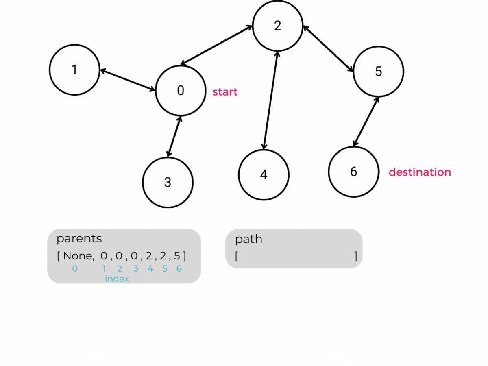

# Breadth First Search & Depth First Search Review

### Breadth First Search (BFS)
Recall from the last lesson that the breadth first search algorithm starts its traversal with a particular node and then visits each node connected to the starting node before expanding outward.

Breadth first search uses a queue to visit nodes in order of proximity to the starting node. It accomplishes this by first adding each of the starting node's neighbors to the queue. The algorithm then removes nodes from the queue one at a time, adding each removed node's unvisited neighbors to both the queue for further processing and the list of visited nodes as it goes along.

### Depth First Search (DFS)
In contrast, the depth first search (DFS) algorithm starts at a particular node and then follows a continuous path of edges from that node as deeply as possible before backing up and following the next path. This pattern of traversal is also referred to as back-tracking.

Depth first search requires the use of a stack. The algorithm first adds each of the starting node's neighbors to the stack. It then removes nodes from the stack one at a time in last-in-first-out order and marks the removed node as visited. It adds each removed node's unvisited neighbors to the stack and repeats the process until the stack is empty. 

<!-- >>>>>>>>>>>>>>>>>>>>>> BEGIN CHALLENGE >>>>>>>>>>>>>>>>>>>>>> -->
<!-- Replace everything in square brackets [] and remove brackets  -->

### !challenge

* type: multiple-choice
* id: b1de5505-dd04-4f45-b159-277342627a8f
* title: Traversal Order
* points: 1
<!-- * topics: [python, pandas] (Checkpoints only. optional the topics for analyzing points) -->

##### !question

A traversal of the above graph with `apple` as the start node returns the following list of visited nodes. 

`visited = [apple, guava, banana, orange, kiwi, lychee]`

Which of the following traversal algorithms could visit the nodes in the listed order?

##### !end-question

##### !options

a| Breadth First Search
b| Depth First Search
c| Neither

##### !end-options

##### !answer

b|

##### !end-answer

<!-- other optional sections -->
<!-- !hint - !end-hint (markdown, hidden, students click to view) -->
<!-- !rubric - !end-rubric (markdown, instructors can see while scoring a checkpoint) -->
##### !explanation 

##### !end-explanation

The answer is B, depth first search.

If `guava` was the first of apple's neighbors to be popped off the stack, depth first search would then visit one of `guava`'s neighbors `banana` or `lychee` next (depending on the order they were placed on the stack). If it visited `banana` first, it would then visit `orange`, `kiwi`, and `lychee` in that order. 

Breadth first search would visit `apple`'s three neighbors - `guava`, `lychee`, and `kiwi` - before visiting `banana` or `orange`.

### !end-challenge

<!-- ======================= END CHALLENGE ======================= -->

### Using Breadth First Search to Find the Shortest Path in an Unweighted Graph

Breadth first search can easily be adapted to find the shortest path between any two nodes in an **unweighted** graph. The length of a path in an unweighted graph is the number of edges it takes to travel from the source node to the destination node. Again, recall that breadth first search visits nodes based on *proximity*. It starts by visiting nodes one edge away from the start node (its neighbors). Then it visits nodes that are two edges away from the starting node (neighbor's neighbors), etc. Therefore, the BFS algorithm can be modified to record the smallest path from an initial node to any other connected node in the graph. 

In order to retrieve the shortest path from the start node to any other node in the graph, we would need to modify breadth first search to store the current shortest distance to the target node as well as the preceding node in the shortest path. The preceding node may also be referred to as the parent node. 

In the above visualization, we have two additional lists. The indices of each list represent the nodes in the graph. The `parents` list initially indicates that the parent of each node in the graph is `None`. As we loop through a particular node's neighbors, we update each neighbor's parent node to be the current node. For example, as we loop through node 0's neighbors, the values of `parents[1]`, `parents[2]`, and `parents[3]` are all updated to 0 to indicate that the previous node on the path from the start node to nodes 1, 2, and 3 is the start node itself.

The distance to the start node `distance[0]` is initialized to 0 to indicate that the distance from the start node to itself is zero. The initial distance to all other nodes in the `distance` list is set to infinity to indicate the algorithm has not yet found a path to these nodes.

As the algorithm traverses new nodes, it updates the distance from the start node to the new node. The distance to a new node will be the distance to its parents node plus one. For example, node 6's parent node is node 5. `distance[5]` is `2` indicating that we have to travel along two edges to get from the start node 0 to node 5. Node 6 is node 5's neighbor, therefore the distance from node 0 to node 6 must be `2 + 1 =  3`. 

We can use the final `parents` list to trace the path from the start node to other nodes in the graph.

To do so, we start by adding the destination node to our path. We then use the `parents` list to find the destination node's parent, then the parent's parent, and so on. We've found our path when we reach the start node. 

We can then reverse the list and we have the path from the start node to the destination node.

<!-- available callout types: info, success, warning, danger, secondary, star  -->
### !callout-info

## Dijkstra's Algorithm

Dijkstra's Algorithm finds the shortest path in a _weighted_ graph. The algorithm uses the same technique of storing distances and preceding nodes to find the shortest path!

 

In fact, Dijkstra's can be thought of as a modified breadth first search.

### !end-callout

<!-- >>>>>>>>>>>>>>>>>>>>>> BEGIN CHALLENGE >>>>>>>>>>>>>>>>>>>>>> -->
<!-- Replace everything in square brackets [] and remove brackets  -->

### !challenge

* type: paragraph
* id: eda163d5-bf67-46a3-ae34-675a8ebf323a
* title: Distance to Unconnected Nodes
* points: 1

##### !question

Imagine we completed a breadth first search to find the shortest path from the start node `3` to all other nodes in the graph. What would our `distance` list state is the distance to node `0` (if implemented like the example in the above section)?

##### !end-question

##### !placeholder

##### !end-placeholder

<!-- other optional sections -->
##### !hint 
The initial distance to each non-start node in the graph is set to infinity. 

##### !end-hint 
<!-- !rubric - !end-rubric (markdown, instructors can see while scoring a checkpoint) -->
##### !explanation 
Initially we set `distance[0]` to be infinity. 

Since breadth first search will never reach node 0 when it starts its traversal at node 3, `distance[0]` will remain infinity. In fact, the distance to any node that is unreachable by the start node will remain infinity. 
##### !end-explanation

### !end-challenge

<!-- ======================= END CHALLENGE ======================= -->

### Why Depth First Search Will Not Find the Shortest Path

In short, the depth first search algorithm does not take a nodes' proximity into consideration when making its traversal, so it's not useful for tracking the distance between nodes.

It is possible for a graph to contain multiple possible paths from the start node to a destination node. Because depth first search does not explore nodes in order of proximity, it is possible it will first encounter a node along a non-optimal path (optimal meaning the shortest path in this case). Both breadth first search and depth first search aim to visit each node exactly once, so if DFS encounters a node along a longer path, it will disregard any alternate routes it finds to that same node further on in its traversal. 

Consider the following graph. 

If we add the neighbors of the start node to the stack in the order they are listed in `adj_dictionary`, node 4 will be the last node added to the stack. DFS will then traverse node 4's neighbor node 3, and find node 2 via the path from node 0 -> node 4 -> node 3 -> node 2 when there is a shorter path available from node 0 -> node 1 -> node 2.

## BFS, DFS, or Either

<!-- >>>>>>>>>>>>>>>>>>>>>> BEGIN CHALLENGE >>>>>>>>>>>>>>>>>>>>>> -->
<!-- Replace everything in square brackets [] and remove brackets  -->

### !challenge

* type: multiple-choice
* id: e012797e-0060-4484-b3b4-245fa4152228
* title: BFS, DFS, Either, or Neither?
* points: 0

##### !question

If we are looking for a node in a graph that is many levels deeper than the starting node, is BFS, DFS, Either, or Neither the best option?

##### !end-question

##### !options

a| Breadth First Search
b| Depth First Search
c| Either
d| Neither

##### !end-options

##### !answer

b|

##### !end-answer

##### !explanation

The correct answer is B because it is faster and more efficent to reach nodes deeper in the graph with Depth First Search.

##### !end-explanation 

### !end-challenge

### !challenge

* type: multiple-choice
* id: b8569433-61d6-48e0-afa2-5b28e3e9facf
* title: BFS, DFS, Either, or Neither?
* points: 0

##### !question

If we are looking to find all the connected nodes in a graph, is BFS, DFS, Either, or Neither the best option?

##### !end-question

##### !options

a| Breadth First Search
b| Depth First Search
c| Either
d| Neither

##### !end-options

##### !answer

c|

##### !end-answer

##### !explanation

The correct answer is C because either algorithm can be used to find all of the connected nodes in a graph. They both have similar time complexity with DFS being only slightly faster on average.

##### !end-explanation 

### !end-challenge

<!-- ======================= END CHALLENGE ======================= -->

## Introduction to Dijkstra's Algorithm

As mentioned earlier, a modified version of breadth first search only allows us to find the shortest path between two nodes in an unweighted graph. A further modification to the breadth first search algorithm called Dijkstra's algorithm, allows us to find the shortest path in a weighted graph. 