# Dijkstra's Algorithm

## Overview 

We have observed that a breadth first search traversal allows us to find the shortest path between any two nodes in an unweighted graph. In an unweighted graph, the length of a path is equal to the number of the edges in the path.

With a weighted graph, finding the shortest path between two nodes looks slightly different. The weight of an edge is equivalent to the 'length' or 'distance' of the edge. The total length of a path is calculated by summing the weights of all the edges that make up at the path. The shortest path is also sometimes referred to as the minimum cost path where an edge's weight is equivalent to its cost.

Below are two versions of the same graph: the version on the left is unweighted and the version on the right is weighted.

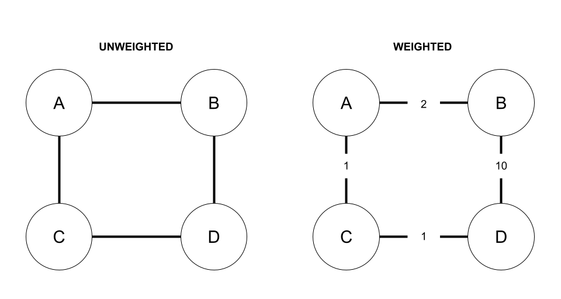

Say we want to find the shortest path from Node B to Node D. In the unweighted graph, the shortest path would be along the direct edge from B to D for a path of length 1. 

However, in the weighted graph, we see the shortest path from Node B to Node D travels from Node B to Node A, from Node A to Node C, and finally from Node C to Node D. The combined length of the path is the sum of the corresponding edges: 2 + 1 + 1 = 4. Because the edge directly between Node B to Node D has a weight or length of 10, it is considered a longer path even though it is a more direct route. 

Because of the change in how we calculate shortest paths when weighted edges exist, we are not able to use breadth first search to find the shortest path in weighted graphs. We need a new algorithm: Dijkstra's. 

## Dijkstra's Algorithm
<iframe src="https://adaacademy.hosted.panopto.com/Panopto/Pages/Embed.aspx?id=be4c815b-3566-474e-abc3-af2300403866&autoplay=false&offerviewer=true&showtitle=true&showbrand=true&captions=true&interactivity=all" height="405" width="720" style="border: 1px solid #464646;" allowfullscreen allow="autoplay"></iframe>

Dijkstra's algorithm takes a weighted graph and determines the least costly path from a specified start node to every other _reachable_ node in the graph.


Dijkstra's algorithm works by initially overestimating the cost to travel from the start node to every other node in the graph. It then operates similarly to breadth first search. Beginning at the given start node, Dijkstra's algorithm visits each direct neighbor of the current node. As it visits new nodes, the algorithm uses the weights of the corresponding edges to adjust the original estimated cost to each neighbor. 

We can see how it works in more detail with an example. The video walkthrough of this example is included at the top of this section.

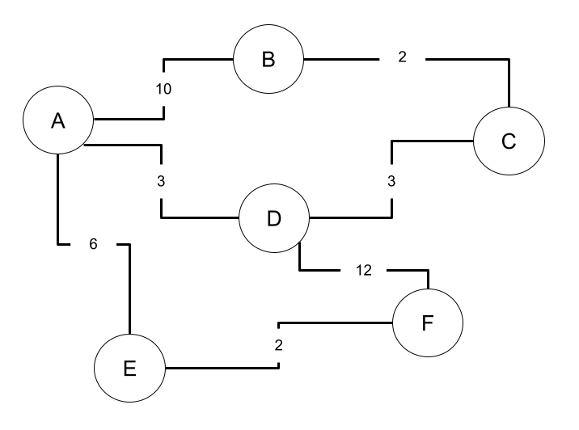
Step 0. We start with a weighted graph. 

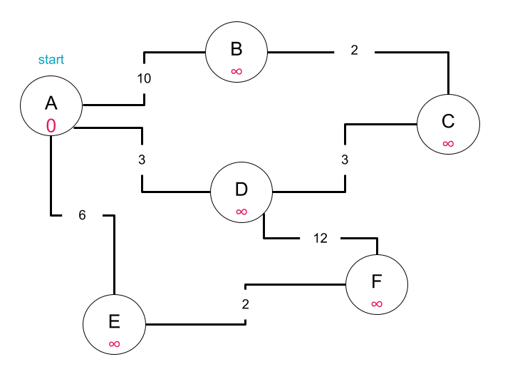
Step 1. We identify our start node, in this example Node A, and set the cost to travel from the start node to all nodes except itself to infinity, an obvious overestimation. The distance of the start node to itself is set to 0.

In the diagram above, the costs are denoted in magenta. 

```
current: A

costs/distances:
    - A: 0
    - B: ∞
    - C: ∞
    - D: ∞
    - E: ∞
    - F: ∞
```
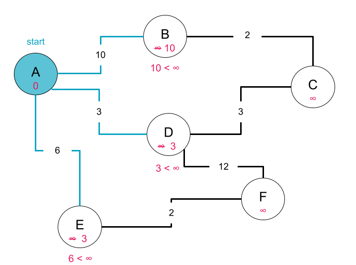
Step 2. We begin by visiting our start node, Node A, and looking at each of its edges. For each of Node A's edges, we check if the cost to travel along that edge to its neighbor is less than the current estimate of the cost to reach that neighbor. If so, we reset the distance of that neighbor to be equal to the weight of the edge. Since at this point in our traversal, all of the nodes have an estimated cost of infinity, the cost of traveling to each of Node A's neighbors will decrease.

For example, in the diagram above the edge from Node A to Node B has a weight of 10. 10 is clearly less than our current estimate of the cost to travel from Node A to B, infinity, so we update the cost of traveling from Node A to Node B to be the lesser value of 10. 

We add our start node to a list of visited nodes.

In the diagram above, visited nodes and edges are identified in teal. 

```
current: A

visited nodes: A

costs/distances:
    - A: 0
    - B: 10
    - C: ∞
    - D: 3
    - E: 6
    - F: ∞
```
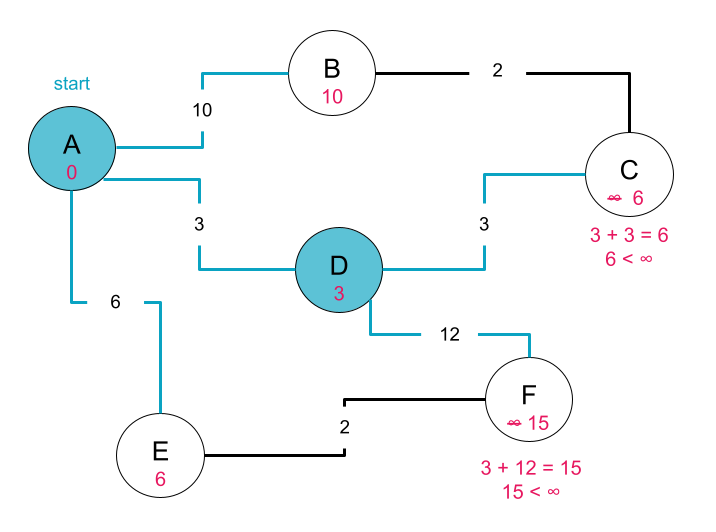
Step 3. We choose to visit Node D next because of all the unvisited nodes, it is currently estimated to be closest to our start node, Node A. Using the same methodology as Step 2, we look at Node D's _untravelled_ edges.

Node D has two unvisited edges, one to Node C and one to Node F. Notice that both of these nodes are not direct neighbors of our start node, Node A. Because our goal is to calculate the minimum cost to get from Node A to Nodes C and F, when considering whether we should update the cost to get to each of these nodes, we need to sum the cost of the edge from Node D to our destination node and whatever the cost to get from Node A to node D is. 

For example, from the work we did in Step 2, we know the cost to get from our start node to node D is 3. The weight of the edge from Node D to C is also 3. 3 + 3 = 6 which is less than the current estimate of infinity so we revise our estimate of the minimum cost to travel from Node A to Node C to be 6. 

We add Node D to the list of visited nodes and update the queue with all Node D's unvisited neighbors.

```
current: D

visited nodes: A, D

costs/distances:
    - A: 0
    - B: 10
    - C: 6
    - D: 3
    - E: 6
    - F: 15
```
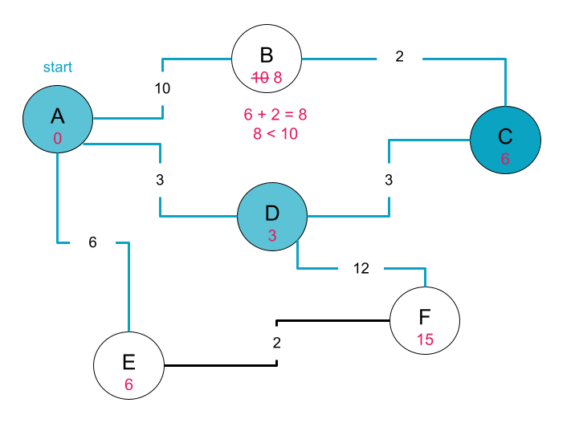
Step 4. Of the unvisited nodes in the graph, there is a tie for the node with minimum listed distance from our start node, Node A. Both Node C and Node E have a cost/distance of 6. We can choose either. Let's visit C next. 

Node C's only unvisited neighbor is Node B. Following the same logic as in Step 3, we sum the cost of travelling from our start node Node A to Node C with the sum of the edge from Node C to Node B. 
6 + 2 = 8 which is less than the currently listed cost of travel from Node A to Node B, 10 so we update our cost/distances list with our newly found minimum cost.

```
current: C

visited nodes: A, D, C

costs/distances:
    - A: 0
    - B: 8
    - C: 6
    - D: 3
    - E: 6
    - F: 15
```

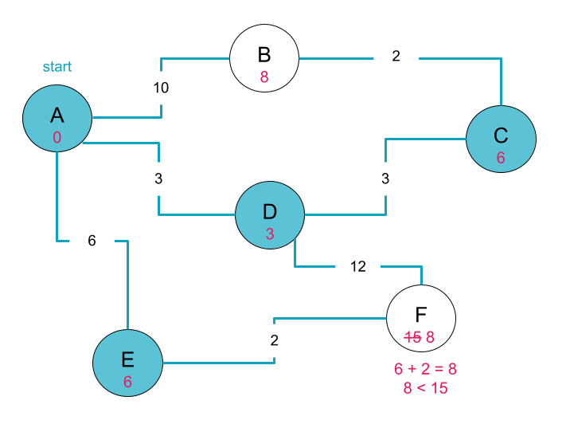
Step 5. Now Node E is the next as yet unvisited node that is closest to our starting point, Node A.

Node E's only unvisited neighbor is Node F. The minimum cost to travel from Node A to Node F is currently estimated to be 15 via the path from Node A -> Node D -> Node F. 

The sum of the cost to travel from Node A to Node E plus the cost to travel along Node E to Node F is 8. The cost of this new path 8 is less than that of the previously found path 15, so we revise our costs/distances list to reflect our new minimum cost.

We add Node E to the list of visited nodes, and its unvisited neighbor, Node F, to the queue.

```
current: E

visited nodes: A, D, C, E 

costs/distances:
    - A: 0
    - B: 8
    - C: 6
    - D: 3
    - E: 6
    - F: 8
```

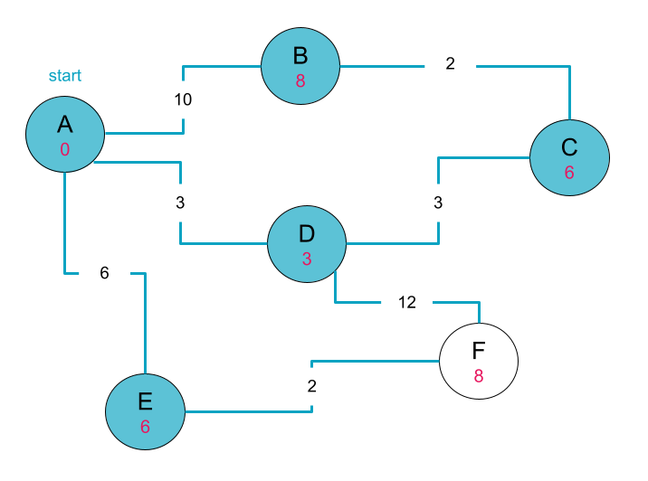
Step 6. Once again, we have a tie for the unvisited node that is the least far from the start node, Node A. Node B and Node F have equivalent listed cost/distance of 8 from Node A. Let's choose to visit Node B.

Node B has no unvisited neighbors, so we so we do not need to perform any further calculations. 

```
current: B

visited nodes: A, D, C, E, B

costs/distances:
    - A: 0
    - B: 8
    - C: 6
    - D: 3
    - E: 6
    - F: 8
```

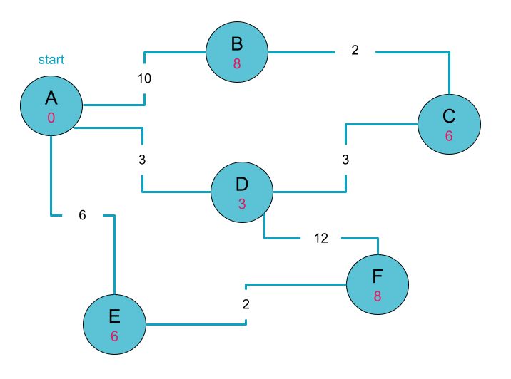
Step 7. Now we are visiting our final unvisited node, F. Like Node B, Node F has no unvisited neighbors.

We simply mark it as visited and then we are done! Our list of costs/distances now represents the minimum cost to travel from Node A to every node in the graph.

```
current: F

visited nodes: A, B, D, E, C, F

costs/distances:
    - A: 0
    - B: 8
    - C: 6
    - D: 3
    - E: 6
    - F: 8
```
<!-- available callout types: info, success, warning, danger, secondary, star  -->
### !callout-warning

## Limitations of Dijkstra's

There are limitations to Dijkstra's algorithm. Dijkstra's _does not work_ for graphs with negative weights. To find the shortest path in a graph with negative weights we can use the [Bellman Ford algorithm](https://www.programiz.com/dsa/bellman-ford-algorithm). This algorithm is outside the scope of our curriculum and appears only very occasionally in interviews for SDE1 positions, but we encourage you to follow your curiosity.


### !end-callout


## Pseudocode
The process outlined above can be generalized as pseudocode.

Before jumping into the pseudocode, observe that to find the cost of a path from Node A to a non-neighboring node D, we needed to know the cost of travelling from Node A to Node D's direct neighbor along that path.

In the example below, say we want to find the cost of the path from Node A to Node D. Node D's neighbor along that path is Node C. We could also say that Node C is the _previous_ or _parent_ node along that path. 

Observe that the cost to get from Node A to Node D is the cost to get from Node A to Node C plus the cost to get from Node D to Node C. 

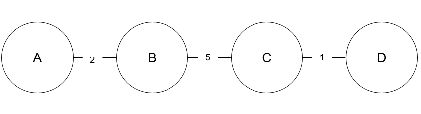

When calculating the cost of a path between two non-neighboring nodes, it helps to know the penultimate node along that path. As a result, when implementing Djikstra's algorithm it is useful for us to keep track of each node's parent node along its minimum cost path.


The following pseudocode implementation of Dijkstra's assumes that we are provided with a graph and a starting node.
```
- Create a distances list equal in length to the number of nodes in the graph
    - Tracks the minimum cost/distance from start node to each node in graph
    - Initialize each value to infinity
    - Initialize distances[start_node] to zero
- Create a previous list equal in length to the number of nodes in the graph
    - Tracks the previous node in each node's shortest/minimum cost path
    - Initialize each value to None since we have not yet traversed any paths
- Create a visited list to track which nodes have already been visited
- Create a priority queue and add the start node to it
- While the queue is not empty:
    - Set current as node in the queue with minimum cost
    - Add current to the list of visited nodes
    - loop through all the current node's neighbors
        - if the neighbor has not yet been visited:
            - calculate distance from start node to neighbor via current node
            - If calculated distance < distances[neighbor]
                - distances[neighbor] = calculated distance
                - previous[neighbor] = current_node
            - queue.append(neighbor)
- Return the previous and distances list

```

We could alternatively use dictionaries instead of lists to represent `distances` and `previous`. This is particularly useful when our nodes have non-numeric values. 

<!-- available callout types: info, success, warning, danger, secondary, star  -->
### !callout-info

## Priority Queues
You may recall that when we first introduced [queues](../02-linked-lists/04-linked-lists-stacks-queues.md), we said queues remove elements in first-in-first-out (FIFO) order. 

<break>

However, in our pseudocode above, we remove elements from the queue in order of minimum cost. This is a special type of queue called a **minimum priority queue**. There are also maximum priority queues where elements are removed in order of maximum cost/priority. 

<break> 

We will use the [`heapq`](https://docs.python.org/3/library/heapq.html) module in Python as our priority queue when we implement Dijkstra's. The internals of implementing a priority queue, also called a heap, are beyond the scope of this course, but we encourage you to follow your curiosity!
### !end-callout

### Challenge
<!-- >>>>>>>>>>>>>>>>>>>>>> BEGIN CHALLENGE >>>>>>>>>>>>>>>>>>>>>> -->
<!-- Replace everything in square brackets [] and remove brackets  -->

### !challenge

* type: code-snippet
* language: python3.6
* id: ea30a148-cce4-458e-a2f0-9f39de10e354
* title: Dijkstra's
* points: 1
<!-- * topics: [python, pandas] (Checkpoints only, optional the topics for analyzing points) -->

##### !question

Given a graph `g` and a start node `s` implement Dijkstra's Algorithm. 

The graph `g` is given as an adjacency matrix where `adj_matrix[i][j]` has a value equal to the weight of the edg between nodes `i` and `j`. A value of zero indicates that there is no edge between node `i` and `j`. The start node `s` is the index of the node. 

Return a dictionary that has two keys:
  - `previous` whose value is a list of the previous nodes in the shortest path from node `s` to the `i`th node
  - `distances` whose value is a list of the distance/cost of the shortest path from node `s` to the `i`th node in the graph `g`.

Example Input:
```python
    g = [
        [0, 4, 0, 0],
        [4, 0, 12, 0],
        [0, 12, 0, 0],
        [0,  0, 0, 0]
        ]
    s = 0
```
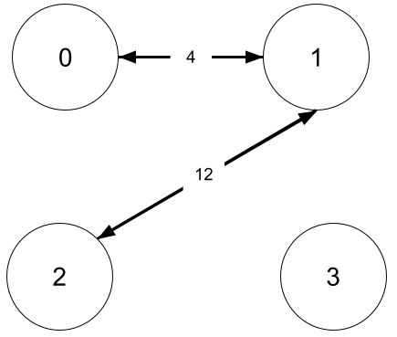

Output:
```py
    {
        'previous': [None, 0, 1, None],
        'distances': [0,4,16,float('inf')]
    }
```

 Spend no more then 15-20 minutes working through this independently. Use the hints below or reach out for help if you are still feeling stuck after 15-20 minutes.

##### !end-question

##### !placeholder
```py
import heapq
def dijkstra(g, s):
    # Hint: Use float('inf') to represent infinity
    # Hint: use heapq to implement a priority queue
    pass
                

        

```

##### !end-placeholder

##### !tests

```py
import unittest
from main import *

class TestPython1(unittest.TestCase):

    def test_with_sample_matrix(self):
        adjacency_matrix = [
            [ 0, 4, 0, 0, 0, 0, 0, 8, 0 ], 
            [ 4, 0, 8, 0, 0, 0, 0, 11, 0 ], 
            [ 0, 0, 7, 0, 9, 14, 0, 0, 0 ], 
            [ 0, 8, 0, 7, 0, 4, 0, 0, 2 ], 
            [ 0, 0, 0, 9, 0, 10, 0, 0, 0 ], 
            [ 0, 0, 4, 14, 10, 0, 2, 0, 0 ], 
            [ 0, 0, 0, 0, 0, 2, 0, 1, 6 ], 
            [ 8, 11, 0, 0, 0, 0, 1, 0, 7 ], 
            [ 0, 0, 2, 0, 0, 0, 6, 7, 0 ] 
        ]
        expected = {
            'previous': [None, 0, 1, 5, 5, 6, 7, 0, 7],
            'distances': [0, 4, 12, 25, 21, 11, 9, 8, 15]
        }

        answer = dijkstra(adjacency_matrix, 0)

        self.assertEqual(answer, expected)

    def test_dijkstra_with_small_graph(self):
        #Arrange
        adjacency_matrix =[ 
            [0, 4, 0, 0],
            [4, 0, 12, 6],
            [0, 12, 0, 0],
            [0,  6, 0, 0]
        ]

        expected = {
            'previous': [None, 0, 1, 1],
            'distances': [0, 4, 16, 10]
        }

        # Act
        answer = dijkstra(adjacency_matrix, 0)

        #Assert
        self.assertEqual(answer, expected)
    
    def test_dijkstra_with_unconnected_graph(self):
        #Arrange
        adjacency_matrix =[ 
            [0, 4, 0, 0],
            [4, 0, 12, 0],
            [0, 12, 0, 0],
            [0,  0, 0, 0]
        ]

        expected = {
            'previous': [None, 0, 1, None],
            'distances': [0,4,16,float('inf')]
        }

        # Act
        answer = dijkstra(adjacency_matrix, 0)
        
        #Assert
        self.assertEqual(answer, expected)

    def test_dijkstra_with_starting_node_other_than_zero(self):
        adjacency_matrix = [
            [0, 4, 0, 0],
            [4, 0, 12, 0],
            [0, 12, 0, 0],
            [0,  0, 0, 0]
        ]

        expected = {
            'previous': [1, 2, None, None],
            'distances': [16, 12, 0, float('inf')]
        }

        #Act
        answer = dijkstra(adjacency_matrix, 2)

        #Assert
        self.assertEqual(answer, expected)
    
    def test_dijkstra_will_report_no_connections_for_starting_at_unconnected_node(self):
        # Arrange
        adjacency_matrix =[ 
            [0, 4, 0, 0],
            [4, 0, 12, 0],
            [0, 12, 0, 0],
            [0,  0, 0, 0]
        ]

        expected = {
            'previous': [None, None, None, None],
            'distances': [float('inf'), float('inf'), float('inf'), 0]
        }

        # Act
        answer = dijkstra(adjacency_matrix, 3)

        #Assert
        self.assertEqual(answer, expected)

    def test_dijkstra_will_return_empty_for_empty_graph(self):
        adjacency_matrix = []

        expected = {
            'previous': [],
            'distances': []
        }

        #Act
        answer = dijkstra(adjacency_matrix, 0)

        #Assert
        self.assertEqual(answer, expected)

    def test_dijkstra_with_unweighted_graph(self):
        adjacency_matrix = [
            [0, 1, 1],
            [1, 0, 1],
            [1, 1, 0]
        ]
        expected = {
            'previous': [1, None, 1],
            'distances': [1, 0, 1]
        }

        #Act
        answer = dijkstra(adjacency_matrix, 1)

        #Assert
        self.assertEqual(answer, expected)

    def test_dijkstra_with_weighted_graph(self):
        adjacency_matrix = [
            [0, 10, 1],
            [10, 0, 1],
            [1, 1, 0]
        ]

        expected = {
            'previous': [2, None, 1],
            'distances': [2, 0, 1]
        }

        #Act
        answer = dijkstra(adjacency_matrix, 1)

        #Assert
        self.assertEqual(answer, expected)
```

##### !end-tests

<!-- other optional sections -->
##### !hint

Use the pseudocode in the section above to guide your implementation.

The [basic examples section of the heapq documentation](https://docs.python.org/3/library/heapq.html#basic-examples) is a good resource for learning how to define a new heap as well as how to push and pop elements on/off the heap. 

When pushing an item to `heapq`, pass a tuple of the form `(priority, node_index)` to the `heappush` function. The node's cost/distance should be the priority. 


Still feeling stuck? Watch the video solution walkthrough below. 
<iframe src="https://adaacademy.hosted.panopto.com/Panopto/Pages/Embed.aspx?id=d511a32d-c85c-4994-9e73-af23004ca554&autoplay=false&offerviewer=true&showtitle=true&showbrand=true&captions=true&interactivity=all" height="360" width="640" style="border: 1px solid #464646;" allowfullscreen allow="autoplay"></iframe>

##### !end-hint
<!-- !rubric - !end-rubric (markdown, instructors can see while scoring a checkpoint) -->
##### !explanation
An example of a working implementation:
```py
def dijkstra(g, s):
    #create a list to store the shortest paths
    distances = []
    #create a list to store the previous node in the shortest path to each node
    previous = []
    #create a set to store nodes already visited
    visited = set()

    #create an empty priority queue
    pq = []

    #initialize each node in distances and previous to infinity/None
    for node in g:
        distances.append(float('inf'))
        previous.append(None)

    #if the graph is not empty
    if g:
        #Add the start node to the priority queue
        heapq.heappush(pq, (0, s))
        
        #Set the distance of the start node to itself to zero
        distances[s] = 0
    
    #while the priority queue is not empty
    while len(pq) > 0:
        #pop the minimum node off of the priority queue
        #_ is the distance to the minimum node, current is the node's index
        _, current = heapq.heappop(pq)
        #add current to visited
        visited.add(current)
        #loop through current's neighbors
        #note since g is an adjacency matrix, we are actually looping through all nodes here
        # we will find the actual neighbors inside the for loop
        for neighbor in range(len(g[current])):
            #get the weight of the edge from current -> neighbor
            edge_weight = g[current][neighbor]
            #if there is actually an edge between current & neighbor
            #and the neighbor has not yet been visited
            if edge_weight > 0 and neighbor not in visited:
                #calculate the cost of path from start node -> neighbor via current node
                temp_distance = distances[current] + edge_weight
                #if calculated distance is less than current listed distance for neighbor
                if temp_distance < distances[neighbor]:
                    #set new minimum distance to temp_distance
                    distances[neighbor] = temp_distance
                    #set previous node in new minimum path to current
                    previous[neighbor] = current
                    #add neighbor to priority queue setting its distance as its priority
                    heapq.heappush(pq, (distances[neighbor], neighbor))
    #return dictionary with list of previous nodes and minimum distances
    return {
        'previous': previous,
        'distances': distances
    }
```
##### !end-explanation

### !end-challenge

<!-- ======================= END CHALLENGE ======================= -->

## Time and Space Complexity

### Time Complexity

The time complexity of Dijkstra's algorithm depends on how the given graph is represented and how we handle our priority queue. We'll first examine the time complexity with our implementation where an adjacency matrix is passed in, then look at factors that may alter the overall time complexity of Dijkstra's algorithm. 


#### Time Complexity with an Adjacency Matrix

Open the drop down menu below to see our implementation of Dijkstra's algorithm when provided an adjacency matrix `g` and a start node `s`. Each non-constant operation is annotated and will be discussed in further detail below. 

<details>
<summary>Sample Implementation of Dijkstra's Algorithm</summary>

Below is our implementation of Dijkstra's algorithm which solves the coding exercise posed above. In this implementation, the graph `g` is an adjacency matrix. 

```py
# N - number of nodes in graph g
# E - number of edges in graph g
def dijkstra(g, s):
    distances = []
    previous = []
    visited = set()

    pq = []
    
    # 1. loops through each node in graph - O(N)
    for node in g:
        distances.append(float('inf'))
        previous.append(None)

    if g:
        # 2. push start node onto an empty queue - O(1)
        heapq.heappush(pq, (0, s))
        
        distances[s] = 0
    
    # 3. pq will have at most E elements added to it 
    # over the course of the traversal - O(E)
    while len(pq) > 0:
        # 4. popping from a priority queue with
        # at most E elements, O(log(E))
        _, current = heapq.heappop(pq)
        visited.add(current)
        # 5. loop through each node in a row
        # of the adjacency matrix g - O(N)
        for neighbor in range(len(g[current])):
            edge_weight = g[current][neighbor]
            if edge_weight > 0 and neighbor not in visited:
                temp_distance = distances[current] + edge_weight
                if temp_distance < distances[neighbor]:
                    distances[neighbor] = temp_distance
                    previous[neighbor] = current
                    # 6. push an element onto a priority queue that will 
                    # have a maximum of E elements - O(log(E))
                    heapq.heappush(pq, (distances[neighbor], neighbor))
    return {
        'previous': previous,
        'distances': distances
    }
```
</details>

1. _Initializing the `distances` and `previous` lists_
    The first non-constant time operation we encounter in the above implementation of Dijkstra's is when we initialize our `distances` and `previous` lists. To set all initial distances to infinity and all initial previous nodes to `None`, we must loop through each node in the graph, giving us an `O(N)` time complexity where `N` is the number of nodes in the graph. 

2. _Adding the start node to an empty priority queue_
    In most cases, the `heappush` operation is a logarithmic operation (see the bottom of this section for further explanation). However, this is a special case because we know that the priority queue is empty. Pushing a node onto an empty priority queue (also known as a heap), is a constant time `O(1)` operation and does not affect the overall time complexity of Dijkstra's.  

3. _Iterating over the priority queue_
    When evaluating the time complexity for Dijkstra's algorithm, one important observation is that it is possible to add more than `N` nodes to our priority queue, where `N` is the number of nodes in the graph. Recall that if a neighbor is unvisited, we add a node and the cost to reach that node following the current path we are exploring to the priority queue. If there exist multiple paths from the start node to a particular node, it is possible that we will add that particular node to the priority queue multiple times - one for each possible path to the node - before we ever explore the node itself. In the worst case, for each edge (neighbor) we traverse, we add the edge's destination node to the priority queue. Therefore, in the worst-case, the priority queue will have `O(E)` elements added to it in total where E is the number of edges in the graph. This means that our loop will iterate `O(E)` times in the worst case.

    Combining this with our for loop from point 1, our overall time complexity for Dijkstra's is now O(N + E).

4. _Popping the current node off the priority queue_
    Like `heappush`, popping a node off the priority queue with `heappop` is also a logarithmic operation. Our priority queue will have at most `E` elements in it, making `heappop` an `O(log(E))`  within our Dijkstra's implementation. 

    Because this operation is nested within our while loop from point 3 which has time complexity `O(E)` we now have that an overall time complexity of `O(N + Elog(E))` for Dijkstra's. 

5. _Looping through the current node's neighbors_
    Next we loop through the current node's neighbors. To loop through a node `i`'s neighbors in our adjacency matrix `g`, we have to loop through every value in the row `g[i]`. Recall that each row has `N` elements, one for each node in the graph. Therefore the time complexity of this loop is `O(N)`. 

    This is nested within our `O(E)` while loop from point 3, but in series with the previous point giving us an overall time complexity of `O(N + Elog(E) + NE)`. 

6. _Adding nodes to the priority queue_
    Adding nodes to a priority queue that will in the worst case have a size of `E` is an `O(log(E))` operation. While this is nested within our two existing loops, we only add a node to our priority queue _if_ the node is a neighbor of the current node. The maximum times a node can be a neighbor is `E` times so we will perform this operation at most `E` times. Therefore adding nodes to the priority queue will be an `O(Elog(E))` operation. 

    This gives us an overall time complexity of `O(N + Elog(E) + NE + Elog(E))` for Dijkstra's.

7. _Simplifying the time complexity_
    With time complexity, we drop coefficients and non-dominant terms. `O(N + Elog(E) + NE + Elog(E))` can be reduced to `O(N + NE + 2Elog(E))`. We drop the 2 and have `O(N + NE + Elog(E))`. 

    Looking at the three remaining terms, `N` is certainly less than `NE`, so we can drop the less dominant term `N` from overall time complexity. Without knowing exact values for `N` and `E` it's not possible to tell whether `NE` or `Elog(E)` will be the dominant term, so we say that the final overall time complexity for Dijkstra's is `O(NE + Elog(E))`.

<!-- available callout types: info, success, warning, danger, secondary, star  -->
### !callout-secondary
## Why are heapq operations O(logn)?

A priority queue or heap is a type of binary tree, somewhat similar to a binary search tree but with different properties to organize nodes. Each time we perform a `heappop` or `heappush` operation, the methods traverse the tree. At each node they decide to look at either the left or right subtree, halving the remaining section of the tree they need to traverse making it an O(logN) operation.

<break>

If interested, you can read more about the time complexity of the `heapq` module [here](https://medium.com/plain-simple-software/python-heapq-use-cases-and-time-complexity-ee7cbb60420f)
### !end-callout


#### Time Complexity with an Adjacency List

If the graph is instead provided as an adjacency list, then it is no longer necessary to loop through each node in the graph every time we want to find the neighbors of a particular node. The neighbors can be accessed in O(1) time with `adjacency_list[node_index]`. This changes the overall time complexity. 

Our outer while loop `while len(pq) > 0` will still iterate at most `E` times because our priority queue will have `O(E)` elements added to it in the worst case. If we alter our implementation slightly to only loop through the current node's neighbors if the current node has not been visited already, our inner for loop will also iterate a maximum of `E` times over the course of the algorithm's traversal. This is because it will traverse each node's edges (loop through each node's neighbors) exactly once, giving us `O(E)` time complexity.  

The overall time complexity for the combined loops will be `O(2E)` which is reduced to `O(E)`. The time complexity is _not_ `O(E^2)` because in practice, the algorithm is not looping through every edge in the list `E` for each of the `E` nodes we pop off the priority queue. 

For each of the `E` edges we traverse, we may push another node onto the priority queue which is an `O(log(E))` operation. Therefore the overall time complexity with an adjacency list is `O(N + Elog(E))`. The `N` stems from the for loop we use to initialize the `distances` and `previous` list. Because we don't how large `E` and `N` are relative to each other, we cannot say either is the dominant term. 

<!-- available callout types: info, success, warning, danger, secondary, star  -->
### !callout-info

## Alternative Priority Queues

Most evaluations of Dijkstra's time complexity on the internet assume the priority queue has a method called `decrease_key`. This method allows the user to change the priority of an existing value in the queue in `O(log(N))` time where `N` is the size of the priority queue.

<br>

`heapq`  is the most commonly used library in Python for a priority queue. However, it does not include the `decrease_key` method. If the `decrease_key` method were available to us, we could easily update a node's priority every time we found a shorter path to a node already in our priority queue. This would make our priority queue have length `N`  in the worst case where `N` is the number of nodes in the graph.

<br> 

Because our priority queue would now be of length `N`, the time complexity for Dijkstra's when given an adjacency matrix would be reduced to `O(N^2 + Elog(N))`. The time complexity for Dijkstra's when given an adjacency list would be reduced to `O((N+E)log(N))`. 

### !end-callout

### Space Complexity 
Regardless of how the graph is represented, our `previous`, `distances`, and `visited` lists will remain the same. Each will hold at most N elements where N is the number of nodes in the graph. As a result, the overall space complexity of Dijkstra's is O(N).


<!-- available callout types: info, success, warning, danger, secondary, star  -->
### !callout-info

## Using V to define time and space complexity

When referencing outside resources, we may see time and space complexity of graph algorithms defined in terms of V instead of N. V stands for vertex which is another name for node. Both V & N, are valid so long as you remember to define your variables! For clarity, we usually choose to use either V or N consistently across our definitions.

<break>

For example, if we say the time complexity of Dijkstra's is O(V), we would say the space complexity is O(V), not O(N).

### !end-callout

## Summary

Dijkstra's algorithm allows us to find the shortest distance path also known as the minimum cost path from any given start node to all other reachable nodes in the graph. Dijkstra's algorithm works on weighted graphs with non-negative edges. 

The algorithm works by first overestimating the cost of reaching all nodes from the start node, and then iteratively relaxing those costs as it traverses each node in the graph. Its traversal prioritizes visiting nodes in the graph that are closer to the start node over nodes that are of a further distance to the start node.

