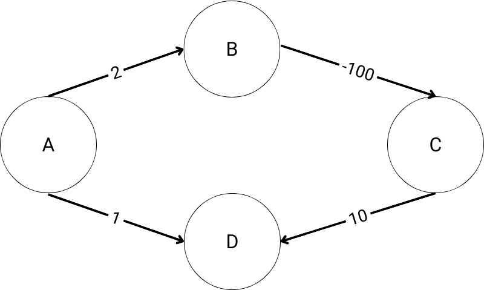
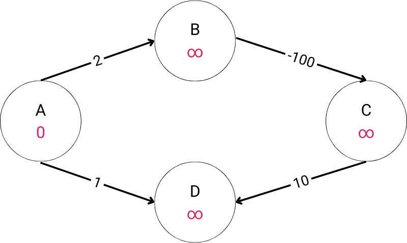
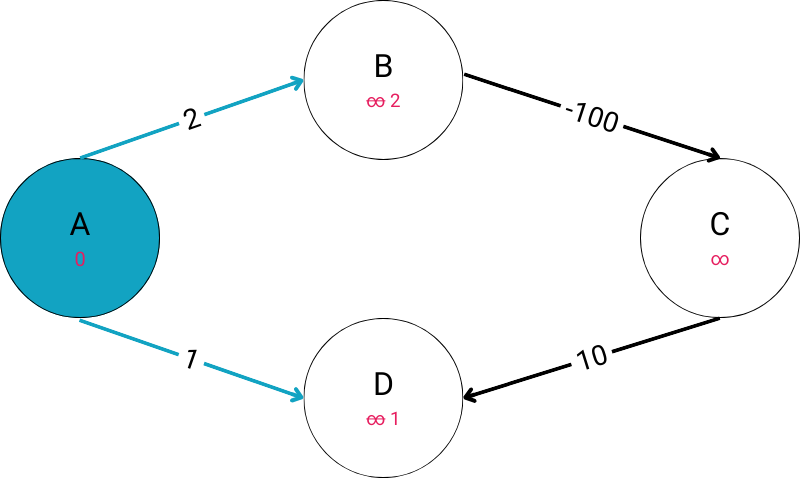
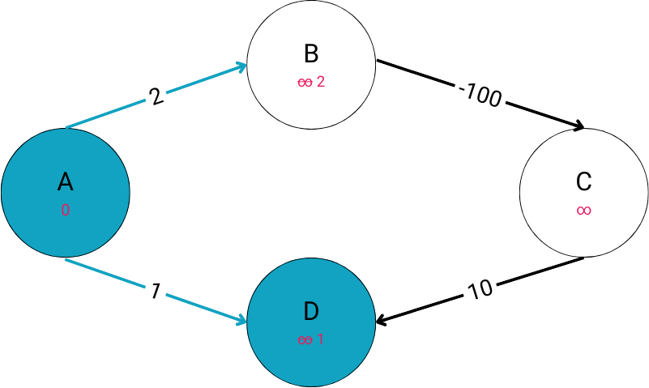
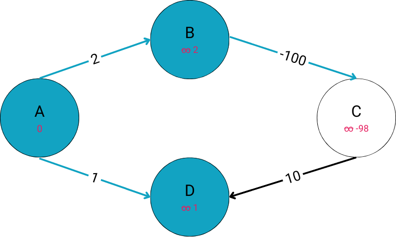
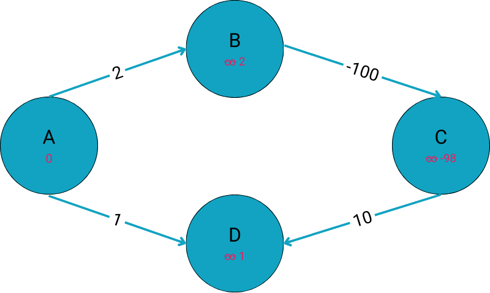

# Optional: Dijkstra vs. Negative Weighted Graphs

### !callout

## Optional Lesson

This lesson is optional because it is not necessary to learn Dijkstra's Algorithm. However, it is does lend a handing in understanding the algorithm.

### !end-callout

As stated previously in the lesson, one of the limitations of Dijkstra’s Algorithm is that when implemented on a graph that contains negatively weighted edges it can possibly produce inaccurate results. This is because of the [“greedy”](https://en.wikipedia.org/wiki/Greedy_algorithm) nature of the algorithm, meaning that it works under the assumption that each subpath it chooses is the most optimal path. Therefore when we visit a node, Dijkstra’s algorithm assumes the current least costly path to the node locally will be the least costly path to the node globally.

Once we’ve visited a node, it is considered closed and there is no way to re-open the path to that node and further relax the cost of the path. Dijkstra is designed to be applied to graphs with no negative costs. Such graphs can be used to solve many useful problems, so this limitation (the same we have with DFS and BFS) doesn't pose a problem when used as designed. If negative weights need to be handled, then the assumptions no longer hold, and some modification needs to be applied. 

Let's walk through an example of Dijkstra’s Algorithm being implemented on a small negatively weighted graph to find the shortest path from Node A to Node D.



Step 0. We start with a weighted graph. Notice that the weight on the edge connecting B to C is -100. The graph is directed. However, this is arbitrary.



Step 1. We identify our start node, Node A, and set the cost to travel from the start node to all other nodes to infinity. The cost to travel to Node A (the start node itself) is set to 0. Something else that will prove to be useful is a list that keeps track of the nodes we’ve already visited. Finally, we add Node A to the top of our priority queue.

```text
priority queue:
	- A

visited:
	

costs/distances:
    - A: 0 
    - B: ∞ 
    - C: ∞ 
    - D: ∞
```



Step 2. Given that Node A is the only node to have a finite distance it moves to the top of our queue and we begin looking at the edges of Node A’s neighboring nodes. Here we check to see if the cost of visiting each unvisited neighbor node from the current node we are visiting is less than the estimated cost we previously noted. Here we can see that 2 and 1, for B and D respectively, are less than infinity. Therefore we will update the distances accordingly. Finally, we add our start node to the list of visited nodes so we don’t visit it again. 

```text
current: A 

visited nodes: 
    - A 

priority queue: 
 	- A
	- D
	- B

costs/distances: 
    - A: 0 
    - B: 2
    - C: ∞ 
    - D: 1
```


Step 3. The next step is to visit the node that is the closest to our start node, which is Node D. Node D has a cost of 1, whereas Node B has a cost of 2. Here we would compute the cost of visiting all of Node D’s unvisited neighboring nodes. However, since Node D’s only neighbor is Node A, a node we’ve already visited, there are no costs to consider. 

Before moving to the next step let’s recall the “greedy” behavior of Dijkstra’s algorithm. Again, Dijkstra’s Algorithm operates under the assumption that the shortest path to a destination node from a start node is an accumulation of the shortest paths connecting intermediate neighboring nodes between the starting node and destination node. Since the cost of visiting Node D was the least costly path so far, Dijkstra's algorithm viewed Node D as the most locally optimal node to visit next. This resulted in Node D being added to the visited list, and the algorithm moved on with the assumption that it found the least costly path to Node D.

```text
current: D 

visited nodes: 
    - A
    - D 

Priority queue:
    - B

costs/distances: 
    - A: 0 
    - B: 2
    - C: ∞ 
    - D: 1

```



Step 4. We now look at the next node at the top of our priority queue, Node B (cost of 2). We will estimate the accumulated cost of reaching Node B’s neighboring nodes, based on the cost we calculated for reaching Node B, plus the cost to reach its neighbors. Node B has a single unvisited neighbor, Node C, and the edge to reach it has a cost of -100. The -100 cost of that edge to C, added to the cost it took to reach Node B (2) results in an estimated cost to Node C of -98. We can update our cost for Node C with our newfound estimate, and since we are now done visiting Node B, we can add Node B to our visited nodes. Finally, we add Node C to our priority queue.

```text
current: B 

visited nodes: 
    - A
    - D
    - B 

Priority queue:
    - C

costs/distances: 
    - A: 0 
    - B: 2
    - C: -98 
    - D: 1
```



Step 5. The next node in our priority queue is Node C. Like before, we will take a look at all of Node C’s unvisited neighbors and calculate the actual cost of visiting. As we can notice, Node C does not have any unvisited nodes and therefore leaves us with nothing to update.

This brings our algorithm to an end and leaves us with the following result. 

```text
visited nodes: 
    - A
    - D
    - B
    - C

costs/distances: 
    - A: 0 
    - B: 2
    - C: -98 
    - D: 1
```
But wait, we can clearly see that the least costly path from Node A to Node D is through Nodes B and C! That is correct, however since Dijkstra’s Algorithm operates under the assumption that each local choice we make is the most optimal choice, Node D was visited early in the traversal when it appeared to be the next lowest cost node to visit after Node A. The cost we estimated at the time it was visited became its calculated cost. Even though we found a lower cost path later, the negative edge causes the greedy assumption "the path we find first will be the cheapest" to become violated. Because Node D had already been visited, the edge to Node D along this later, cheaper path would not be considered. This is why Dijkstra’s Algorithm can possibly fail when implemented on graphs with negative weights.

To circumvent the negative weight limitation, we encourage you to follow your own curiosity and research the A* Search and Bellman Ford Algorithms.