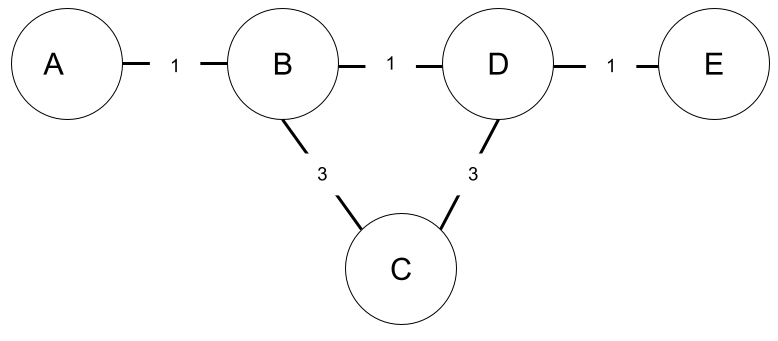

# The Greedy Approach

<!-- Definition -->
<!-- The algorithm makes the optional s-->
<!-- Greedy algorithms -->

## Introduction
The divide and conquer approach won't work for all problems so it is useful to be familiar with additional techniques we can use to develop algorithms. **Greedy Algorithms** or the greedy approach is another handy strategy and is often used to solve optimization problems.

We can think of a greedy algorithm as a mouse moving through a maze filled with cheese. At each decision point in the maze, the mouse will choose the path that provides the tastiest cheese. The mouse can't see the entire problem; it chooses its path using only the information available at the moment (which fork in the road offers the tastier cheese?)
without regard for future consequences. Greedy algorithms _hope_ that by making a locally optimal choice at each step, they arrive at an optimum solution for the larger problem, but it does not always work out.

In the diagram below, we can see that the mouse successfully makes it out of the maze by using the greedy approach. 


However, if a maze route that ended in a dead-end offered tastier cheese, the mouse could just as easily end up lost in the maze!


## Applications of Greedy Algorithms

Although greedy algorithms don't always provide the most optimal or even correct solution there are many cases where they do!

We have actually already seen a successful greedy algorithm in practice. [Dijkstra's Algorithm](./../09-graphs-p2/02-dijkstra.md) uses a greedy approach and is proven to always return the shortest path between two connected nodes in any graph with non-negative weights.

### Dijkstra's as a Greedy Algorithm

Why is Dijkstra's a greedy algorithm? Recall that overall, Dijkstra's works by initially overestimating the distance from the start node to every other node in the graph. Then, as the algorithm traverses the graph, it uses the weight of each edge it traverses to check if it should revise its estimate for the shortest distance from the start node to the node at the end of its current path.

Let's give ourselves a more detailed reminder by looking at the pseudocode below.

```
- Create a distances list equal in length to the number of nodes in the graph
    - Tracks the minimum cost/distance from start node to each node in graph
    - Initialize each value to infinity
    - Initialize distances[start_node] to zero
- Create a previous list equal in length to the number of nodes in the graph
    - Tracks the previous node in each node's shortest/minimum cost path
    - Initialize each value to None since we have not yet traversed any paths
- Create a visited list to track which nodes have already been visited
- Create a priority queue and add the start node to it
- While the queue is not empty:
    - Set current as node in the queue with minimum cost
    - Add current to the list of visited nodes
    - loop through all the current node's neighbors
        - if the neighbor has not yet been visited:
            - calculate distance from start node to neighbor via current node
            - If calculated distance < distance[neighbor]
                - distance[neighbor] = calculated distance
                - previous[neighbor] = current_node
            - queue.append(neighbor)
- Return the previous and distances list
```

The reason Dijkstra's is a greedy algorithm is because of the order in which it conducts its traversal. Notice the order in which Dijkstra chooses which node to visit or traverse next. Dijkstra's chooses to visit the node which is _currently least expensive to visit_. Since we are trying to find the minimum cost path, this is the optimal choice at that point. At each step in the traversal, Dijkstra's doesn't necessarily have all information about the weights of every edge in the graph and all possible paths to each node, making its choices locally optimal decisions.

Dijkstra's operates on the **optimal substructure** assumption. This assumption states that the optimal solution to the overall problem is made up of the optimal solution to each of its subproblems. For Dijkstra's we can observe that the optimal path between two nodes is made up of optimal paths between any intermediary nodes. 



#### Greedy Sort

One example of a greedy sorting algorithm is this `greedy_sort` method. 

```python
def greedy_sort(numbers):
    for i in range(len(numbers)):
        for j in range(i+1, len(numbers)):
            if(numbers[i] > numbers[j]):
                swap(numbers, i, j)
    return numbers
```

**Question** Compare the `greedy_sort` with `selection_sort` below.  Which will end up making fewer swaps?

```python
def selection_sort(numbers):
    for i in range(len(numbers) - 1):
        min = i
        for j in range(i, len(numbers)):
            if numbers[min] > numbers[j]:
                min = j
        swap(numbers, min, i)
    return numbers
```

#### Greedy Example 2 - Merging Sorted Lists

In this problem you are given `k` sorted arrays of varying lengths and asked to merge them.  The greedy approach is to merge the smallest two arrays, then the next two smallest, including the merged result.

Let's walk through how we could solve this with a greedy approach.

For example, suppose you had arrays a, b, and c which have 30, 20 and 15 elements each.  The greedy approach would be to merge arrays b & c, which would take 35 iterations, then merge the result with array a, which would take 65 iterations, for a total of 100.  If you had merged arrays a and b first, that would take 50 iterations, and then merging array c would take 65, for a total of 115 iterations.  

## Benefits of Greedy Algorithms


## Drawbacks to Greedy Algorithms

## Summary
