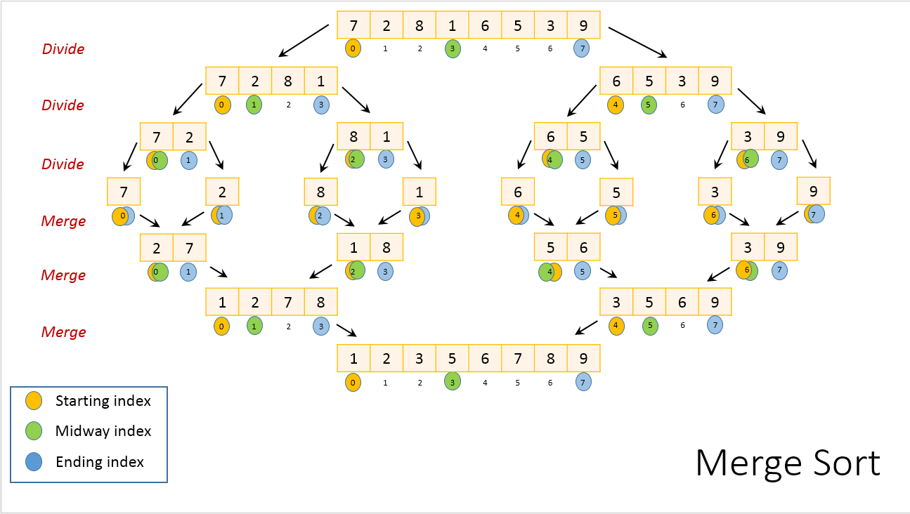

## Analyzing Algorithms

When we analyze an algorithm we generally do not care how an algorithm performs on a specific input size.  Instead we look at how the runtime and memory usage changes as the input size grows.  Looking at how an algorithm's runtime and memory usage increases with increasing input is called, _Asymptotic Analysis_, i.e. Big O.

Why bother with asymptotic analysis?  Why bother with examining how an algorithm increases in runtime and memory usage as the input size increases?  Asymptotic analysis allows us to compare algorithms and select one over another.  It also allows us to judge if any algorithm will be able to solve a particular problem within a meaningful amount of time or the system's limited storage capacity.

Most often we measure things in terms of _worst-case_ performance of an algorithm.  This is important when response time and memory usage is critical like in managing a self-driving car or autopilot system.  There are also times where the _average-case_ performance is important, especially where an algorithm is run often or across many instance, like an analysis program run regularly on a cloud platform. The average runtime (and standard deviation) can be important for a task run thousands of times an hour.

| Big-O | English Term
|--- |--- |
| O(1) | Constant |
| O(log n) | Logarithmic |
| O(n) | Linear |
| O(n2) | Quadratic |
| O(n3) | Cubic |
| O(2n) | Exponential |
| O(n!) | Factorial |

### Analyzing Binary Search Trees

In a _balanced_ binary search tree, finding a particular node has an asymptotic complexity of O(log2 n), because at each step we cut the number of possible nodes by half.  This type of algorithm is called a _divide and conquer_ algorithm.

In this Divide & Conquer Algorithm we:

- Divide by splitting the remaining nodes into a left and right subtrees
- Conquer by continuing the search on the subtree which may contain the element

In a divide and conquer algorithm we reduce a large problem into smaller subproblems, which are the same problem, but in a smaller scale until we reach a base-case.  In this example, when we reach the node being searched for or a leaf node.

Because we will continually divide our list of potential nodes in half until we reach a leaf node, or the item searched for, this algorithm is O(log n) for time complexity.

### Mergesort

Mergesort is another classic divide and conquer algorithm.  In mergesort, if our list has a size greater than 1, we divide our list into two halves conduct a mergesort on each half and merge the sorted lists together.

#### Analysis of Mergesort

If the Time complexity of mergesort is `T(n)` we can determine the time complexity of mergesort as follows.

**Dividing** When we divide the list into two sublists this takes `O(1)` as it just calculates the middle of the sub-array.
**Conquer**  We then recursively sort each half, which is of size n/2.  You can then say that the time complexity of both halves is `2 * T(n/2)`.
**Combining** The merge method into an n-element subarray is `O(n)`.  

If you look at the diagram above we will divide and recombine a total of log n levels, just like a binary tree.  At each level of the merging step we will be merging a total of `n` elements.  Since we will have log n levels and at each level we merge n elements, this algorithm is `O(n log n)`