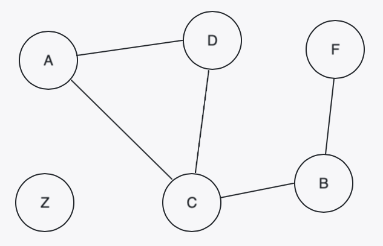
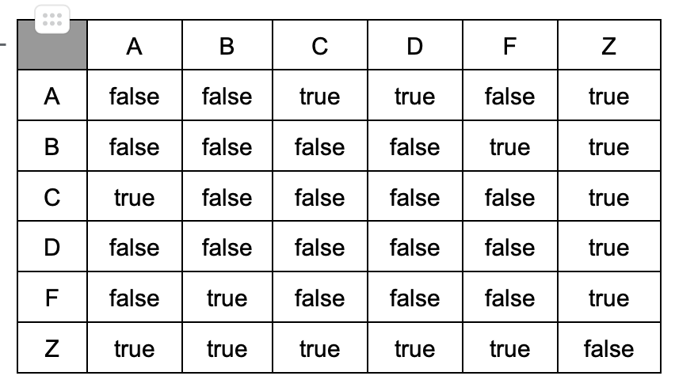
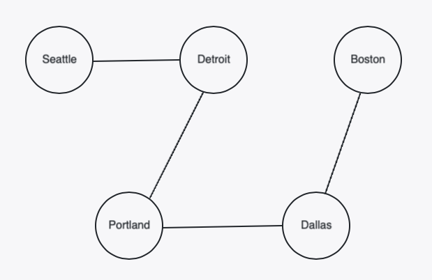

## Overview of Graphs
In the previous lesson, we talked about graphs, how to represent them, and a couple algorithms for traversing graphs. In this lesson, we'll go over a quick review of some of the learnings from the last lesson and introduce a new algorithm that can be used to solve a multitude of graph problems.

## Graph Representation Review Questions

You may recall in the previous lesson that graphs are a linked abstract data structure in computer science represented by a set of *nodes* connected by what are called *edges*. 

Let's review how to represent a graph via a list of edges, an adjacency matrix, and an adjacency dictionary.

<!-- >>>>>>>>>>>>>>>>>>>>>> BEGIN CHALLENGE >>>>>>>>>>>>>>>>>>>>>> -->

### !challenge

* type: multiple-choice
* id: 3490f39e-c8e4-4eaa-9908-ba5407937934
* title: Representing a Graph with a List of Edges
* points: 0

##### !question

Which list of edges represents the graph shown in the diagram below? Assume the graph is undirected.


##### !end-question

##### !options

a| ```py
[
    [0, 2],
    [1, 3],
    [2, 3]
]
```
b| ```py
[
    [0, 3],
    [0, 1],
    [1, 4]
]
```
c| ```py
[
    [0, 3],
    [0, 1],
    [1, 4],
    [1, 3]
]
```
d| ```py
[
    [0, 3],
    [0, 1],
    [1, 2],
    [1, 4]
]
```

##### !end-options

##### !answer

d|

##### !end-answer

### !explanation
Answer D is the correct answer because all of the edges in the graph are represented and correspond correctly to the edges in the graph.

[0, 3] indicates the edge from node 0 to node 3.
[0, 1] indicates the edge from node 0 to node 1.
[1, 2] indicates the edge from node 1 to node 2.
[1, 4] indicates the edge from node 1 to node 4.

### !end-explanation

### !end-challenge

<!-- ======================= END CHALLENGE ======================= -->

<!-- >>>>>>>>>>>>>>>>>>>>>> BEGIN CHALLENGE >>>>>>>>>>>>>>>>>>>>>> -->
<!-- Replace everything in square brackets [] and remove brackets  -->

### !challenge

* type: multiple-choice
* id: bc42d1a0-b66a-4cc2-ad42-b2b5c51323c1
* title: Representing a graph with an adjacency matrix
* points: 0

##### !question

Which adjacency matrix represents the graph shown in the diagram below? Assume the graph is undirected.



Assume the letters are mapped to the following indices:
* A -> 0
* B -> 1
* C -> 2
* D -> 3
* F -> 4
* Z -> 5

#### Option A


#### Option B


#### Option C


##### !end-question

##### !options

a| Option A
b| Option B
c| Option C

##### !end-options

##### !answer

b|

##### !end-answer

##### !explanation

Option B is the correct answer because the edges in the graph are all represented in the adjacency matrix.

For instance:

Row A, column C (Matrix[A][C]) is true because there exists an edge between node A and node C. Similarly, row C, column A (Matrix[C][A]) is true because of the same edge. 

Each cell containing true denotes an edge between the corresponding nodes.

Row Z is all false because node Z does not share an edge with any other node.

##### !end-explanation

### !end-challenge

<!-- ======================= END CHALLENGE ======================= -->

<!-- >>>>>>>>>>>>>>>>>>>>>> BEGIN CHALLENGE >>>>>>>>>>>>>>>>>>>>>> -->
<!-- Replace everything in square brackets [] and remove brackets  -->

### !challenge

* type: multiple-choice
* id: 2a316cff-6a03-4d90-9d15-4cf299afd223
* title: Representing a graph with an adjacency dictionary
* points: 0

##### !question

Which graph is represented by the following adjacency dictionary?

```py
adjacency_dict = {
    "Seattle": ["Portland"],
    "Portland": ["Dallas", "Seattle"],
    "Detroit": ["Dallas"],
    "Dallas": ["Boston", "Detroit", "Portland"],
    "Boston": ["Dallas"]
}
```

#### Option A


#### Option B


#### Option C


##### !end-question

##### !options

a| Option A
b| Option B
c| Option C

##### !end-options

##### !answer

a|

##### !end-answer

##### !explanation

Option A is correct because the nodes/edges in the adjacency dictionary correspond with the nodes and edges in the graph. 

For instance:

* Seattle is connected to only one city: Portland
* Portland is connected to Dallas and Seattle
* Dallas is connected to Boston, Detroit, and Portland
* Detroit is connected to Dallas
* Boston is connected to Dallas

##### !end-explanation 

### !end-challenge

<!-- ======================= END CHALLENGE ======================= -->

## Review of Breadth First Search & Depth First Search

### Breadth First Search (BFS)
You may recall from the last lesson that the Breadth First Search (BFS) algorithm starts with a particular node and then visits each node connected to the starting point before expanding outward.

The BFS algorithm requires us to use a queue to visit nodes in a "level-by-level" ordering by adding each of the neighbors of the starting node to the queue. We then loop through the queue, adding unvisited neighbors to the list of visited nodes as well as to the queue to be further processed.

### Depth First Search (DFS)
You may also recall from the last lesson that the Depth First Search (DFS) algorithm starts at a node and then follows a path as deeply as possible before backing up and following the next path. We refer to this algorithm as a back-tracking algorithm.

The DFS algorithm requires the use of a stack. The stack is used to further process nodes along the path, starting with the first node and then adding its neighbors to the stack before iterating on the nodes added to the stack. 

### Why DFS does not find shortest path

The main reason the DFS algorithm is not typically used to find the shortest path is because DFS is not a "greedy" algorithm. The algorithm is not designed to account for changes in logic based on the data it encounters, which is what is needed for finding the shortest path in a graph.

## !callout
A greedy algorithm is an approach for solving a problem by selecting the best option available at the moment. A greedy algorithm never reverses the earlier decision even if the choise is wrong. An algorithm which is considered greedy may not produce the best result for all problems.
## !end-callout

### Why BFS (kinda) allows for shortest path of an unweighted graph

By itself, BFS does *not* allow for finding the shortest path of an unweighted graph. In order to retrieve the shortest path using the BFS algorithm, one would need to modify the algorithm to store the current shortest distance to the target node as well as the preceding node in the shortest path. This is essentially what Djikstra's algorithm does, which we will learn more about in the next section.

## BFS, DFS, or Either

<!-- >>>>>>>>>>>>>>>>>>>>>> BEGIN CHALLENGE >>>>>>>>>>>>>>>>>>>>>> -->
<!-- Replace everything in square brackets [] and remove brackets  -->

### !challenge

* type: multiple-choice
* id: e012797e-0060-4484-b3b4-245fa4152228
* title: BFS, DFS, Either, or Neither?
* points: 0

##### !question

If we are looking for a node in a graph that is many levels deeper than the starting node, is BFS, DFS, Either, or Neither the best option?

##### !end-question

##### !options

a| Breadth First Search
b| Depth First Search
c| Either
d| Neither

##### !end-options

##### !answer

b|

##### !end-answer

##### !explanation

The correct answer is B because it is faster and more efficent to reach nodes deeper in the graph with Depth First Search.

##### !end-explanation 

### !end-challenge

### !challenge

* type: multiple-choice
* id: b8569433-61d6-48e0-afa2-5b28e3e9facf
* title: BFS, DFS, Either, or Neither?
* points: 0

##### !question

If we are looking to find all the connected nodes in a graph, is BFS, DFS, Either, or Neither the best option?

##### !end-question

##### !options

a| Breadth First Search
b| Depth First Search
c| Either
d| Neither

##### !end-options

##### !answer

a|

##### !end-answer

##### !explanation

The correct answer is A because BFS allows us to find which nodes are connected to one another in an efficient manner. We would not necessarily want to use DFS to find all connected nodes because the algorithm does not lend itself to finding connected nodes efficiently. 

For instance, if we are looking to see if a node 2 levels away from the starting node is connected, the DFS algorithm may need to run for a much longer time to find that connected node that is placed nearby in the graph in comparison to the BFS algorithm which will find the connected node much sooner.

##### !end-explanation 

### !end-challenge

<!-- ======================= END CHALLENGE ======================= -->

## Introduction to Djikstra's Algorithm

As mentioned earlier, BFS does not allow for finding the shortest path between two nodes without some additional modifications. One way to utilize the BFS algorithm to find the shortest distance between two nodes is by implementing what is called Djikstra's Algorithm. 

We will learn more about Djikstra's Algorithm in the following lesson.
