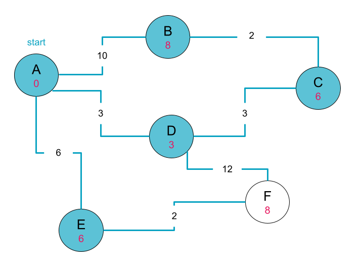

# Dijkstra's Algorithm

## Overview 

We have observed that a breadth first search traversal of a tree allows us to find the shortest path between any two nodes in an unweighted graph. In an unweighted graph, the length of a path is equal to the number of the edges in the path.

With a weighted graph, finding the shortest path between two nodes looks slightly different. We consider the weight of each edge to be the 'length' or 'distance' of the edge. We calculate the total length of a path by summing the weights of all the edges that make up at the path.

Below are two versions of the same graph: the version on the left is unweighted and the version on the right is unweighted.

Say we want to find the shortest path from Node B to Node D. In the unweighted graph, the shortest path would be along the direct edge from B to D for a path of length 1. 

However, in the weighted graph, we the shortest path from Node B to Node D travels from Node B to Node A, from Node A to Node C, and finally from Node D. The combined length of the path is the sum of the corresponding edges: 2 + 1 + 1 = 4. Because the edge directly between Node B to Node D has a weight or length of 10, it is considered a longer path even though it is a more direct route. 


Because of the change in how we calculate shortest paths when weighted edges exist, we are not able to use breadth first search to find the shortest path in weighted graphs. We need a new algorithm: Dijkstra's. 

## Dijkstra's Algorithm
<!-- Video -->

Dijkstra's algorithm takes a weighted graph and determines the cost to get from a specified start node to every other _reachable_ node in the graph.

Dijkstra's algorithm works by initially overestimating the distance between the start node and every other node in the graph. It then operates similarly to breadth first search. Starting at the given start node, Dijkstra's algorithm visits each direct neighbor of the current node. As it visits new nodes, the algorithm uses the weights of the corresponding edges to adjust the original estimated distance to each neighbor. 

We can see how it works in more detail with an example.





```
pseudocode
```

### Backtracking

### Pseudocode

### Challenge

### Dijkstra's with a priority queue

We can improve the performance of Dijkstra's by using a priority queue instead of a regular first-in-first-out queue. 


## Limitations of Dijkstra's

Dijkstra's _does not work_ for graphs with negative weights. To find the shortest path in a graph with negative weights we can use the [Bellman Ford algorithm](https://www.programiz.com/dsa/bellman-ford-algorithm). This algorithm is outside the scope of our curriculum and appears only very occasionally in interviews for SDE1 positions, but we encourage you to follow your curiosity.
